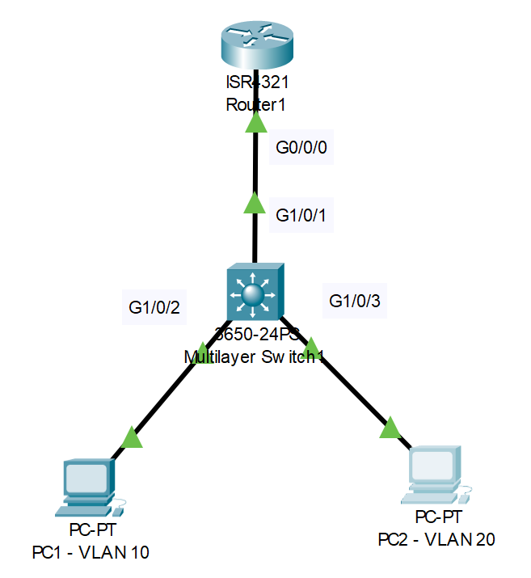

# David Bombal-VLAN Lab (Source: Udemy)
## Scenario: 


Lab File Link (pkt): [Here](https://mega.nz/file/3hJE0JAZ#Xk2_rMHKQMEXzTNofXgV3EmsTAuuwVMm1A465N06F4Y) 

# **Configure Router on a stick as follows:**
```
1) VLAN 1 = 10.1.1.0/24, VLAN 10 = 10.1.10.0/24, VLAN 20 = 10.1.20.0/24
2) Router = last IP address in subnet
3) Switch = 10.1.1.253/24 only
Configure VLANs on switch (PC1 in VLAN 10 and PC2 in VLAN 20)
4) Configure link between switch and router
5) Make sure PC1 can ping PC2 (PC1 = 10.1.10.1) PC2 = 10.1.20.2)
```
### **First check the status of R1's g0/0/0 interface.**
```
R1(config)#do sh ip int brief
Interface              IP-Address      OK? Method Status                Protocol 
GigabitEthernet0/0/0   unassigned      YES unset  administratively down down 🟩
GigabitEthernet0/0/1   unassigned      YES unset  administratively down down 
Vlan1                  unassigned      YES unset  administratively down down
R1(config)#int g0/0/0
R1(config-if)#no shut
```
### **Now configure three sub/logical interface for vlan 1, 10 and 20 on R1.** 
```
R1(config-if)#int g0/0/0.1
R1(config-subif)#encapsulation dot1q 1
R1(config-subif)#encapsulation dot1q 1 native 
R1(config-subif)#ip address 10.1.1.254 255.255.255.0
--------------------------------------------------------
R1(config-subif)#int g0/0/0.10
R1(config-subif)#encapsulation dot1q 10
R1(config-subif)#ip address 10.1.10.254 255.255.255.0
--------------------------------------------------------
R1(config-subif)#int g0/0/0.20
R1(config-subif)#encapsulation dot1q 20
R1(config-subif)#ip address 10.1.20.254 255.255.255.0
```
### **Verify the subinterface is configure correctly.**
```
R1#sh run 
interface GigabitEthernet0/0/0.1
 encapsulation dot1Q 1 native
 ip address 10.1.1.254 255.255.255.0
!
interface GigabitEthernet0/0/0.10
 encapsulation dot1Q 10
 ip address 10.1.10.254 255.255.255.0
!
interface GigabitEthernet0/0/0.20
 encapsulation dot1Q 20
 ip address 10.1.20.254 255.255.255.0
--------------------------------------------------------
R1#sh ip int brief
Interface              IP-Address      OK? Method Status                Protocol 
GigabitEthernet0/0/0   unassigned      YES unset  up                    up 
GigabitEthernet0/0/0.1 10.1.1.254      YES manual up                    up 🟩
GigabitEthernet0/0/0.1010.1.10.254     YES manual up                    up 🟩
GigabitEthernet0/0/0.2010.1.20.254     YES manual up                    up 🟩
GigabitEthernet0/0/1   unassigned      YES unset  administratively down down 
Vlan1                  unassigned      YES unset  administratively down down
```
> Everything looks good. Now go to Layer-3 switch. 
### **First check the vlan database.**
```
S1#sh vlan brief

VLAN Name                             Status    Ports
---- -------------------------------- --------- -------------------------------
1    default                          active    Gig1/0/1, Gig1/0/2, Gig1/0/3, Gig1/0/4
                                                Gig1/0/5, Gig1/0/6, Gig1/0/7, Gig1/0/8
                                                Gig1/0/9, Gig1/0/10, Gig1/0/11, Gig1/0/12
                                                Gig1/0/13, Gig1/0/14, Gig1/0/15, Gig1/0/16
                                                Gig1/0/17, Gig1/0/18, Gig1/0/19, Gig1/0/20
                                                Gig1/0/21, Gig1/0/22, Gig1/0/23, Gig1/0/24
                                                Gig1/1/1, Gig1/1/2, Gig1/1/3, Gig1/1/4
10   VLAN0010                         active   🟩 
20   VLAN0020                         active   🟩
1002 fddi-default                     active    
1003 token-ring-default               active    
1004 fddinet-default                  active    
1005 trnet-default                    active  
```
### **Here, Vlan 10 and 20 were auto-generated. To simplify and enhance clarity, let's manually create and name these two VLANs for better understanding.**
```
S1(config)#vlan 10
S1(config-vlan)#name VLAN10
S1(config-vlan)#vlan 20
S1(config-vlan)#name VLAN20
```
```
S1(config-vlan)#do sh vlan brief

VLAN Name                             Status    Ports
---- -------------------------------- --------- -------------------------------
1    default                          active    Gig1/0/1, Gig1/0/2, Gig1/0/3, Gig1/0/4
                                                Gig1/0/5, Gig1/0/6, Gig1/0/7, Gig1/0/8
                                                Gig1/0/9, Gig1/0/10, Gig1/0/11, Gig1/0/12
                                                Gig1/0/13, Gig1/0/14, Gig1/0/15, Gig1/0/16
                                                Gig1/0/17, Gig1/0/18, Gig1/0/19, Gig1/0/20
                                                Gig1/0/21, Gig1/0/22, Gig1/0/23, Gig1/0/24
                                                Gig1/1/1, Gig1/1/2, Gig1/1/3, Gig1/1/4
10   VLAN10                           active   🟩 
20   VLAN20                           active   🟩
1002 fddi-default                     active    
1003 token-ring-default               active    
1004 fddinet-default                  active    
1005 trnet-default                    active   
```
### **Now configure vlan 1 and assign associated interface for vlan 10 and 20.***
```
S1(config)#int vlan 1
S1(config-if)#ip address 10.1.1.253 255.255.255.0
S1(config-if)#no shut
---------------------------------------------------
S1(config-if)#int g1/0/2
S1(config-if)#sw mode acc
S1(config-if)#sw acc vlan 10
---------------------------------------------------
S1(config-if)#int g1/0/3
S1(config-if)#sw mode acc
S1(config-if)#sw acc vlan 20
---------------------------------------------------
S1(config-if)#int g1/0/1
S1(config-if)#sw mode trunk 
```
```
S1(config-if)#do sh int g1/0/1 sw
Name: Gig1/0/1
Switchport: Enabled
Administrative Mode: trunk
Operational Mode: trunk
Administrative Trunking Encapsulation: dot1q 🟩
Operational Trunking Encapsulation: dot1q
```
### **Now go to**
> PC1: 
```
Manually assign: 
IP Address: 10.1.10.1
Subnet Mask: 255.255.255.0
Default Gateway: 10.1.10.254
```
> PC2: 
```
Manually assign: 
IP Address: 10.1.20.2
Subnet Mask: 255.255.255.0
Default Gateway: 10.1.20.254
```
### **Check connectivity.**
> Go to PC1 command line: 
```
C:\>ping 10.1.1.254
C:\>ping 10.1.10.254
C:\>ping 10.1.20.254
C:\>ping 10.1.20.2
```
> Go to PC2 command line: 
```
C:\>ping 10.1.1.254
C:\>ping 10.1.10.254
C:\>ping 10.1.20.254
C:\>ping 10.1.10.1
```
> All ping should work. 
### **But why this ping failed.**
```
C:\>ping 10.1.1.253

Pinging 10.1.1.253 with 32 bytes of data:

Request timed out.
Request timed out.
Request timed out.
Request timed out.

Ping statistics for 10.1.1.253:
    Packets: Sent = 4, Received = 0, Lost = 4 (100% loss),
```
> From PC1 when we issue ping 10.1.1.253 which is vlan 1 ip this ping fails. Because in layer-3 switch the ip routing is enable and we need to configure the default-gateway for the vlan 1 as we did like vlan 10 and 20. So for fix this issue simply go to layer-3 switch then disable the 'ip routing' and set the default-gateway manually.
```
S1(config)#no ip routing 
S1(config)#ip default-gateway 10.1.1.254
S1(config)#do sh ip route
Default gateway is 10.1.1.254 🟩

Host               Gateway           Last Use    Total Uses  Interface
ICMP redirect cache is empty
```
> Now again do the same ping: 
```
C:\>ping 10.1.1.253

Pinging 10.1.1.253 with 32 bytes of data:

Request timed out.
Reply from 10.1.1.253: bytes=32 time=1ms TTL=254
Reply from 10.1.1.253: bytes=32 time=11ms TTL=254
Reply from 10.1.1.253: bytes=32 time=1ms TTL=254

Ping statistics for 10.1.1.253:
    Packets: Sent = 4, Received = 3, Lost = 1 (25% loss),
Approximate round trip times in milli-seconds:
    Minimum = 1ms, Maximum = 11ms, Average = 4ms
```
> This time it works. That's great...!!!  

> All necessary command at a glance: 
```
R1(config-if)#int g0/0/0.1
R1(config-subif)#encapsulation dot1q 1
R1(config-subif)#encapsulation dot1q 1 native 
R1(config-subif)#ip address 10.1.1.254 255.255.255.0

R1(config-subif)#int g0/0/0.10
R1(config-subif)#encapsulation dot1q 10
R1(config-subif)#ip address 10.1.10.254 255.255.255.0

R1(config-subif)#int g0/0/0.20
R1(config-subif)#encapsulation dot1q 20
R1(config-subif)#ip address 10.1.20.254 255.255.255.0
--------------------------------------------------------
S1(config)#vlan 10
S1(config-vlan)#name VLAN10
S1(config-vlan)#vlan 20
S1(config-vlan)#name VLAN20

S1(config)#int vlan 1
S1(config-if)#ip address 10.1.1.253 255.255.255.0
S1(config-if)#no shut

S1(config-if)#int g1/0/2
S1(config-if)#sw mode acc
S1(config-if)#sw acc vlan 10

S1(config-if)#int g1/0/3
S1(config-if)#sw mode acc
S1(config-if)#sw acc vlan 20

S1(config-if)#int g1/0/1
S1(config-if)#sw mode trunk 

S1(config)#no ip routing 
S1(config)#ip default-gateway 10.1.1.254
--------------------------------------------------------
```
## **[The End]**