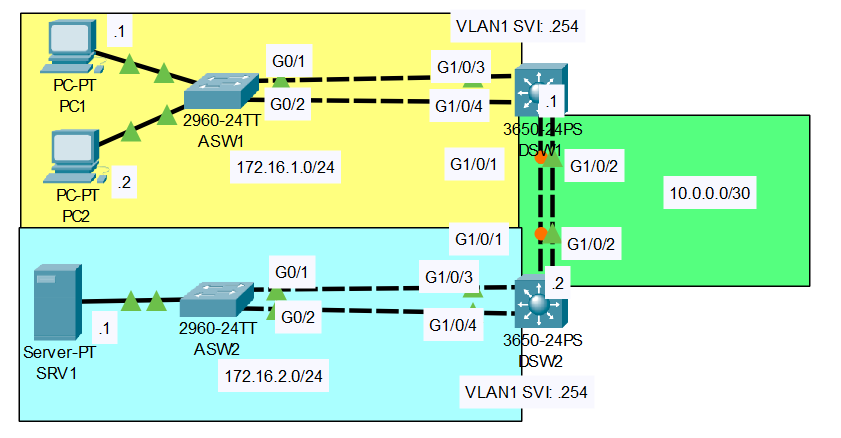

# Etherchannel Lab
## Source (YouTube: Jeremy's IT Lab)
### Video Link: [Here](https://www.youtube.com/watch?v=8gKF2fMMjA8&list=PLxbwE86jKRgMpuZuLBivzlM8s2Dk5lXBQ&index=44&pp=iAQB)
### Lab File (pkt): [Here Day-23](https://mega.nz/folder/n8QXiR7S#Rognn2PnGaD4hQAA0EleEQ)

>**Scenario:**


# **1. Configure Layer 2 EtherChannel between ASW1 and DSW1 using LACP. Configure it as a trunk. (End host and SVI IP addresses are pre-configured)**
> **Go to ASW1**
```
ASW1(config)#do sh spanning-tree
VLAN0001
  Spanning tree enabled protocol ieee
  Root ID    Priority    20481
             Address     0007.EC07.1D30
             Cost        8
             Port        25(GigabitEthernet0/1)
             Hello Time  2 sec  Max Age 20 sec  Forward Delay 15 sec

  Bridge ID  Priority    32769  (priority 32768 sys-id-ext 1)
             Address     0005.5E1E.5B9D
             Hello Time  2 sec  Max Age 20 sec  Forward Delay 15 sec
             Aging Time  20

Interface        Role Sts Cost      Prio.Nbr Type
---------------- ---- --- --------- -------- --------------------------------
Fa0/1            Desg FWD 19        128.1    P2p
Fa0/2            Desg FWD 19        128.2    P2p
Gi0/1            Root FWD 4         128.25   P2p 🟩
Gi0/2            Altn BLK 4         128.26   P2p 🟩
```
```
ASW1(config)#int range g0/1-2
ASW1(config-if-range)#channel-group 1 mode active
ASW1(config-if-range)#int po1
ASW1(config-if)#switchport mode trunk 
-----------------------------------------
ASW1(config-if)#do sh run
interface GigabitEthernet0/1
 switchport mode trunk
 channel-group 1 mode active
!
interface GigabitEthernet0/2
 switchport mode trunk
 channel-group 1 mode active
!
---------------------------------
ASW1(config-if)#do sh etherchannel summary
Flags:  D - down        P - in port-channel
        I - stand-alone s - suspended
        H - Hot-standby (LACP only)
        R - Layer3      S - Layer2
        U - in use      f - failed to allocate aggregator
        u - unsuitable for bundling
        w - waiting to be aggregated
        d - default port


Number of channel-groups in use: 1
Number of aggregators:           1

Group  Port-channel  Protocol    Ports
------+-------------+-----------+----------------------------------------------

1      Po1(SD)           LACP   Gig0/1(I) Gig0/2(I) 🟩
```
> **Go to DSW1**
```
DSW1(config)#int range g1/0/3-4
DSW1(config-if-range)#channel-group 1 mode active 
DSW1(config-if-range)#int po1
DSW1(config-if)#switchport mode trunk
```
> **Back to ASW1 and check spanning tree.**
```
ASW1(config-if)#do sh spanning-tree
VLAN0001
  Spanning tree enabled protocol ieee
  Root ID    Priority    20481
             Address     0007.EC07.1D30
             Cost        7
             Port        27(Port-channel1)
             Hello Time  2 sec  Max Age 20 sec  Forward Delay 15 sec

  Bridge ID  Priority    32769  (priority 32768 sys-id-ext 1)
             Address     0005.5E1E.5B9D
             Hello Time  2 sec  Max Age 20 sec  Forward Delay 15 sec
             Aging Time  20

Interface        Role Sts Cost      Prio.Nbr Type
---------------- ---- --- --------- -------- --------------------------------
Po1              Root FWD 3         128.27   Shr 🟩
Fa0/1            Desg FWD 19        128.1    P2p
Fa0/2            Desg FWD 19        128.2    P2p
```
```
ASW1(config-if)#do sh int trunk
Port        Mode         Encapsulation  Status        Native vlan
Po1         on           802.1q         trunking      1

Port        Vlans allowed on trunk
Po1         1-1005

Port        Vlans allowed and active in management domain
Po1         1 🟩

Port        Vlans in spanning tree forwarding state and not pruned
Po1         1
```
> **All Commands at a glance (for question 1)**
```
ASW1(config)#int range g0/1-2
ASW1(config-if-range)#channel-group 1 mode active
ASW1(config-if-range)#int po1
ASW1(config-if)#switchport mode trunk 
--------------------------------------------------
DSW1(config)#int range g1/0/3-4
DSW1(config-if-range)#channel-group 1 mode active 
DSW1(config-if-range)#int po1
DSW1(config-if)#switchport mode trunk
--------------------------------------------------
ASW1(config-if)#do sh spanning-tree
ASW1(config-if)#do sh int trunk
```
# **2. Configure Layer 2 EtherChannel between ASW2 and DSW2 using PAgP. Configure it as a trunk.**
> Same configuration as previous just different switch.
```
ASW2(config)#int range g0/1-2
ASW2(config-if-range)#channel-group 1 mode desirable
ASW2(config-if-range)#int po1
ASW2(config-if)#switchport mode trunk
-----------------------------------------------------
DSW2(config)#int range g1/0/3-4
DSW2(config-if-range)#channel-group 1 mode desirable
DSW2(config-if-range)#int po1
DSW2(config-if)#switchport mode trunk
```
```
ASW2(config-if)#do sh span
VLAN0001
  Spanning tree enabled protocol ieee
  Root ID    Priority    20481
             Address     0007.EC07.1D30
             Cost        3
             Port        27(Port-channel1)
             Hello Time  2 sec  Max Age 20 sec  Forward Delay 15 sec

  Bridge ID  Priority    32769  (priority 32768 sys-id-ext 1)
             Address     0050.0FEB.DDCC
             Hello Time  2 sec  Max Age 20 sec  Forward Delay 15 sec
             Aging Time  20

Interface        Role Sts Cost      Prio.Nbr Type
---------------- ---- --- --------- -------- --------------------------------
Po1              Root LRN 3         128.27   Shr 🟩
Fa0/1            Desg FWD 19        128.1    P2p
```
# **3. Configure Layer 3 EtherChannel between DSW1 and DSW2 using static EtherChannel.**
```
DSW1(config)#int range g1/0/1-2
DSW1(config-if-range)#no switchport 
DSW1(config-if-range)#channel-group 2 mode on
DSW1(config-if-range)#int po2
DSW1(config-if)#ip address 10.0.0.1 255.255.255.252
DSW1(config-if)#no shut
------------------------------------------------------
DSW2(config)#int range g1/0/1-2
DSW2(config-if-range)#no switchport 
DSW2(config-if-range)#channel-group 2 mode on
DSW2(config-if-range)#int po2
DSW2(config-if)#ip address 10.0.0.2 255.255.255.252 
DSW2(config-if)#no shut
```
```
DSW1(config-if)#do sh eth summ
Flags:  D - down        P - in port-channel
        I - stand-alone s - suspended
        H - Hot-standby (LACP only)
        R - Layer3      S - Layer2
        U - in use      f - failed to allocate aggregator
        u - unsuitable for bundling
        w - waiting to be aggregated
        d - default port


Number of channel-groups in use: 2
Number of aggregators:           2

Group  Port-channel  Protocol    Ports
------+-------------+-----------+----------------------------------------------

1      Po1(SU)           LACP   Gig1/0/3(P) Gig1/0/4(P) 
2      Po2(RU)           -      Gig1/0/1(P) Gig1/0/2(P) 🟩
```
```
DSW1(config-if)#do ping 10.0.0.2

Type escape sequence to abort.
Sending 5, 100-byte ICMP Echos to 10.0.0.2, timeout is 2 seconds:
.!!!!
Success rate is 80 percent (4/5), round-trip min/avg/max = 0/0/1 ms
```
# **4. Configure routes to allow the PCs to reach SRV1.**
```
DSW1(config)#do sh ip route
Default gateway is not set 🟩 

Host               Gateway           Last Use    Total Uses  Interface
ICMP redirect cache is empty
```
> **In DSW1**
```
DSW1(config)#ip routing
DSW1(config)#ip route 172.16.2.0 255.255.255.0 10.0.0.2
DSW1(config)#do sh ip route
Codes: C - connected, S - static, I - IGRP, R - RIP, M - mobile, B - BGP
       D - EIGRP, EX - EIGRP external, O - OSPF, IA - OSPF inter area
       N1 - OSPF NSSA external type 1, N2 - OSPF NSSA external type 2
       E1 - OSPF external type 1, E2 - OSPF external type 2, E - EGP
       i - IS-IS, L1 - IS-IS level-1, L2 - IS-IS level-2, ia - IS-IS inter area
       * - candidate default, U - per-user static route, o - ODR
       P - periodic downloaded static route

Gateway of last resort is not set

     10.0.0.0/30 is subnetted, 1 subnets
C       10.0.0.0 is directly connected, Port-channel2
     172.16.0.0/24 is subnetted, 2 subnets
C       172.16.1.0 is directly connected, Vlan1
S       172.16.2.0 [1/0] via 10.0.0.2 🟩
```
> **In DSW2**
```
DSW2(config)#ip routing
DSW2(config)#ip route 172.16.1.0 255.255.255.0 10.0.0.1
DSW2(config)#do sh ip route
Codes: C - connected, S - static, I - IGRP, R - RIP, M - mobile, B - BGP
       D - EIGRP, EX - EIGRP external, O - OSPF, IA - OSPF inter area
       N1 - OSPF NSSA external type 1, N2 - OSPF NSSA external type 2
       E1 - OSPF external type 1, E2 - OSPF external type 2, E - EGP
       i - IS-IS, L1 - IS-IS level-1, L2 - IS-IS level-2, ia - IS-IS inter area
       * - candidate default, U - per-user static route, o - ODR
       P - periodic downloaded static route

Gateway of last resort is not set

     10.0.0.0/30 is subnetted, 1 subnets
C       10.0.0.0 is directly connected, Port-channel2
     172.16.0.0/24 is subnetted, 2 subnets
S       172.16.1.0 [1/0] via 10.0.0.1 🟩
C       172.16.2.0 is directly connected, Vlan1
```
# **5. What is the default EtherChannel load-balancing method used on each switch?**
```
ASW1#sh etherchannel load-balance 
EtherChannel Load-Balancing Operational State (src-mac): 🟩 

DSW1#sh etherchannel load-balance 
EtherChannel Load-Balancing Configuration:
        src-mac 🟩
```
# **6. Configure the switches to load-balance based on source and destination IP addresses.**
```
ASW1(config)#port-channel load-balance src-dst-ip
ASW1(config)#do sh etherchannel load
EtherChannel Load-Balancing Operational State (src-dst-ip):
```
```
DSW1(config)#port-channel load-balance src-dst-ip
DSW1(config)#do sh etherchannel load-balance
EtherChannel Load-Balancing Configuration:
        src-dst-ip
```
```
ASW2(config)#port-channel load-balance src-dst-ip
ASW2(config)#do sh etherchannel load-balance
EtherChannel Load-Balancing Operational State (src-dst-ip):
```
```
DSW2(config)#port-channel load-balance src-dst-ip
DSW2(config)#do sh et load
EtherChannel Load-Balancing Configuration:
        src-dst-ip
```
# **7. Ping from PC to Server**
```
C:\>ping 172.16.2.1

Pinging 172.16.2.1 with 32 bytes of data:

Request timed out.
Reply from 172.16.2.1: bytes=32 time=1ms TTL=126
Reply from 172.16.2.1: bytes=32 time<1ms TTL=126
Reply from 172.16.2.1: bytes=32 time<1ms TTL=126

Ping statistics for 172.16.2.1:
    Packets: Sent = 4, Received = 3, Lost = 1 (25% loss),
Approximate round trip times in milli-seconds:
    Minimum = 0ms, Maximum = 1ms, Average = 0ms
```
### **[The End]**