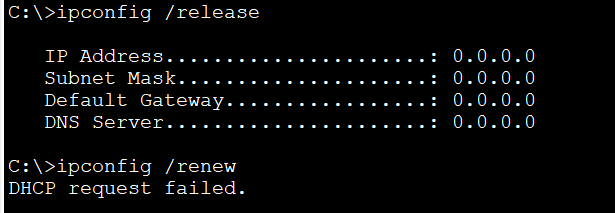

# DHCP Configuration (Source: Udemy)
## Instructor: Neil Anderson  
### Scenario: 

### **Pkt file:** [Here](https://mega.nz/file/ToZzHC6Z#d05DQzXhldtmISsIInyR3UIApteVErZAKAgRYGc0pFY)

# **Cisco DHCP Client.**
### **1) You have not acquired a static public IP address from the Internet service provider. Configure the outside interface FastEthernet 0/0 on R1 to receive its IP address using DHCP. The Service Provider is already configured and you have no access to it.**
```
R1(config)#int f0/0
R1(config-if)#no shut
R1(config-if)#ip address dhcp
```
### **2) Verify that R1 received its public IP address via DHCP (you may need to wait a few minutes for the address to be assigned).**
```
%DHCP-6-ADDRESS_ASSIGN: Interface FastEthernet0/0 assigned DHCP address 203.0.113.2, mask 255.255.255.0, hostname R1

R1(config-if)#do sh ip int brief
Interface              IP-Address      OK? Method Status                Protocol 
FastEthernet0/0        203.0.113.2     YES DHCP   up                    up 🟩
FastEthernet0/1        10.10.10.1      YES manual up                    up 
FastEthernet1/0        10.10.20.1      YES manual up                    up 
FastEthernet1/1        unassigned      YES unset  administratively down down 
Vlan1                  unassigned      YES unset  administratively down down
```
### **3) What is the IP address of R1’s DHCP server?**
```
R1#sh dhcp lease
Temp IP addr: 203.0.113.2 for peer on Interface: FastEthernet0/0
Temp sub net mask: 255.255.255.0
   DHCP Lease server: 203.0.113.1 , state: Bound 🟩
   DHCP Transaction id: 17ABA9C7
   Lease: 86400 secs,  Renewal: 43200 secs,  Rebind: 75600 secs
Temp default-gateway addr: 203.0.113.1
   Next timer fires after: 11:58:19
   Retry count: 0  Client-ID:cisco-0001.63C2.9701-Fa0/0
   Client-ID hex dump: 636973636F2D303030312E363343322E
                       93730312D4661302F30
   Hostname: R1
```

# **Cisco DHCP Server.**
### **4) Enable the DHCP service on R1 so it gives out IP addresses to the PCs in the 10.10.10.0/24 subnet. Leave IP addresses 10.10.10.1 – 10 free to be assigned to servers and printers. 10.10.20.10 is the DNS server.**
```
R1(config)#ip dhcp excluded-address 10.10.10.1 10.10.10.10 
R1(config)#ip dhcp pool kibria
R1(dhcp-config)#network 10.10.10.0 255.255.255.0
R1(dhcp-config)#default-router 10.10.10.1
R1(dhcp-config)#dns-server 10.10.20.10
```
### **5) Verify the clients received their IP information via DHCP.**


### **6) Verify the clients can ping the DNS server by its hostname ‘DNSserver’ (it might take some time for DNS to resolve the hostname).**

### **7) On R1, verify both clients received an IP address via DHCP.**
```
R1#sh ip dhcp binding
IP address       Client-ID/              Lease expiration        Type
                 Hardware address
10.10.10.11      0000.0CA0.A359           --                     Automatic
10.10.10.12      0002.164E.D116           --                     Automatic
```
### **8) Cleanup – remove the DHCP server configuration on R1. You will use an external DHCP server instead in the next section.**
```
R1(config)#no ip dhcp excluded-address 10.10.10.1 10.10.10.10 
R1(config)#no ip dhcp pool kibria 
```
### **9) Enter the command ‘ipconfig /release’ on the PCs to release their IP addresses.**
```
C:\>ipconfig /release

   IP Address......................: 0.0.0.0
   Subnet Mask.....................: 0.0.0.0
   Default Gateway.................: 0.0.0.0
   DNS Server......................: 0.0.0.0
```
### **10) Enter the command ‘ipconfig /renew’ on the PCs and verify they can no longer obtain an IP address via DHCP.**
```
C:\>ipconfig /renew
DHCP request failed. 
```

# **External DHCP Server**
### **11) The server at 10.10.20.10 has been configured as a DHCP server with a scope of IP addresses for the 10.10.10.0/24 subnet, but the PCs there are not receiving IP addresses. Why is this?**
> DHCP request use broadcast traffic. R1 is not forwarding the request on to the DHCP server as routers do not forward broadcast traffic by default.

### **12)	Configure the network to allow the PCs to receive their IP addresses from the DHCP server.**
```
R1(config)#int f0/1
R1(config-if)#ip helper-address 10.10.20.10
```
### **13) Verify the clients received their IP information via DHCP.**
```
C:\>ipconfig /renew

   IP Address......................: 10.10.10.100
   Subnet Mask.....................: 255.255.255.0
   Default Gateway.................: 10.10.10.1
   DNS Server......................: 10.10.20.10
```

## **[The End]**