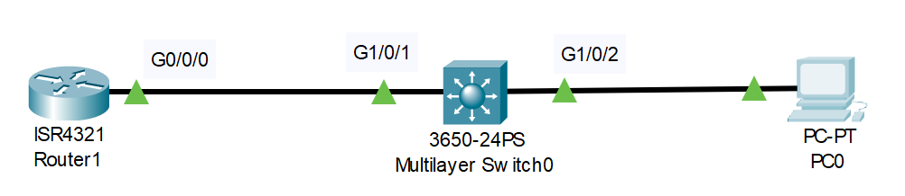
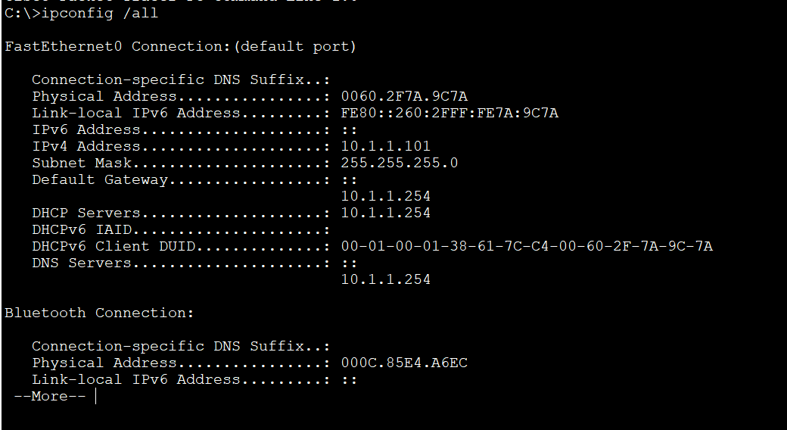
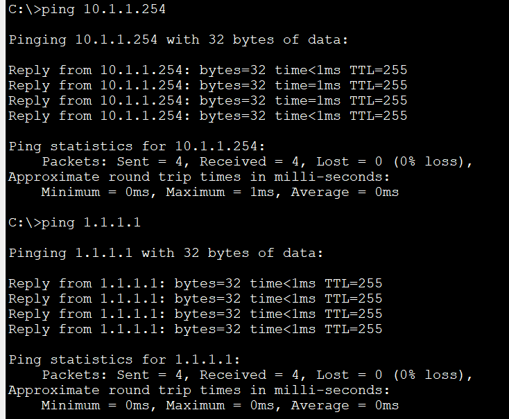
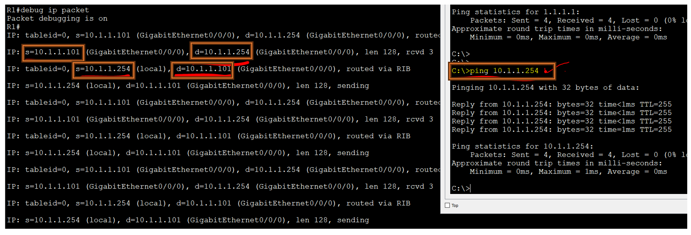

# David Bombal-DHCP Configuration Lab (Source: Udemy)
## Scenario: 


Lab File Link (pkt): [Here](https://mega.nz/file/ql5TDDaY#MzwuMSCwFE-IT8HnN7vYID0xuC_ffzqnGZcPgcyWpwU)  
## **Configure DHCP on Router1 as follows:**
```
1) Excluded address range 10.1.1.1 to 10.1.1.100
2) Pool name = pc
3) Network 10.1.1.0/24
4) Default Gateway = Router 1
5) DNS Server = Router 1
6) Test that PC can ping loopback of Router 1
```
```
R1#sh ip int brief
Interface              IP-Address      OK? Method Status                Protocol 
GigabitEthernet0/0/0   10.1.1.254      YES manual up                    up 
GigabitEthernet0/0/1   unassigned      YES unset  administratively down down 
Loopback0              1.1.1.1         YES manual up                    up 
Vlan1                  unassigned      YES unset  administratively down down
```
```
R1(config)#ip dhcp excluded-address 10.1.1.1 10.1.1.100
R1(config)#ip dhcp pool pc
R1(dhcp-config)#network 10.1.1.0 255.255.255.0 
R1(dhcp-config)#default-router 10.1.1.254
R1(dhcp-config)#dns-server 10.1.1.254 
```
```
R1#wr
Building configuration...
[OK]
R1#copy running-config startup-config 
Destination filename [startup-config]? 
Building configuration...
[OK]
```
```
R1#ping 10.1.1.101

Type escape sequence to abort.
Sending 5, 100-byte ICMP Echos to 10.1.1.101, timeout is 2 seconds:
!!!!!
Success rate is 100 percent (5/5), round-trip min/avg/max = 0/0/0 ms
```
>Checking connectivity: 





>Debug: 



## **[The End]**