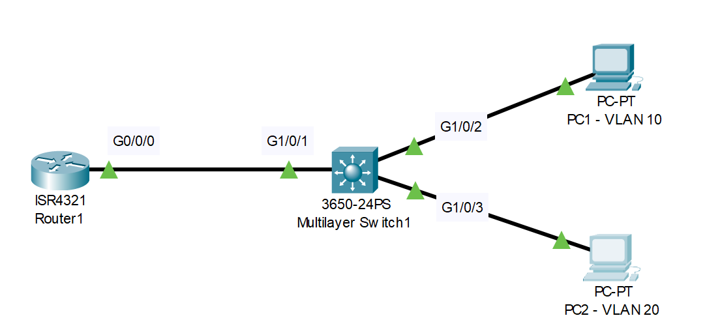
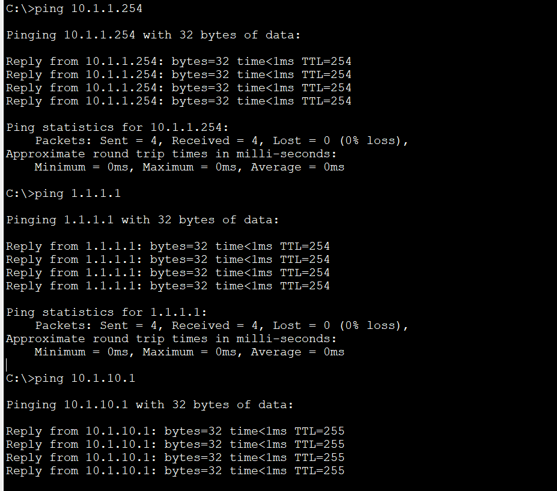
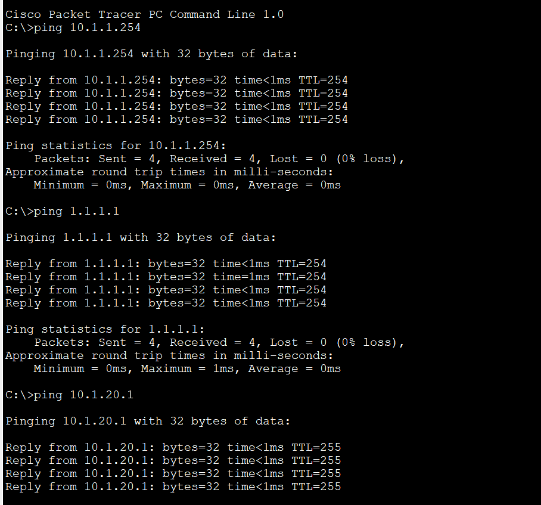

# David Bombal-DHCP Configuration Lab (Source: Udemy)
## Scenario: 


### Lab File Link (pkt): [Here](https://mega.nz/file/rh4k0Qxb#zJAUsRvSSqCgdKmNKVmT-ClewswGcAfq2RZMRVp9r38) 

# **Configure DHCP on Router1 as follows:**
```
1) Exclude first 10 IP addresses in each subnet from pool
Pool names = vlan10 and vlan20
2) Networks =  10.1.10.0/24 (VLAN 10) and 10.1.20.0/24 (VLAN 20)
4) Default Gateway = Switch1
5) DNS Server = Router1
6) Make sure PCs can ping each other and the loopback of Router1
```
### First check the default-router for dhcp configuration in R1, mark the vlan10 and vlan20 ip address:   
```
S1#sh ip int brief
Interface              IP-Address      OK? Method Status                Protocol 
Vlan1                  10.1.1.1        YES manual up                    up 
Vlan10                 10.1.10.1       YES manual up                    up 🟩
Vlan20                 10.1.20.1       YES manual up                    up 🟩
```
### Now check the dns-server ip address (which is R1's g0/0/0 interface): 
```
R1#sh ip int brief
Interface              IP-Address      OK? Method Status                Protocol 
GigabitEthernet0/0/0   10.1.1.254      YES manual up                    up 🟩
GigabitEthernet0/0/1   unassigned      YES unset  administratively down down 
Loopback0              1.1.1.1         YES manual up                    up 
Vlan1                  unassigned      YES unset  administratively down down
```
### Now configure dhcp for vlan10 and vlan20 into R1:  
```
R1(config)#ip dhcp excluded-address 10.1.10.1 10.1.10.10
R1(config)#ip dhcp pool vlan10 
R1(dhcp-config)#network 10.1.10.0 255.255.255.0 
R1(dhcp-config)#default-router 10.1.10.1 
R1(dhcp-config)#dns-server 10.1.1.254
---------------------------------------------------------
R1(config)#ip dhcp excluded-address 10.1.20.1 10.1.20.10 
R1(config)#ip dhcp pool vlan20 
R1(dhcp-config)#network 10.1.20.0 255.255.255.0 
R1(dhcp-config)#default-router 10.1.20.1 
R1(dhcp-config)#dns-server 10.1.1.254 
```
### Now check the dhcp configuration from running-configuration: 
```
R1#sh run | s dhcp
ip dhcp excluded-address 10.1.10.1 10.1.10.10
ip dhcp excluded-address 10.1.20.1 10.1.20.10
ip dhcp pool vlan10
 network 10.1.10.0 255.255.255.0
 default-router 10.1.10.1
 dns-server 10.1.1.254
ip dhcp pool vlan20
 network 10.1.20.0 255.255.255.0
 default-router 10.1.20.1
 dns-server 10.1.1.254
```
### Now we need to configure a static route in R1 for reaching vlan10 and vlan20 via vlan1 as the next hop address (10.1.1.1) of switch:
```
R1(config)#ip route 10.1.10.0 255.255.255.0 10.1.1.1
R1(config)#ip route 10.1.20.0 255.255.255.0 10.1.1.1
R1(config)#do sh ip route 
Codes: L - local, C - connected, S - static, R - RIP, M - mobile, B - BGP
       D - EIGRP, EX - EIGRP external, O - OSPF, IA - OSPF inter area
       N1 - OSPF NSSA external type 1, N2 - OSPF NSSA external type 2
       E1 - OSPF external type 1, E2 - OSPF external type 2, E - EGP
       i - IS-IS, L1 - IS-IS level-1, L2 - IS-IS level-2, ia - IS-IS inter area
       * - candidate default, U - per-user static route, o - ODR
       P - periodic downloaded static route

Gateway of last resort is not set

     1.0.0.0/32 is subnetted, 1 subnets
C       1.1.1.1/32 is directly connected, Loopback0
     10.0.0.0/8 is variably subnetted, 4 subnets, 2 masks
C       10.1.1.0/24 is directly connected, GigabitEthernet0/0/0
L       10.1.1.254/32 is directly connected, GigabitEthernet0/0/0
S       10.1.10.0/24 [1/0] via 10.1.1.1 🟩
S       10.1.20.0/24 [1/0] via 10.1.1.1 🟩
``` 
### Now check if we can ping the next hop address (10.1.1.1) and vlan10 and vlan20 from R1: 
```
R1#ping 10.1.1.1

Type escape sequence to abort.
Sending 5, 100-byte ICMP Echos to 10.1.1.1, timeout is 2 seconds:
.!!!!
Success rate is 80 percent (4/5), round-trip min/avg/max = 0/0/0 ms
------------------------------------
R1#ping 10.1.10.1

Type escape sequence to abort.
Sending 5, 100-byte ICMP Echos to 10.1.10.1, timeout is 2 seconds:
!!!!!
Success rate is 100 percent (5/5), round-trip min/avg/max = 0/0/0 ms
------------------------------------
R1#ping 10.1.20.1

Type escape sequence to abort.
Sending 5, 100-byte ICMP Echos to 10.1.20.1, timeout is 2 seconds:
!!!!!
Success rate is 100 percent (5/5), round-trip min/avg/max = 0/0/0 ms
```
### Now we need to pass the dhcp message from pc's to R1 which is going via layter-3 switch. So, this swith must act as a dhcp relay agent for passing/receiving those dhcp message to/from the dhcp server (R1). So, we need to set ip helper-address for both vlan10 and vlan20 inside layer-3 switch. And also a static route for going to R1's loopback interface via R1's g0/0/0 as the next hop. 
```
S1#sh ip route 
Default gateway is not set

Host               Gateway           Last Use    Total Uses  Interface
ICMP redirect cache is empty
```
```
S1(config)#ip routing 
```
```
S1(config)#do sh ip route 
Codes: C - connected, S - static, I - IGRP, R - RIP, M - mobile, B - BGP
       D - EIGRP, EX - EIGRP external, O - OSPF, IA - OSPF inter area
       N1 - OSPF NSSA external type 1, N2 - OSPF NSSA external type 2
       E1 - OSPF external type 1, E2 - OSPF external type 2, E - EGP
       i - IS-IS, L1 - IS-IS level-1, L2 - IS-IS level-2, ia - IS-IS inter area
       * - candidate default, U - per-user static route, o - ODR
       P - periodic downloaded static route

Gateway of last resort is not set

     10.0.0.0/24 is subnetted, 3 subnets
C       10.1.1.0 is directly connected, Vlan1
C       10.1.10.0 is directly connected, Vlan10
C       10.1.20.0 is directly connected, Vlan20
```
```
S1(config)#ip route 1.1.1.1 255.255.255.255 10.1.1.254
```
```
S1(config)#do sh ip route 
Codes: C - connected, S - static, I - IGRP, R - RIP, M - mobile, B - BGP
       D - EIGRP, EX - EIGRP external, O - OSPF, IA - OSPF inter area
       N1 - OSPF NSSA external type 1, N2 - OSPF NSSA external type 2
       E1 - OSPF external type 1, E2 - OSPF external type 2, E - EGP
       i - IS-IS, L1 - IS-IS level-1, L2 - IS-IS level-2, ia - IS-IS inter area
       * - candidate default, U - per-user static route, o - ODR
       P - periodic downloaded static route

Gateway of last resort is not set

     1.0.0.0/32 is subnetted, 1 subnets
S       1.1.1.1 [1/0] via 10.1.1.254 🟩
     10.0.0.0/24 is subnetted, 3 subnets
C       10.1.1.0 is directly connected, Vlan1
C       10.1.10.0 is directly connected, Vlan10
C       10.1.20.0 is directly connected, Vlan20
```
```
S1(config)#do ping 1.1.1.1

Type escape sequence to abort.
Sending 5, 100-byte ICMP Echos to 1.1.1.1, timeout is 2 seconds:
!!!!!
Success rate is 100 percent (5/5), round-trip min/avg/max = 0/0/0 ms
```
```
S1(config)#int vlan 10
S1(config-if)#ip helper-address 10.1.1.254
S1(config-if)#int vlan 20
S1(config-if)#ip helper-address 10.1.1.254
```
### Checking the ip address of the pc's learn via dhcp
```
R1#sh ip dhcp binding 
IP address       Client-ID/              Lease expiration        Type
                 Hardware address
10.1.10.11       0060.2F7A.9C7A           --                     Automatic
10.1.20.11       000C.8576.3D43           --                     Automatic
```
### Now ping those two pc's from dchp server
```
R1#ping 10.1.10.11

Type escape sequence to abort.
Sending 5, 100-byte ICMP Echos to 10.1.10.11, timeout is 2 seconds:
.!!!!
Success rate is 80 percent (4/5), round-trip min/avg/max = 0/0/0 ms
```
```
R1#ping 10.1.20.11

Type escape sequence to abort.
Sending 5, 100-byte ICMP Echos to 10.1.20.11, timeout is 2 seconds:
.!!!!
Success rate is 80 percent (4/5), round-trip min/avg/max = 0/0/1 ms
```
### Now ping from pc1 and pc2 
> All pings are works.   
```
C:\>ping 10.1.1.254
C:\>ping 1.1.1.1
C:\>ping 10.1.10.1
```

```
C:\>ping 10.1.1.254
C:\>ping 1.1.1.1
C:\>ping 10.1.20.1
C:\>ping 10.1.10.1
```


> **All necessary command at a glance:** 
```
R1(config)#ip dhcp excluded-address 10.1.10.1 10.1.10.10
R1(config)#ip dhcp pool vlan10 
R1(dhcp-config)#network 10.1.10.0 255.255.255.0 
R1(dhcp-config)#default-router 10.1.10.1 
R1(dhcp-config)#dns-server 10.1.1.254
---------------------------------------------------------
R1(config)#ip dhcp excluded-address 10.1.20.1 10.1.20.10 
R1(config)#ip dhcp pool vlan20 
R1(dhcp-config)#network 10.1.20.0 255.255.255.0 
R1(dhcp-config)#default-router 10.1.20.1 
R1(dhcp-config)#dns-server 10.1.1.254 
---------------------------------------------------------
R1(config)#ip route 10.1.10.0 255.255.255.0 10.1.1.1
R1(config)#ip route 10.1.20.0 255.255.255.0 10.1.1.1
---------------------------------------------------------
S1(config)#ip routing 
S1(config)#ip route 1.1.1.1 255.255.255.255 10.1.1.254
S1(config)#int vlan 10
S1(config-if)#ip helper-address 10.1.1.254
S1(config-if)#int vlan 20
S1(config-if)#ip helper-address 10.1.1.254
```
## **[The End]**