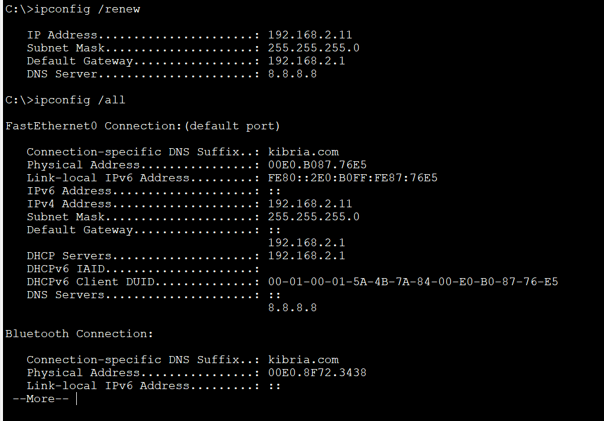
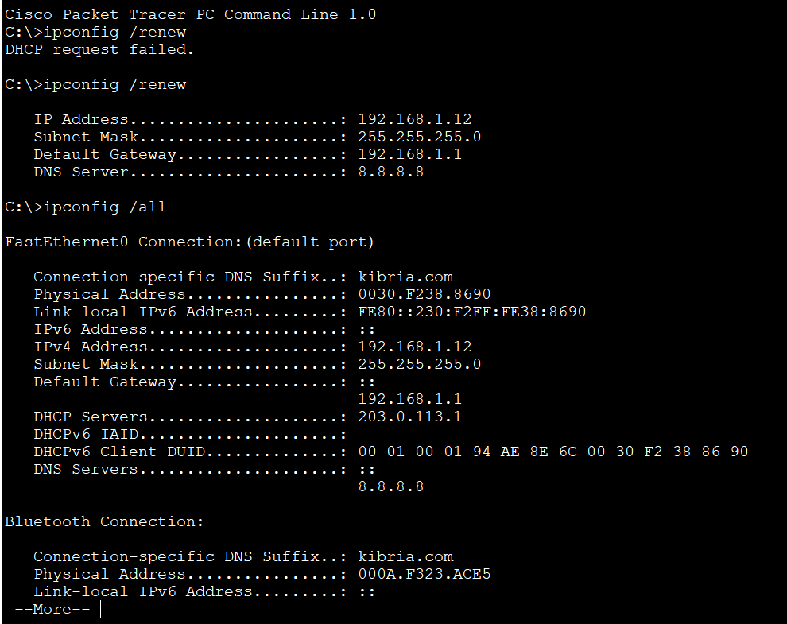

# DHCP Configuratoin
## Source (YouTube: Jeremy's IT Lab)
### Video Link: [Here](https://youtu.be/cgMsoIQB9Wk?si=06CN-CJCVUWhUSjz)
### Lab File Link (pkt): [Here Day-39](https://mega.nz/folder/n8QXiR7S#Rognn2PnGaD4hQAA0EleEQ)
### Scenario: 

## **1. Configure the following DHCP pools on R2:**
```
Given:
POOL1: 192.168.1.0/24 (reserve .1 to .10)
     DNS 8.8.8.8
     Domain: jeremysitlab.com
     Default Gateway: R1
POOL2: 192.168.2.0/24 (reserve .1 to .10)
     DNS 8.8.8.8
     Domain: jeremysitlab.com
     Default Gateway: R2
POOL3: 203.0.113.0/30 (reserve .1)
```
```
R2(config)#ip dhcp excluded-address 192.168.1.1 192.168.1.10
R2(config)#ip dhcp pool POOL1
R2(dhcp-config)#network 192.168.1.0 255.255.255.0
R2(dhcp-config)#default-router 192.168.1.1 
R2(dhcp-config)#dns-server 8.8.8.8
R2(dhcp-config)#domain-name kibria.com 

R2(config)#ip dhcp excluded-address 192.168.2.1 192.168.2.10
R2(config)#ip dhcp pool POOL2 
R2(dhcp-config)#network 192.168.2.0 255.255.255.0
R2(dhcp-config)#default-router 192.168.2.1 
R2(dhcp-config)#dns-server 8.8.8.8
R2(dhcp-config)#domain-name kibria.com 

R2(config)#ip dhcp excluded-address 203.0.113.1 
R2(config)#ip dhcp pool POOL3
R2(dhcp-config)#network 203.0.113.0 255.255.255.252
```
```
R2#sh run | section dhcp
ip dhcp excluded-address 192.168.1.1 192.168.1.10
ip dhcp excluded-address 192.168.2.1 192.168.2.10
ip dhcp excluded-address 203.0.113.1
ip dhcp pool POOL1 🟩
 network 192.168.1.0 255.255.255.0
 default-router 192.168.1.1
 dns-server 8.8.8.8
 domain-name kibria.com
ip dhcp pool POOL2 🟩
 network 192.168.2.0 255.255.255.0
 default-router 192.168.2.1
 dns-server 8.8.8.8
 domain-name kibria.com
ip dhcp pool POOL3 🟩
 network 203.0.113.0 255.255.255.252
```
>From PC2:  

 


## **2. Configure R1's G0/0 interface as a DHCP client. What IP address did it configure?**
```
R1(config)#int g0/0
R1(config-if)#no shut
R1(config-if)#ip add dhcp
```
```
R1#sh ip int brief
Interface              IP-Address      OK? Method Status                Protocol 
GigabitEthernet0/0     203.0.113.2     YES DHCP   up                    up 🟩
GigabitEthernet0/1     192.168.1.1     YES manual up                    up 
GigabitEthernet0/2     unassigned      YES unset  administratively down down 
Vlan1                  unassigned      YES unset  administratively down down
```
## **3. Configure R1 as a DHCP relay agent for the 192.168.1.0/24 subnet.**
```
R1(config-if)#int g0/1
R1(config-if)#ip helper-address 203.0.113.1
```
## **4. Use the CLI of PC1 and PC2 to make them request an IP address from their DHCP server.**
> FRom PC1: 



## **[The End]**