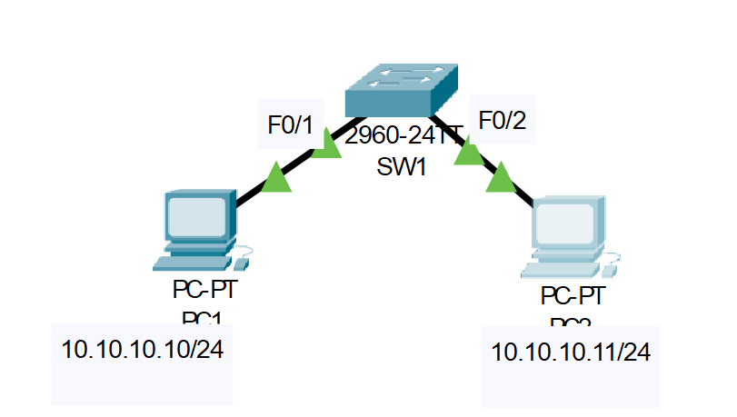

# Porst Security Configuratoin
## Source (Udemy: Neil Anderson Course)

### Lab File Link (pkt): [Here](https://mega.nz/file/T4wE0IbT#DlimlzWZaHYyIxhrLw-fXcItBld5-j9HpmwMcC8vp38)
### Scenario: 


# **Disable Unused Ports.**
### **1) Disable all unused ports on SW1. This prevents unauthorised hosts plugging in to them to gain access to the network.**
```
SW1#sh ip int brief
Interface              IP-Address      OK? Method Status                Protocol 
FastEthernet0/1        unassigned      YES manual up                    up 🟩
FastEthernet0/2        unassigned      YES manual up                    up 🟩
FastEthernet0/3        unassigned      YES manual down                  down 
FastEthernet0/4        unassigned      YES manual down                  down 
FastEthernet0/5        unassigned      YES manual down                  down 
FastEthernet0/6        unassigned      YES manual down                  down 
FastEthernet0/7        unassigned      YES manual down                  down 
FastEthernet0/8        unassigned      YES manual down                  down 
FastEthernet0/9        unassigned      YES manual down                  down 
FastEthernet0/10       unassigned      YES manual down                  down 
FastEthernet0/11       unassigned      YES manual down                  down 
FastEthernet0/12       unassigned      YES manual down                  down 
FastEthernet0/13       unassigned      YES manual down                  down 
FastEthernet0/14       unassigned      YES manual down                  down 
FastEthernet0/15       unassigned      YES manual down                  down 
FastEthernet0/16       unassigned      YES manual down                  down 
FastEthernet0/17       unassigned      YES manual down                  down 
FastEthernet0/18       unassigned      YES manual down                  down 
FastEthernet0/19       unassigned      YES manual down                  down 
FastEthernet0/20       unassigned      YES manual down                  down 
FastEthernet0/21       unassigned      YES manual down                  down 
FastEthernet0/22       unassigned      YES manual down                  down 
FastEthernet0/23       unassigned      YES manual down                  down 
FastEthernet0/24       unassigned      YES manual down                  down 
GigabitEthernet0/1     unassigned      YES manual down                  down 
GigabitEthernet0/2     unassigned      YES manual down                  down 
Vlan1                  unassigned      YES manual administratively down down
```
```
SW1(config)#int range f0/3-24
SW1(config-if-range)#shut
```
```
SW1(config-if-range)#int range g0/1
SW1(config-if-range)#int range g0/1-2
```

# **Port Security Configuration.**
### **2) Configure port security on interface FastEthernet 0/1. Allow a maximum of two MAC addresses and manually add PC1’s MAC address to the configuration.**
> First find the mac-address of PC1.  
```
SW1#sh mac address-table 
          Mac Address Table
-------------------------------------------

Vlan    Mac Address       Type        Ports
----    -----------       --------    -----
```
> The mac-address is not listed. Generate some traffic so that the switch can learn the mac-address of two PC's.   
```
C:\>ping 10.10.10.11

Pinging 10.10.10.11 with 32 bytes of data:

Reply from 10.10.10.11: bytes=32 time<1ms TTL=128
Reply from 10.10.10.11: bytes=32 time<1ms TTL=128
Reply from 10.10.10.11: bytes=32 time=1ms TTL=128
Reply from 10.10.10.11: bytes=32 time<1ms TTL=128

Ping statistics for 10.10.10.11:
    Packets: Sent = 4, Received = 4, Lost = 0 (0% loss),
Approximate round trip times in milli-seconds:
    Minimum = 0ms, Maximum = 1ms, Average = 0ms
```
> Now check again:  
```
SW1#sh mac address-table 
          Mac Address Table
-------------------------------------------

Vlan    Mac Address       Type        Ports
----    -----------       --------    -----

   1    0000.1111.1111    DYNAMIC     Fa0/1
   1    0000.2222.2222    DYNAMIC     Fa0/2
```
> Now configure the port-security:  
```
SW1(config)#int f0/1
SW1(config-if)#switchport mode access
SW1(config-if)#switchport port-security 
SW1(config-if)#switchport port-security maximum 2
SW1(config-if)#switchport port-security mac-address 0000.1111.1111
```
```
SW1(config-if)#do sh port-sec int f0/1
Port Security              : Enabled
Port Status                : Secure-up
Violation Mode             : Shutdown
Aging Time                 : 0 mins
Aging Type                 : Absolute
SecureStatic Address Aging : Disabled
Maximum MAC Addresses      : 2
Total MAC Addresses        : 1
Configured MAC Addresses   : 1
Sticky MAC Addresses       : 0
Last Source Address:Vlan   : 0000.0000.0000:0 🟩
Security Violation Count   : 0
```
> From PC1:  
```
C:\>ping 10.10.10.11

Pinging 10.10.10.11 with 32 bytes of data:

Reply from 10.10.10.11: bytes=32 time<1ms TTL=128
Reply from 10.10.10.11: bytes=32 time<1ms TTL=128
Reply from 10.10.10.11: bytes=32 time=1ms TTL=128
Reply from 10.10.10.11: bytes=32 time=1ms TTL=128

Ping statistics for 10.10.10.11:
    Packets: Sent = 4, Received = 4, Lost = 0 (0% loss),
Approximate round trip times in milli-seconds:
    Minimum = 0ms, Maximum = 1ms, Average = 0ms
```
```
SW1(config-if)#do sh port-sec int f0/1
Port Security              : Enabled
Port Status                : Secure-up
Violation Mode             : Shutdown
Aging Time                 : 0 mins
Aging Type                 : Absolute
SecureStatic Address Aging : Disabled
Maximum MAC Addresses      : 2
Total MAC Addresses        : 1
Configured MAC Addresses   : 1
Sticky MAC Addresses       : 0
Last Source Address:Vlan   : 0000.1111.1111:1 🟩
Security Violation Count   : 0
```
### **3) Enable Port Security on interface FastEthernet 0/2 with the default settings.**
```
SW1(config)#int f0/2
SW1(config-if)#switchport mode access
SW1(config-if)#switchport port-security
```
# **4) Use a ‘show port-security’ command to verify the MAC address on PC2.**
```
C:\>ping 10.10.10.10

Pinging 10.10.10.10 with 32 bytes of data:

Reply from 10.10.10.10: bytes=32 time<1ms TTL=128
Reply from 10.10.10.10: bytes=32 time<1ms TTL=128
Reply from 10.10.10.10: bytes=32 time<1ms TTL=128
Reply from 10.10.10.10: bytes=32 time<1ms TTL=128

Ping statistics for 10.10.10.10:
    Packets: Sent = 4, Received = 4, Lost = 0 (0% loss),
Approximate round trip times in milli-seconds:
    Minimum = 0ms, Maximum = 0ms, Average = 0ms
```
```
SW1(config-if)#do sh port-sec int f0/2
Port Security              : Enabled
Port Status                : Secure-up
Violation Mode             : Shutdown
Aging Time                 : 0 mins
Aging Type                 : Absolute
SecureStatic Address Aging : Disabled
Maximum MAC Addresses      : 1
Total MAC Addresses        : 1
Configured MAC Addresses   : 0
Sticky MAC Addresses       : 0
Last Source Address:Vlan   : 0000.2222.2222:1 🟩
Security Violation Count   : 0
```
### **5) Verify the full Port Security configuration on both interfaces.**
```
SW1#sh port-sec address
               Secure Mac Address Table
-----------------------------------------------------------------------------
Vlan    Mac Address       Type                          Ports   Remaining Age
                                                                   (mins)
----    -----------       ----                          -----   -------------
   1    0000.1111.1111    SecureConfigured              Fa0/1        -
   1	0000.2222.2222	DynamicConfigured	FastEthernet0/2		-
-----------------------------------------------------------------------------
Total Addresses in System (excluding one mac per port)     : 0
Max Addresses limit in System (excluding one mac per port) : 1024
```
```
SW1#sh port-sec int f0/1
Port Security              : Enabled
Port Status                : Secure-up
Violation Mode             : Shutdown
Aging Time                 : 0 mins
Aging Type                 : Absolute
SecureStatic Address Aging : Disabled
Maximum MAC Addresses      : 2
Total MAC Addresses        : 1
Configured MAC Addresses   : 1
Sticky MAC Addresses       : 0
Last Source Address:Vlan   : 0000.1111.1111:1 🟩
Security Violation Count   : 0
```
```
SW1#sh port-sec int f0/2
Port Security              : Enabled
Port Status                : Secure-up
Violation Mode             : Shutdown
Aging Time                 : 0 mins
Aging Type                 : Absolute
SecureStatic Address Aging : Disabled
Maximum MAC Addresses      : 1
Total MAC Addresses        : 1
Configured MAC Addresses   : 0
Sticky MAC Addresses       : 0
Last Source Address:Vlan   : 0000.2222.2222:1 🟩
Security Violation Count   : 0
```
## **[The End]**