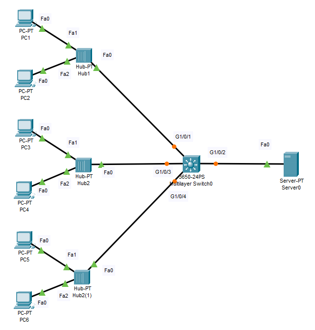

# Porst Security Configuratoin
## Source (Udemy: David Bombal Course)

### Lab File Link (pkt): [Here](https://mega.nz/file/SlgCUDrJ#e1vMV8hILSUDGZcNNu2WFO84ubyS70eQWvKQpZVxCJs)
### Scenario: 

## **Configure Port Security as follows:**
# **1) Use just one port security command on G1/0/1**
```
Questions: 
a. By default, how MAC addresses are permitted?
b. Verify that only the first host is allowed.
c. What happens when the second host sends traffic into the network?
d. Is the first host's MAC address written to the running configuration?
e. What happens when the switch is power cycled (save config first)? 
```
### **a. By default, how MAC addresses are permitted?**
```
One MAC address.
```
### **b. Verify that only the first host is allowed.**
> By default PC1 and PC2 ip address is set to dhcp. First change it to static. Otherwise when we enable port-Security which PC receive dhcp message first port security will store that pc's mac address. But we want only the PC1 will be receive the ip address via dhcp. So that's why we manually set the ip configuration is static.    
```
SW1#sh port-security
Secure Port MaxSecureAddr CurrentAddr SecurityViolation Security Action
               (Count)       (Count)        (Count)
--------------------------------------------------------------------
     Gig1/0/1        1          0                 0         Shutdown 🟩
----------------------------------------------------------------------
```
```
SW1#sh port-security int g1/0/1
Port Security              : Enabled
Port Status                : Secure-up 🟩
Violation Mode             : Shutdown 🟩
Aging Time                 : 0 mins
Aging Type                 : Absolute
SecureStatic Address Aging : Disabled
Maximum MAC Addresses      : 1 🟩
Total MAC Addresses        : 0
Configured MAC Addresses   : 0
Sticky MAC Addresses       : 0
Last Source Address:Vlan   : 0000.0000.0000:0 🟩
Security Violation Count   : 0
```
```
SW1#sh port-security address
               Secure Mac Address Table
-----------------------------------------------------------------------------
Vlan    Mac Address       Type                          Ports   Remaining Age
                                                                   (mins)
----    -----------       ----                          -----   -------------
-----------------------------------------------------------------------------
Total Addresses in System (excluding one mac per port)     : 0
Max Addresses limit in System (excluding one mac per port) : 1024
```
> Now go to PC1 and set the ip configuration as dhcp. Then go to pc1 command prompt.   
```
C:\>ipconfig /renew

   IP Address......................: 10.1.1.5
   Subnet Mask.....................: 255.255.255.0
   Default Gateway.................: 10.1.1.254
   DNS Server......................: 10.1.1.254
```
> The upper command we see that pc1 is receive a ip address via dhcp. So the sw must store the pc1 mac-address (00C0.1111.1111) for port-security.   
```
SW1#sh port-security address
               Secure Mac Address Table
-----------------------------------------------------------------------------
Vlan    Mac Address       Type                          Ports   Remaining Age
                                                                   (mins)
----    -----------       ----                          -----   -------------
1	00C0.1111.1111	DynamicConfigured	GigabitEthernet1/0/1		-
-----------------------------------------------------------------------------
Total Addresses in System (excluding one mac per port)     : 0
Max Addresses limit in System (excluding one mac per port) : 1024
```
```
SW1#sh port-sec int g1/0/1
Port Security              : Enabled
Port Status                : Secure-up 🟩
Violation Mode             : Shutdown
Aging Time                 : 0 mins
Aging Type                 : Absolute
SecureStatic Address Aging : Disabled
Maximum MAC Addresses      : 1
Total MAC Addresses        : 1
Configured MAC Addresses   : 0
Sticky MAC Addresses       : 0
Last Source Address:Vlan   : 00C0.1111.1111:1 🟩
Security Violation Count   : 0
```
> Now this time if I want to go to PC2 and set the ip configuration to dhcp and try to allocate a new ip address via dhcp the dhcp request message will be failed. Because the maximum mac-address is 1 and already this is pc1 mac-address. That's why pc2's dhcp message is failed and store the mac-address of pc2 as a violating mac-address. Notice the Porst Status is: **Secure-shutdown**
```
C:\>ipconfig /renew
DHCP request failed. 
```
```
SW1#sh port-sec int g1/0/1
Port Security              : Enabled
Port Status                : Secure-shutdown 🟩
Violation Mode             : Shutdown
Aging Time                 : 0 mins
Aging Type                 : Absolute
SecureStatic Address Aging : Disabled
Maximum MAC Addresses      : 1
Total MAC Addresses        : 0
Configured MAC Addresses   : 0
Sticky MAC Addresses       : 0
Last Source Address:Vlan   : 00C0.2222.2222:1 🟩
Security Violation Count   : 1 🟩
```
### **c. What happens when the second host sends traffic into the network?**
> The interface will be shutdown.  
```
SW1#sh port-sec 
Secure Port MaxSecureAddr CurrentAddr SecurityViolation Security Action
               (Count)       (Count)        (Count)
--------------------------------------------------------------------
     Gig1/0/1        1          0                 1         Shutdown 🟩
----------------------------------------------------------------------
```
### **d. Is the first host's MAC address written to the running configuration?**
### **The answer is: NO.**
> The g1/0/1 is now shutdown state. Go to pc2 and set the ip config to static and then go to sw1 and issue this command:  
```
SW1(config)#int g1/0/1
SW1(config-if)#shut
SW1(config-if)#no shut
```
> From PC1:  
```
C:\>ipconfig /renew

   IP Address......................: 10.1.1.5
   Subnet Mask.....................: 255.255.255.0
   Default Gateway.................: 10.1.1.254
   DNS Server......................: 10.1.1.254
```
```
SW1#sh port-sec address
               Secure Mac Address Table
-----------------------------------------------------------------------------
Vlan    Mac Address       Type                          Ports   Remaining Age
                                                                   (mins)
----    -----------       ----                          -----   -------------
1	00C0.1111.1111	DynamicConfigured	GigabitEthernet1/0/1		-
-----------------------------------------------------------------------------
Total Addresses in System (excluding one mac per port)     : 0
Max Addresses limit in System (excluding one mac per port) : 1024
```
> Now save the configuration file and reload the switch and check the running configuration:  
```
SW1#wr
Building configuration...
Compressed configuration from 7383 bytes to 3601 bytes[OK]
[OK]
SW1#reload
```
```
SW1#sh run 
interface GigabitEthernet1/0/1
 switchport mode access
 switchport port-security
```
```
SW1#sh port-sec int g1/0/1
Port Security              : Enabled
Port Status                : Secure-up 🟩
Violation Mode             : Shutdown
Aging Time                 : 0 mins
Aging Type                 : Absolute
SecureStatic Address Aging : Disabled
Maximum MAC Addresses      : 1
Total MAC Addresses        : 0
Configured MAC Addresses   : 0
Sticky MAC Addresses       : 0
Last Source Address:Vlan   : 0000.0000.0000:0 🟩
Security Violation Count   : 0
```
```
SW1#sh port-sec add
               Secure Mac Address Table
-----------------------------------------------------------------------------
Vlan    Mac Address       Type                          Ports   Remaining Age
                                                                   (mins)
----    -----------       ----                          -----   -------------
-----------------------------------------------------------------------------
Total Addresses in System (excluding one mac per port)     : 0
Max Addresses limit in System (excluding one mac per port) : 1024
```
> So we can see that all the configuration was removed. Now if we turn on the dhcp of pc2 first then the sw1 will store the mac address of pc2. 

### **e. What happens when the switch is power cycled (save config first)?**
```
A different mac-address could be learnt. We are not restricting mac-address on this port we are only restricting the number of mac-address allowed on that port. If the switch reboots then a different mac-address could be learnt on that port and the original mac-address coule be seen as a violating mac-address.
```

# **3) Enable port security on G1/0/4 by manually specifying PC5's MAC address. Drop other traffic and send log messages when a violation occurs.**
```
SW1(config)#int g1/0/4
SW1(config-if)#switchport mode access
SW1(config-if)#switchport port-security 
SW1(config-if)#switchport port-security violation restrict
SW1(config-if)#switchport port-security mac-address 00C0.5555.5555
```
```
SW1#sh run 
interface GigabitEthernet1/0/4
 switchport mode access
 switchport port-security
 switchport port-security violation restrict  🟩
 switchport port-security mac-address 00C0.5555.5555 🟩
!
```
> Go to PC5:  
```
C:\>ipconfig /renew

   IP Address......................: 10.1.1.4
   Subnet Mask.....................: 255.255.255.0
   Default Gateway.................: 10.1.1.254
   DNS Server......................: 10.1.1.254
```
```
SW1#sh port-security int g1/0/4
Port Security              : Enabled
Port Status                : Secure-up
Violation Mode             : Restrict
Aging Time                 : 0 mins
Aging Type                 : Absolute
SecureStatic Address Aging : Disabled
Maximum MAC Addresses      : 1 🟩
Total MAC Addresses        : 1 🟩
Configured MAC Addresses   : 1
Sticky MAC Addresses       : 0
Last Source Address:Vlan   : 00C0.5555.5555:1 🟩
Security Violation Count   : 0 🟩
```
Go to PC6:    
```
C:\>ipconfig /renew
DHCP request failed. 
```
```
SW1#sh port-security int g1/0/4
Port Security              : Enabled
Port Status                : Secure-up 🟩
Violation Mode             : Restrict
Aging Time                 : 0 mins
Aging Type                 : Absolute
SecureStatic Address Aging : Disabled
Maximum MAC Addresses      : 1
Total MAC Addresses        : 1
Configured MAC Addresses   : 1
Sticky MAC Addresses       : 0
Last Source Address:Vlan   : 00C0.6666.6666:1
Security Violation Count   : 2 🟩
```


 