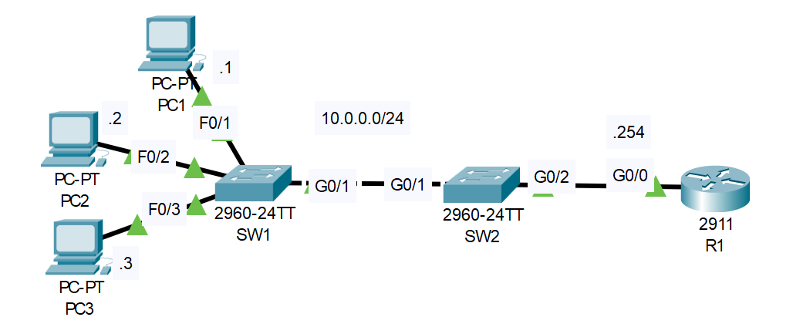

# Port Security Configuration
## Source (YouTube: Jeremy's IT Lab)
### Video Link: [Here](https://youtu.be/zZwhrxKeGj8?si=0LG7ACloc6nSBQPZ)
### Lab File Link (pkt): [Here Day-49](https://mega.nz/file/b0QzWKxI#Y8byKsrf5UJO1KyOYmxM7Fmp8js7lP_5zBQgUOz_7Os)
### Scenario: 


# **1. Configure port security on the following interfaces:**
```
Given: 
SW1 F0/1, F0/2, F0/3
Violation mode: Shutdown
Maximum addresses: 1
Sticky learning: Disabled
Aging time: 1 hour
```
### **First check the switchport status of f0/1-3. Because we can't enable port-security of an interface which administrative mode is dynamic auto. So that's why first check the port status of f0/1-3.**
```
SW1#sh int f0/1 switchport 
Name: Fa0/1
Switchport: Enabled
Administrative Mode: dynamic auto 🟩
Operational Mode: static access
Administrative Trunking Encapsulation: dot1q
```
### **Now change the interface type as access port.**
```
SW1#conf t	
SW1(config)#int range f0/1-3
SW1(config-if-range)#switchport mode access
```
### **The default Violation mode is shutdown, default maximum mac address allowed is 1 and also sticy learing is disable by default. So we just need to enable port security and configure the aging time 60 minutes. That's it...!**
```
SW1(config-if-range)#switchport port-security
SW1(config-if-range)#switchport port-security aging time 60
```
### **Now check if we did it correctly.**	
```
SW1#sh port-security int f0/2
Port Security              : Enabled 🟩
Port Status                : Secure-up
Violation Mode             : Shutdown 🟩
Aging Time                 : 60 mins 🟩
Aging Type                 : Absolute
SecureStatic Address Aging : Disabled
Maximum MAC Addresses      : 1 🟩
Total MAC Addresses        : 0
Configured MAC Addresses   : 0
Sticky MAC Addresses       : 0
Last Source Address:Vlan   : 0000.0000.0000:0
Security Violation Count   : 0
```
# **2. Configure port security on the following interfaces:**
```
Given: 
SW2 G0/1
Violation mode: Restrict
Maximum addresses: 4
Sticky learning: Enabled
```
### **First Configure everything as requirements.**
```
SW2(config)#int g0/1
SW2(config-if)#sw mode access
SW2(config-if)#switchport port-security
SW2(config-if)#switchport port-security violation restrict
SW2(config-if)#switchport port-security maximum 4
SW2(config-if)#switchport port-security mac-address sticky
```
### **Now check if everything is ok...!**
```
SW2(config-if)#do sh port-security int g0/1
Port Security              : Enabled
Port Status                : Secure-up
Violation Mode             : Restrict 🟩
Aging Time                 : 0 mins
Aging Type                 : Absolute
SecureStatic Address Aging : Disabled
Maximum MAC Addresses      : 4 🟩
Total MAC Addresses        : 1
Configured MAC Addresses   : 0
Sticky MAC Addresses       : 0
Last Source Address:Vlan   : 0060.471C.1D19:1
Security Violation Count   : 0
```
# **3. Trigger port security violations on SW1 and SW2 (for example by connecting another PC) and observe the actions taken by each switch.**
### **Go to PC1, PC2 and PC3 and ping R1:**
```
C:\>ping 10.0.0.254
```
### **Now go to SW2 and see the status before and after the ping:**
> Before ping:    
```
SW2(config-if)#do sh port-security int g0/1
Port Security              : Enabled
Port Status                : Secure-up
Violation Mode             : Restrict
Aging Time                 : 0 mins
Aging Type                 : Absolute
SecureStatic Address Aging : Disabled
Maximum MAC Addresses      : 4
Total MAC Addresses        : 1 🟩
Configured MAC Addresses   : 0
Sticky MAC Addresses       : 0
Last Source Address:Vlan   : 0060.471C.1D19:1
Security Violation Count   : 0
```
> After ping (note the difference):    
```
SW2(config-if)#
SW2(config-if)#do sh port-security int g0/1
Port Security              : Enabled
Port Status                : Secure-up
Violation Mode             : Restrict
Aging Time                 : 0 mins
Aging Type                 : Absolute
SecureStatic Address Aging : Disabled
Maximum MAC Addresses      : 4
Total MAC Addresses        : 4 🟩
Configured MAC Addresses   : 0
Sticky MAC Addresses       : 3
Last Source Address:Vlan   : 0060.471C.1D19:1
Security Violation Count   : 0
```
> Running configuration of SW2's g0/1 interface:   
```
SW2(config-if)#do sh run
interface GigabitEthernet0/1
 switchport mode access
 switchport port-security
 switchport port-security maximum 4
 switchport port-security mac-address sticky 
 switchport port-security violation restrict 
 switchport port-security mac-address sticky 0001.0001.0001
 switchport port-security mac-address sticky 0002.0002.0002
 switchport port-security mac-address sticky 0003.0003.0003
 switchport port-security mac-address sticky 0060.471c.1d19
```
> Check the mac address table: (Type is showing static because of sticky learning). Total 4 mac address beacuse 3 from pc's and one from sw1 interface which is connected to sw2. 
```
SW2#sh mac address-table
          Mac Address Table
-------------------------------------------

Vlan    Mac Address       Type        Ports
----    -----------       --------    -----

   1    0001.0001.0001    STATIC      Gig0/1
   1    0002.0002.0002    STATIC      Gig0/1
   1    0003.0003.0003    STATIC      Gig0/1
   1    0060.471c.1d19    STATIC      Gig0/1
```
> Check the port-security status:  
```
SW2#sh port-security
Secure Port MaxSecureAddr CurrentAddr SecurityViolation Security Action
               (Count)       (Count)        (Count)
--------------------------------------------------------------------
       Gig0/1        4          4                 0         Restrict
----------------------------------------------------------------------
```
### **SW2 violation check.** 
> Go to SW1 and set the SVI for vlan1. Now if SW1 tries to ping R1 the source MAC address will be the MAC address of the vlan1 SVI. SW2 learns the mac address of SW1 g0/1 interface but it doesn't learn the mac address of vlan1 SVI. So let's try that ping. The ping doesn't work, SW2 blocking the ping because of the unauthorized source MAC address.     
```
SW1(config)#int vlan 1
SW1(config-if)#ip address 10.0.0.10 255.255.255.0 
SW1(config-if)#no shut 
---------------------------------------------------
SW1(config-if)#do ping 10.0.0.254
Type escape sequence to abort.
Sending 5, 100-byte ICMP Echos to 10.0.0.254, timeout is 2 seconds:
Success rate is 0 percent (0/5)
```
> Now go to SW2 and check the violation status:  
```
SW2#sh port-security int g0/1
Port Security              : Enabled
Port Status                : Secure-up
Violation Mode             : Restrict
Aging Time                 : 0 mins
Aging Type                 : Absolute
SecureStatic Address Aging : Disabled
Maximum MAC Addresses      : 4
Total MAC Addresses        : 4
Configured MAC Addresses   : 0
Sticky MAC Addresses       : 3
Last Source Address:Vlan   : 0060.471C.1D19:1
Security Violation Count   : 6 🟩
```
### **SW1 violation check.**
> First go to PC1 and change it's mac address.   

> Original mac address of PC1:  
```
0001.0001.0001
```
> Change the mac address:  
```
0001.0001.000a
```
> From PC1 now ping R1:    
```
C:\>ping 10.0.0.254

Pinging 10.0.0.254 with 32 bytes of data:

Request timed out.
Request timed out.
Request timed out.
Request timed out.

Ping statistics for 10.0.0.254:
    Packets: Sent = 4, Received = 0, Lost = 4 (100% loss),
```
> Examine the violation status in SW1:  
```
%LINK-5-CHANGED: Interface FastEthernet0/1, changed state to administratively down

%LINEPROTO-5-UPDOWN: Line protocol on Interface FastEthernet0/1, changed state to down

SW1#sh port-security int f0/1
Port Security              : Enabled
Port Status                : Secure-shutdown
Violation Mode             : Shutdown 🟩
Aging Time                 : 60 mins
Aging Type                 : Absolute
SecureStatic Address Aging : Disabled
Maximum MAC Addresses      : 1
Total MAC Addresses        : 0
Configured MAC Addresses   : 0
Sticky MAC Addresses       : 0
Last Source Address:Vlan   : 0001.0001.000A:1
Security Violation Count   : 1 🟩
```
# **All necessary commands at a glance.**
```
SW1(config)#int range f0/1-3
SW1(config-if-range)#switchport mode access
SW1(config-if-range)#switchport port-security
SW1(config-if-range)#switchport port-security aging time 60
--------------------------------------------------------------
SW2(config)#int g0/1
SW2(config-if)#sw mode access
SW2(config-if)#switchport port-security
SW2(config-if)#switchport port-security violation restrict
SW2(config-if)#switchport port-security maximum 4
SW2(config-if)#switchport port-security mac-address sticky
--------------------------------------------------------------
SW1(config)#int vlan 1
SW1(config-if)#ip address 10.0.0.10 255.255.255.0 
SW1(config-if)#no shut 
```
## **[The End]** 