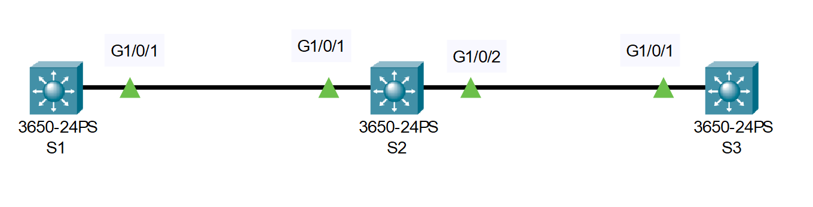

# VTP Configuration 
## Source (Udemy: David Bombal Course)

### Lab File Link (pkt): [Here](https://mega.nz/file/DhxiGJyL#pJQ5dH-FzFx7mAlcWBfl5OEPiDsOVi_cNd3Idm0X_k0)
### Scenario: 


# **Configure VTP as follows**

### **1) S2 should not synchronize its VLAN database with other switches (Use a VTP domain of ccna)**
> We first need to set the all ports between switches as trunk because by default they are set to access port.   
```
SW1(config)#int g1/0/1
SW1(config-if)#switchport mode trunk 

SW2(config)#int range g1/0/1-2
SW2(config-if-range)#switchport mode trunk 

SW3(config)#int g1/0/1
SW3(config-if)#switchport mode trunk 
```
> Now set the SW2 vtp mode transparent  
```
SW2(config)#vtp domain ccna
SW2(config)#vtp mode transparent
```
```
SW2(config)#do sh vtp status
VTP Version capable             : 1 to 2
VTP version running             : 1
VTP Domain Name                 : ccna 🟩
VTP Pruning Mode                : Disabled
VTP Traps Generation            : Disabled
Device ID                       : 0030.F222.AC00
Configuration last modified by 0.0.0.0 at 0-0-00 00:00:00

Feature VLAN : 
--------------
VTP Operating Mode                : Transparent 🟩
Maximum VLANs supported locally   : 1005
Number of existing VLANs          : 5
Configuration Revision            : 0
MD5 digest                        : 0xE1 0x2A 0x13 0xE5 0xB3 0xA4 0x96 0xA4 
                                    0xD5 0x24 0x3A 0x44 0x82 0x4A 0x95 0xEB 
```
### **2) Users should be able to add VLANs on S1 and S2, but not S3.**
> In question 1 we configure sw2 first. So let's create vlan on sw2 first.  
```
SW2(config)#vlan 20
SW2(config-vlan)#vlan 22
```
```
SW2(config-vlan)#do sh vlan brief

VLAN Name                             Status    Ports
---- -------------------------------- --------- -------------------------------
1    default                          active    Gig1/0/3, Gig1/0/4, Gig1/0/5, Gig1/0/6
                                                Gig1/0/7, Gig1/0/8, Gig1/0/9, Gig1/0/10
                                                Gig1/0/11, Gig1/0/12, Gig1/0/13, Gig1/0/14
                                                Gig1/0/15, Gig1/0/16, Gig1/0/17, Gig1/0/18
                                                Gig1/0/19, Gig1/0/20, Gig1/0/21, Gig1/0/22
                                                Gig1/0/23, Gig1/0/24, Gig1/1/1, Gig1/1/2
                                                Gig1/1/3, Gig1/1/4
20   VLAN0020                         active   🟩 
22   VLAN0022                         active   🟩 
1002 fddi-default                     active    
1003 token-ring-default               active    
1004 fddinet-default                  active    
1005 trnet-default                    active  
```
> So we can create vlan in sw2. Since it is in transparent mode sw2 doesn't synchronize it's vlan databasae with other switches. We cant see the vlan 20 and 22 in sw1 and sw3.  

> Now add vlan in sw1. (Remember the vtp domain is already set to ccna in sw1 and sw3 because we already set domain into sw2 first. Although sw2 is in transparent mode it doesn't synchronize its vlan database but will send and recieve vtp messages from other switches.)   
```
SW1(config)#vlan 10
SW1(config-vlan)#vlan 11
```
```
SW1(config-vlan)#do sh vlan brief

VLAN Name                             Status    Ports
---- -------------------------------- --------- -------------------------------
1    default                          active    Gig1/0/2, Gig1/0/3, Gig1/0/4, Gig1/0/5
                                                Gig1/0/6, Gig1/0/7, Gig1/0/8, Gig1/0/9
                                                Gig1/0/10, Gig1/0/11, Gig1/0/12, Gig1/0/13
                                                Gig1/0/14, Gig1/0/15, Gig1/0/16, Gig1/0/17
                                                Gig1/0/18, Gig1/0/19, Gig1/0/20, Gig1/0/21
                                                Gig1/0/22, Gig1/0/23, Gig1/0/24, Gig1/1/1
                                                Gig1/1/2, Gig1/1/3, Gig1/1/4
10   VLAN0010                         active    🟩
11   VLAN0011                         active    🟩
1002 fddi-default                     active    
1003 token-ring-default               active    
1004 fddinet-default                  active    
1005 trnet-default                    active  
```
> So we are able to add vlan in sw1 also. This vlan 10 and 11 will **not** be synchronize with sw2 hence it is transparent mode but this will be synchronize with sw3 and you will be able to see vlan 10 and 11 in sw3. Lets check:  
```
SW3#sh vlan brief

VLAN Name                             Status    Ports
---- -------------------------------- --------- -------------------------------
1    default                          active    Gig1/0/2, Gig1/0/3, Gig1/0/4, Gig1/0/5
                                                Gig1/0/6, Gig1/0/7, Gig1/0/8, Gig1/0/9
                                                Gig1/0/10, Gig1/0/11, Gig1/0/12, Gig1/0/13
                                                Gig1/0/14, Gig1/0/15, Gig1/0/16, Gig1/0/17
                                                Gig1/0/18, Gig1/0/19, Gig1/0/20, Gig1/0/21
                                                Gig1/0/22, Gig1/0/23, Gig1/0/24, Gig1/1/1
                                                Gig1/1/2, Gig1/1/3, Gig1/1/4
10   VLAN0010                         active    🟩
11   VLAN0011                         active    🟩
1002 fddi-default                     active    
1003 token-ring-default               active    
1004 fddinet-default                  active    
1005 trnet-default                    active 
```
> Since sw3 default vtp mode is server we'll now add vlan in sw3 also but our question says that we can't add vlan in sw3. So we need to change the vtp mode to client.  
```
SW3(config)#vtp mode client 
SW3(config)#vlan 40
VTP VLAN configuration not allowed when device is in CLIENT mode.
```
# **Verification:**
### **1) Prove that VLANs created on S1 are replicated to S3, but not to S2**
> We already did it in the upper answer. See the last two 'sh vlan brief' command on SW1 and SW3.  

## **[The End]**