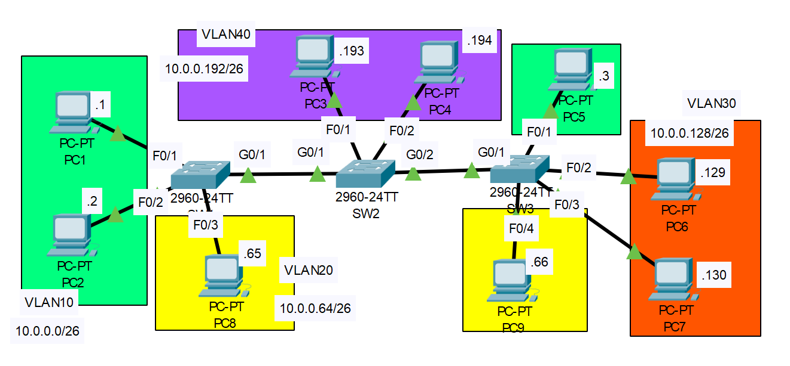

# VTP and DTP Configuration
## Source (YouTube: Jeremy's IT Lab)
### Video Link: [Here](https://youtu.be/ngTns2vF_44?si=sVq9wZi0Wcl0xCeh)
### Lab File Link (pkt): [Here Day-19](https://mega.nz/file/z85kDZJZ#MUsCls6LHmxpHmUjn896eNnIrSbY2tYvgYCmCy6IMV4)
### Scenario: 


# **◆ ▬▬▬▬▬▬▬ ❴1❵ ▬▬▬▬▬▬▬ ◆**
### **Configure the switchports connecting switches as trunk ports.**
> First check the SW1 g0/1 interface status:  
```
SW1(config-if)#do sh int g0/1 sw
Name: Gig0/1
Switchport: Enabled
Administrative Mode: dynamic auto 🟩
Operational Mode: static access 🟩
Administrative Trunking Encapsulation: dot1q
Operational Trunking Encapsulation: native
Negotiation of Trunking: On 🟩
```
### **Disable DTP on the ports.**    
```
SW1#conf t
SW1(config)#int g0/1
SW1(config-if)#switchport mode trunk 
SW1(config-if)#switchport nonegotiate 
```
### **Confirm the administrative and operational mode of each interface.**
```
SW1#sh int g0/1 switchport 
Name: Gig0/1
Switchport: Enabled
Administrative Mode: trunk 🟩
Operational Mode: trunk 🟩
Administrative Trunking Encapsulation: dot1q
Operational Trunking Encapsulation: dot1q
Negotiation of Trunking: Off 🟩
```
### **Do this same thing for SW2 and Sw3.**  
> SW2:  
```
SW2(config)#int range g0/1-2
SW2(config-if-range)#switchport mode trunk 
SW2(config-if-range)#switchport nonegotiate
```
```
SW2(config-if-range)#do sh int g0/1 sw
Name: Gig0/1
Switchport: Enabled
Administrative Mode: trunk
Operational Mode: trunk 🟩
Administrative Trunking Encapsulation: dot1q
Operational Trunking Encapsulation: dot1q
Negotiation of Trunking: Off 🟩
```
```
SW2(config-if-range)#do sh int g0/2 sw
Name: Gig0/2
Switchport: Enabled
Administrative Mode: trunk
Operational Mode: trunk 🟩
Administrative Trunking Encapsulation: dot1q
Operational Trunking Encapsulation: dot1q
Negotiation of Trunking: Off 🟩
```
> SW3:    
```
SW3(config)#int g0/1
SW3(config-if)#switchport mode trunk 
SW3(config-if)#switchport nonegotiate 
```
```
SW3(config-if)#do sh int g0/1 sw
Name: Gig0/1
Switchport: Enabled
Administrative Mode: trunk
Operational Mode: trunk 🟩
Administrative Trunking Encapsulation: dot1q
Operational Trunking Encapsulation: dot1q
Negotiation of Trunking: Off 🟩
```
# **◆ ▬▬▬▬▬▬▬ ❴2❵ ▬▬▬▬▬▬▬ ◆**
### **Configure SW1 in VTP domain CCNA.**
> First check the vtp status:  
```
SW1#sh vtp status
VTP Version                     : 1
Configuration Revision          : 0
Maximum VLANs supported locally : 255
Number of existing VLANs        : 5
VTP Operating Mode              : Server 🟩
VTP Domain Name                 : 🟩
VTP Pruning Mode                : Disabled
VTP V2 Mode                     : Disabled
VTP Traps Generation            : Disabled
MD5 digest                      : 0x7D 0x5A 0xA6 0x0E 0x9A 0x72 0xA0 0x3A 
Configuration last modified by 0.0.0.0 at 0-0-00 00:00:00
Local updater ID is 0.0.0.0 (no valid interface found)
```
```
SW1#conf t
SW1(config)#vtp domain ccna
Changing VTP domain name from NULL to ccna
```
### **Create VLANs 10, 20, and 30 on SW1.**
```
SW1(config)#vlan 10
SW1(config-vlan)#vlan 20
SW1(config-vlan)#vlan 30
```
```
SW1(config-vlan)#do sh vtp status
VTP Version                     : 1
Configuration Revision          : 3
Maximum VLANs supported locally : 255
Number of existing VLANs        : 8 🟩
VTP Operating Mode              : Server 🟩
VTP Domain Name                 : ccna 🟩
VTP Pruning Mode                : Disabled
VTP V2 Mode                     : Disabled
VTP Traps Generation            : Disabled
MD5 digest                      : 0x83 0xCF 0x9B 0x7C 0x95 0x03 0xF4 0x3C 
Configuration last modified by 0.0.0.0 at 2-28-93 21:40:44
Local updater ID is 0.0.0.0 (no valid interface found)
```
```
SW1(config-vlan)#do sh vlan brief

VLAN Name                             Status    Ports
---- -------------------------------- --------- -------------------------------
1    default                          active    Fa0/1, Fa0/2, Fa0/3, Fa0/4
                                                Fa0/5, Fa0/6, Fa0/7, Fa0/8
                                                Fa0/9, Fa0/10, Fa0/11, Fa0/12
                                                Fa0/13, Fa0/14, Fa0/15, Fa0/16
                                                Fa0/17, Fa0/18, Fa0/19, Fa0/20
                                                Fa0/21, Fa0/22, Fa0/23, Fa0/24
                                                Gig0/2
10   VLAN0010                         active  🟩  
20   VLAN0020                         active  🟩 
30   VLAN0030                         active  🟩 
1002 fddi-default                     active    
1003 token-ring-default               active    
1004 fddinet-default                  active    
1005 trnet-default                    active   
```
### **Have SW2 and SW3 added VLANs 10, 20, and 30?**
> Yes...    

> SW2:  
```
SW2#sh vtp status
VTP Version                     : 1
Configuration Revision          : 3
Maximum VLANs supported locally : 255
Number of existing VLANs        : 8
VTP Operating Mode              : Server
VTP Domain Name                 : ccna 🟩
VTP Pruning Mode                : Disabled
VTP V2 Mode                     : Disabled
VTP Traps Generation            : Disabled
MD5 digest                      : 0x83 0xCF 0x9B 0x7C 0x95 0x03 0xF4 0x3C 
Configuration last modified by 0.0.0.0 at 2-28-93 21:40:44
Local updater ID is 0.0.0.0 (no valid interface found)
```
```
SW2#sh vlan brief

VLAN Name                             Status    Ports
---- -------------------------------- --------- -------------------------------
1    default                          active    Fa0/1, Fa0/2, Fa0/3, Fa0/4
                                                Fa0/5, Fa0/6, Fa0/7, Fa0/8
                                                Fa0/9, Fa0/10, Fa0/11, Fa0/12
                                                Fa0/13, Fa0/14, Fa0/15, Fa0/16
                                                Fa0/17, Fa0/18, Fa0/19, Fa0/20
                                                Fa0/21, Fa0/22, Fa0/23, Fa0/24
10   VLAN0010                         active    
20   VLAN0020                         active    
30   VLAN0030                         active    
1002 fddi-default                     active    
1003 token-ring-default               active    
1004 fddinet-default                  active    
1005 trnet-default                    active  
```
> SW3:  
```
SW3#sh vlan brief

VLAN Name                             Status    Ports
---- -------------------------------- --------- -------------------------------
1    default                          active    Fa0/1, Fa0/2, Fa0/3, Fa0/4
                                                Fa0/5, Fa0/6, Fa0/7, Fa0/8
                                                Fa0/9, Fa0/10, Fa0/11, Fa0/12
                                                Fa0/13, Fa0/14, Fa0/15, Fa0/16
                                                Fa0/17, Fa0/18, Fa0/19, Fa0/20
                                                Fa0/21, Fa0/22, Fa0/23, Fa0/24
                                                Gig0/2
10   VLAN0010                         active    
20   VLAN0020                         active    
30   VLAN0030                         active    
1002 fddi-default                     active    
1003 token-ring-default               active    
1004 fddinet-default                  active    
1005 trnet-default                    active
```
# **◆ ▬▬▬▬▬▬▬ ❴3❵ ▬▬▬▬▬▬▬ ◆**

### **Configure SW2 in VTP transparent mode.**
> First check the default vtp mode:  
```
SW2(config)#do sh vtp status 
VTP Version                     : 1
Configuration Revision          : 3
Maximum VLANs supported locally : 255
Number of existing VLANs        : 8
VTP Operating Mode              : Server 🟩
VTP Domain Name                 : ccna
VTP Pruning Mode                : Disabled
VTP V2 Mode                     : Disabled
VTP Traps Generation            : Disabled
MD5 digest                      : 0x83 0xCF 0x9B 0x7C 0x95 0x03 0xF4 0x3C 
Configuration last modified by 0.0.0.0 at 2-28-93 21:40:44
Local updater ID is 0.0.0.0 (no valid interface found)
```
> Now make it transpartent.  
```
SW2(config)#vtp mode transparent 
Setting device to VTP TRANSPARENT mode.
```
```
SW2(config)#do sh vtp status
VTP Version                     : 1
Configuration Revision          : 0
Maximum VLANs supported locally : 255
Number of existing VLANs        : 8 🟩
VTP Operating Mode              : Transparent 🟩
VTP Domain Name                 : ccna
VTP Pruning Mode                : Disabled
VTP V2 Mode                     : Disabled
VTP Traps Generation            : Disabled
MD5 digest                      : 0xAD 0x0A 0x92 0xA8 0x83 0xFA 0x84 0x3C 
Configuration last modified by 0.0.0.0 at 2-28-93 21:40:44
```
### **Add VLAN40 to SW2.**
```
SW2(config)#vlan 40
```
```
SW2(config-vlan)#do sh vtp status 
VTP Version                     : 1
Configuration Revision          : 0
Maximum VLANs supported locally : 255
Number of existing VLANs        : 9 🟩
VTP Operating Mode              : Transparent 🟩
VTP Domain Name                 : ccna
VTP Pruning Mode                : Disabled
VTP V2 Mode                     : Disabled
VTP Traps Generation            : Disabled
MD5 digest                      : 0xAD 0x0A 0x92 0xA8 0x83 0xFA 0x84 0x3C 
Configuration last modified by 0.0.0.0 at 2-28-93 21:40:44
```
```
SW2(config-vlan)#do sh vlan brief

VLAN Name                             Status    Ports
---- -------------------------------- --------- -------------------------------
1    default                          active    Fa0/1, Fa0/2, Fa0/3, Fa0/4
                                                Fa0/5, Fa0/6, Fa0/7, Fa0/8
                                                Fa0/9, Fa0/10, Fa0/11, Fa0/12
                                                Fa0/13, Fa0/14, Fa0/15, Fa0/16
                                                Fa0/17, Fa0/18, Fa0/19, Fa0/20
                                                Fa0/21, Fa0/22, Fa0/23, Fa0/24
10   VLAN0010                         active    
20   VLAN0020                         active    
30   VLAN0030                         active    
40   VLAN0040                         active   🟩 
1002 fddi-default                     active    
1003 token-ring-default               active    
1004 fddinet-default                  active    
1005 trnet-default                    active  
```
### **Is VLAN40 added to the VLAN database of SW1/SW3?**
> No...Because if we enable VTP mode transparent in a switch then that switch don't send its own vtp advertisement but forward other switches vtp advertisement receive from different switch in this case from sw1 and sw3.  
```
SW1#sh vlan brief

VLAN Name                             Status    Ports
---- -------------------------------- --------- -------------------------------
1    default                          active    Fa0/1, Fa0/2, Fa0/3, Fa0/4
                                                Fa0/5, Fa0/6, Fa0/7, Fa0/8
                                                Fa0/9, Fa0/10, Fa0/11, Fa0/12
                                                Fa0/13, Fa0/14, Fa0/15, Fa0/16
                                                Fa0/17, Fa0/18, Fa0/19, Fa0/20
                                                Fa0/21, Fa0/22, Fa0/23, Fa0/24
                                                Gig0/2
10   VLAN0010                         active    
20   VLAN0020                         active    
30   VLAN0030                         active    
1002 fddi-default                     active    
1003 token-ring-default               active    
1004 fddinet-default                  active    
1005 trnet-default                    active 
```
> Notice vlan 40 is not listed in sw1 and sw3.  
```
SW3#sh vlan brief

VLAN Name                             Status    Ports
---- -------------------------------- --------- -------------------------------
1    default                          active    Fa0/1, Fa0/2, Fa0/3, Fa0/4
                                                Fa0/5, Fa0/6, Fa0/7, Fa0/8
                                                Fa0/9, Fa0/10, Fa0/11, Fa0/12
                                                Fa0/13, Fa0/14, Fa0/15, Fa0/16
                                                Fa0/17, Fa0/18, Fa0/19, Fa0/20
                                                Fa0/21, Fa0/22, Fa0/23, Fa0/24
                                                Gig0/2
10   VLAN0010                         active    
20   VLAN0020                         active    
30   VLAN0030                         active    
1002 fddi-default                     active    
1003 token-ring-default               active    
1004 fddinet-default                  active    
1005 trnet-default                    active 
```
# **◆ ▬▬▬▬▬▬▬ ❴4❵ ▬▬▬▬▬▬▬ ◆**
### **Configure SW3 in VTP client mode.**
```
SW3(config)#vtp mode client 
Setting device to VTP CLIENT mode.
```
```
SW3(config)#do sh vtp status 
VTP Version                     : 1
Configuration Revision          : 3
Maximum VLANs supported locally : 255
Number of existing VLANs        : 8
VTP Operating Mode              : Client 🟩
VTP Domain Name                 : ccna
VTP Pruning Mode                : Disabled
VTP V2 Mode                     : Disabled
VTP Traps Generation            : Disabled
MD5 digest                      : 0x83 0xCF 0x9B 0x7C 0x95 0x03 0xF4 0x3C 
Configuration last modified by 0.0.0.0 at 2-28-93 21:40:44
```
### **Try to configure VLAN50 on SW3. Is it added?**
> No...  
```
SW3(config)#vlan 50
VTP VLAN configuration not allowed when device is in CLIENT mode.
```

# **◆ ▬▬▬▬▬▬▬ ❴5❵ ▬▬▬▬▬▬▬ ◆**

### **Configure all switchports connected to hosts in the correct VLAN.**
```
SW1(config)#int range f0/1-2
SW1(config-if-range)#switchport mode access
SW1(config-if-range)#switchport access vlan 10
SW1(config-if-range)#int f0/3
SW1(config-if)#switchport mode access
SW1(config-if)#switchport access vlan 20 
```
```
SW2(config)#int range f0/1-2
SW2(config-if-range)#switchport mode access 
SW2(config-if-range)#switchport access vlan 40
```
```
SW3(config)#int f0/1
SW3(config-if)#sw mode acc
SW3(config-if)#sw acc vlan 10
SW3(config-if)#int range f0/2-3
SW3(config-if-range)#sw mode acc
SW3(config-if-range)#sw acc vlan 30
SW3(config-if-range)#int f0/4
SW3(config-if)#sw mode acc
SW3(config-if)#sw acc vlan 20
```
### **Manually configure them as access ports.**
```
SW1(config-if)#do sh int f0/1 sw
Name: Fa0/1
Switchport: Enabled
Administrative Mode: static access
Operational Mode: static access 🟩
```
### **Is DTP still enabled on the switchports?**
> No...  
```
SW1(config-if)#do sh int f0/1 sw
Name: Fa0/1
Switchport: Enabled
Administrative Mode: static access
Operational Mode: static access
Administrative Trunking Encapsulation: dot1q
Operational Trunking Encapsulation: native
Negotiation of Trunking: Off 🟩
```

## **[The End]** 