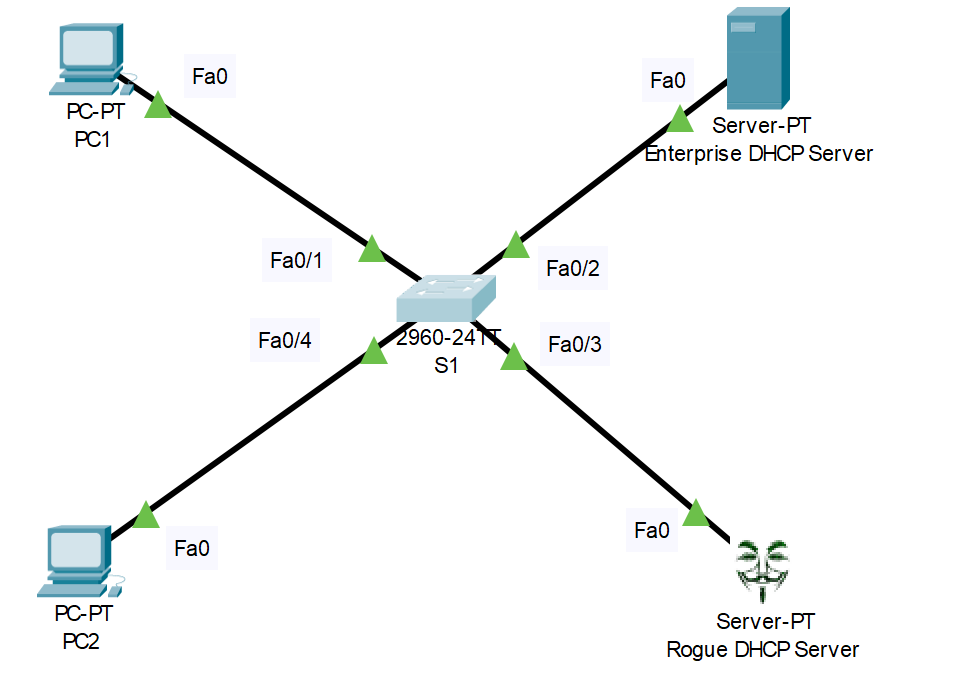

# DHCP Snooping Configuration
## Source (Udemy: David Bombal Course)

### Lab File Link (pkt): [Here](https://mega.nz/file/28YF2CyR#4nSWJMWyJIW5X8QGKDjcwqQUi4Cdgz0bOUivU3V-bGs)
### Scenario: 

# DHCP Snooping Configuration:  
```
Configure DHCP Snooping
1) Only trust the Enterprrise DHCP Server
2) Block the Rogue DHCP Server

Verification:
1) Use debugs to view results
2) Prove that DHCP packets are not allowed from the Rogue server
```
# **◆ ▬▬▬▬▬▬▬ ❴1❵ ▬▬▬▬▬▬▬ ◆**
> First check the dhcp snooping status of the switch:  
```
S1#sh ip dhcp snooping
Switch DHCP snooping is disabled 🟩
DHCP snooping is configured on following VLANs:
none 🟩
Insertion of option 82 is enabled
Option 82 on untrusted port is not allowed
Verification of hwaddr field is enabled
Interface                  Trusted    Rate limit (pps)
-----------------------    -------    ----------------
```
> Here notice one important thing. The legitimate dhcp server is in 10.1.1.0 subnet so the pc's must receive ip address from this subnet. But the problem is when I issue ipconfing /renew command multiple times on both pc the ip is allocate from the rouge dhcp server which is in 10.1.100.0 subnet. Which is really very bad and security issue. So we need to stop it...!  
```
C:\>ipconfig /renew

   IP Address......................: 10.1.1.2 🟩
   Subnet Mask.....................: 255.255.255.0
   Default Gateway.................: 10.1.1.254
   DNS Server......................: 10.1.1.200

C:\>ipconfig /renew

   IP Address......................: 10.1.100.3 🟩
   Subnet Mask.....................: 255.255.255.0
   Default Gateway.................: 10.1.100.254
   DNS Server......................: 10.1.100.254
```
> So for stop this we need to enable dhcp snooping and trust the port which is connected to the legitimate dhcp server.  
```
S1#conf t
S1(config)#ip dhcp snooping 
S1(config)#ip dhcp snooping vlan 1
S1(config)#no ip dhcp snooping information option 
S1(config)#int f0/2
S1(config-if)#ip dhcp snooping trust
```
> Now turn on the debug on the switch and issue ipconfig /renew command in pc.  
```
S1#debug ip dhcp snooping packet
```
```
C:\>ipconfig /renew

   IP Address......................: 10.1.1.2
   Subnet Mask.....................: 255.255.255.0
   Default Gateway.................: 10.1.1.254
   DNS Server......................: 10.1.1.200
```
> Now back to sw screen and see the debug output:  
```
S1#00:12:06: DHCP_SNOOPING: received new DHCP packet from input interface (FastEthernet0/1)
00:12:06: DHCP_SNOOPING: process new DHCP packet, message type: DHCP REQUEST, input interface: Fa0/1, MAC da: FFFF.FFFF.FFFF, MAC sa: 0001.43C9.501C, IP da: 255.255.255.255, IP sa: 0.0.0.0, DHCP ciaddr: 0.0.0.0, DHCP yiaddr: 10.1.1.2, DHCP siaddr: 10.1.1.200, DHCP giaddr: 10.1.1.254, DHCP chaddr: 0001.43C9.501C
00:12:06: DHCP_SNOOPING: direct forward dhcp reply to output port: FastEthernet0/1 🟩
00:12:06: DHCP_SNOOPING: received new DHCP packet from input interface (FastEthernet0/2)
00:12:06: DHCP_SNOOPING: process new DHCP packet, message type: DHCP ACK, input interface: Fa0/2, MAC da: FFFF.FFFF.FFFF, MAC sa: 0002.4ACA.E185, IP da: 255.255.255.255, IP sa: 10.1.1.200, DHCP ciaddr: 0.0.0.0, DHCP yiaddr: 10.1.1.2, DHCP siaddr: 10.1.1.200, DHCP giaddr: 10.1.1.254, DHCP chaddr: 0001.43C9.501C
00:12:06: DHCP_SNOOPING: direct forward dhcp reply to output port: FastEthernet0/2
```
# **◆ ▬▬▬▬▬▬▬ ❴2❵ ▬▬▬▬▬▬▬ ◆**
> Now check the snooping binding and snooping database:  
```
S1#sh ip dhcp snooping binding 
MacAddress          IpAddress        Lease(sec)  Type           VLAN  Interface
------------------  ---------------  ----------  -------------  ----  -----------------
00:01:43:C9:50:1C   10.1.1.2         86400       dhcp-snooping  1     FastEthernet0/1
00:02:4A:09:21:A9   10.1.1.1         86400       dhcp-snooping  1     FastEthernet0/4
Total number of bindings: 2
```
> This is the mac-address of pc1 and pc2.
```
S1#sh ip dhcp snooping database 
Agent URL : 
Write delay Timer : 300 seconds
Abort Timer : 

Agent Running : No
Delay Timer Expiry : Not Running
Abort Timer Expiry : Not Running

Last Succeded Time : None
Last Failed Time : None
Last Failed Reason : No failure recorded.

Total Attempts       :        3   Startup Failures :        0
Successful Transfers :        0   Failed Transfers :        0
Successful Reads     :        0   Failed Reads     :        0
Successful Writes    :        3   Failed Writes    :        0
Media Failures       :        0
```
> Now if I do ipconfig /renew in pc's multiple times the ip will be assign from the legitimate dhcp server. This time the switch will block the traffic from the rouge dhcp server because of the dhcp snooping enable.  

> Let's verify it  
```
C:\>ipconfig /renew

   IP Address......................: 10.1.1.2
   Subnet Mask.....................: 255.255.255.0
   Default Gateway.................: 10.1.1.254
   DNS Server......................: 10.1.1.200

C:\>ipconfig /renew

   IP Address......................: 10.1.1.2
   Subnet Mask.....................: 255.255.255.0
   Default Gateway.................: 10.1.1.254
   DNS Server......................: 10.1.1.200
```
> See the ip is in 10.1.1.0 subnet even if for multiple ipconfig /renew command. That's great...! 
## **[The End]**