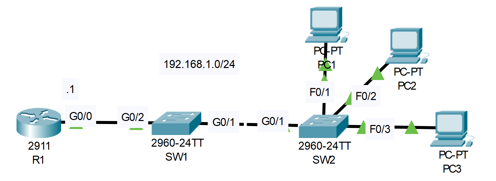

# DHCP Snooping Configuration
## Source (YouTube: Jeremy's IT Lab)
### Video Link: [Here](https://youtu.be/YMom_e545H4?si=oK48WAvFZkZ8I5i6)
### Lab File Link (pkt): [Here Day-50](https://mega.nz/file/DxAjQaaY#vw2BPHqcZtX17DaRETsr2sg4qp_lwvQX9mJHWNtzxBc)
### Scenario:

# **◆ ▬▬▬▬▬▬▬ ❴1❵ ▬▬▬▬▬▬▬ ◆**
```
🟩 Given: 
Configure R1 as a DHCP server.
Exclude 192.168.1.1 - 192.168.1.9 from the pool
Default gateway: R1
```
```
R1(config)#ip dhcp excluded-address 192.168.1.1 192.168.1.9
R1(config)#ip dhcp pool kibria
R1(dhcp-config)#network 192.168.1.0 255.255.255.0 
R1(dhcp-config)#default-router 192.168.1.1 
```
# **◆ ▬▬▬▬▬▬▬ ❴2❵ ▬▬▬▬▬▬▬ ◆**
```
🟩 Given: 
Configure DHCP snooping on SW1 and SW2.
Configure the uplink interfaces as trusted ports.
```
```
SW1(config)#ip dhcp snooping
SW1(config)#ip dhcp snooping vlan 1
SW1(config)#int g0/2
SW1(config-if)#ip dhcp snooping trust
```
```
SW2(config)#ip dhcp snooping 
SW2(config)#ip dhcp snooping vlan 1
SW2(config)#int g0/1
SW2(config-if)#ip dhcp snooping trust
```
# **◆ ▬▬▬▬▬▬▬ ❴3❵ ▬▬▬▬▬▬▬ ◆**
```
Use IPCONFIG /RENEW on PC1 to get an IP address.
Does it work?  Why or why not?
```
> On PC1:  
```
C:\>ipconfig /renew
DHCP request failed. 
```
> It does not works because option82 value on untrusted port, message type: DHCP DISCOVER, MAC sa: 0001.6432.B922  
# **◆ ▬▬▬▬▬▬▬ ❴4❵ ▬▬▬▬▬▬▬ ◆**
> If it doesn't work, make the necessary configuration change to fix it.  
```
SW1(config)#no ip dhcp snooping information option 
SW2(config)#no ip dhcp snooping information option 
```
> Now check again (from PC1):    
```
C:\>ipconfig /renew

   IP Address......................: 192.168.1.10
   Subnet Mask.....................: 255.255.255.0
   Default Gateway.................: 192.168.1.1
   DNS Server......................: 0.0.0.0
```
> Now it works. That's great...!

## **[The End]**
https://github.com/EZAZ-2281/Semester-09/assets/81481142/376f4d01-d015-4026-a30f-cdf3238bc874
