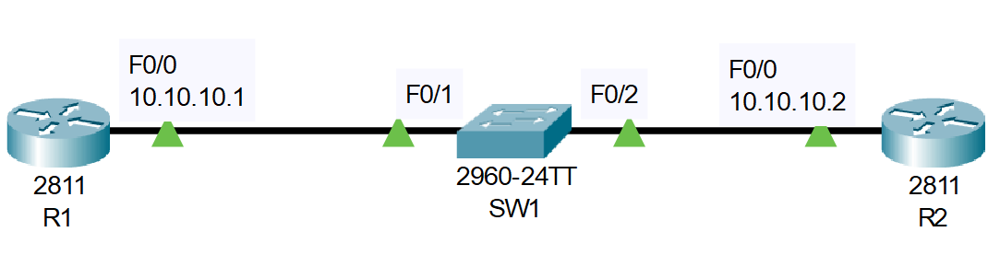

# Cisco Router and Switch Basic Configuration (Source: Udemy)
## Instructor: Neil Anderson  
### Scenario: 

### **Pkt file:** [Here](https://mega.nz/file/K1ACSDYT#pK48tiOe3vp9U91MSNxQZwsvLxTGm-rU0cY2yaKsSek)

# **Cisco Router and Switch Initial Configuration.**
### **1. Configure hostname on Router and two Switches.**
```
Router(config)#hostname R1
Switch(config)#hostname SW1
Router(config)#hostname R2
```
### **2. Configure IP address on R1 and R2.**
```
R1(config)#int f0/0
R1(config-if)#ip address 10.10.10.1 255.255.255.0
R1(config-if)#no shut

R2(config)#int f0/0
R2(config-if)#ip address 10.10.10.2 255.255.255.0
R2(config-if)#no shut
```
### **3. Give SW1 the management IP address 10.10.10.10/24**
```
SW1(config)#int vlan 1
SW1(config-if)#ip address 10.10.10.10 255.255.255.0
SW1(config-if)#no shut
```
### **4. The SW1 should have IP connectivity to other subnet via R2.**
```
SW1(config)#ip default-gateway 10.10.10.2
```
### **5. Verify the switch can ping it's default-gateway.**
```
SW1(config)#do ping 10.10.10.2
Type escape sequence to abort.
Sending 5, 100-byte ICMP Echos to 10.10.10.2, timeout is 2 seconds:
.!!!!
Success rate is 80 percent (4/5), round-trip min/avg/max = 0/0/0 ms
```
### **6. Enter suitable description on each device.**
```
R1(config)#int f0/0
R1(config-if)#description Link to SW1
SW1(config)#int f0/
----------------------------------------
SW1(config-if)#description Link to R1
SW1(config-if)#int f0/2
SW1(config-if)#description Link to R2
----------------------------------------
R2(config)#int f0/0
R2(config-if)#description Link to SW1
```
### **7. Verify the speed and duplex on SW1.**
```
SW1#sh int f0/1
FastEthernet0/1 is up, line protocol is up (connected)
  Hardware is Lance, address is 00e0.8fd6.8901 (bia 00e0.8fd6.8901)
  Description: Link to R1
 BW 100000 Kbit, DLY 1000 usec,
     reliability 255/255, txload 1/255, rxload 1/255
  Encapsulation ARPA, loopback not set
  Keepalive set (10 sec)
  **Full-duplex, 100Mb/s** 🟩
```
### **8. Manually configure full duplex and FastEthernet speed on the link to R2.**
```
SW1(config)#int f0/2
SW1(config-if)#speed 100
SW1(config-if)#duplex full

R2(config)#int f0/0
R2(config-if)#speed 100
R2(config-if)#duplex full
```
### **9. Show the running IOS version on SW1.**
```
SW1#sh version 
Cisco IOS Software, C2960 Software (C2960-LANBASE-M), Version 12.2(25)FX, RELEASE SOFTWARE (fc1)
Copyright (c) 1986-2005 by Cisco Systems, Inc.
```
# **CDP Configuration.**
### 10. Verify the directly attached Cisco neighbors using Cisco Discovery Protocol.**
```
SW1#sh cdp neighbors
Capability Codes: R - Router, T - Trans Bridge, B - Source Route Bridge
                  S - Switch, H - Host, I - IGMP, r - Repeater, P - Phone
Device ID    Local Intrfce   Holdtme    Capability   Platform    Port ID
R1           Fas 0/1          131            R       C2800       Fas 0/0
R2           Fas 0/2          126            R       C2800       Fas 0/0
```
### **11. Prevent R1 from discovering information about Switch 1 via CDP.**
```
R1(config)#int f0/0
R1(config-if)#no cdp run
```
### **12. Flush the CDP cache on R1 by entering the ‘no cdp run’ then ‘cdp run’ commands in global configuration mode.**
```
R1(config)#no cdp run
R1(config)#cdp run
```
### **13. Verify that R1 cannot see SW1 via CDP.**
```
R1#sh cdp neighbors
Capability Codes: R - Router, T - Trans Bridge, B - Source Route Bridge
                  S - Switch, H - Host, I - IGMP, r - Repeater, P - Phone
Device ID    Local Intrfce   Holdtme    Capability   Platform    Port ID
```
# **Switch Troubleshooting.**
### **14. Verify the status of the switch port connected to R2 with the show ip interface brief command. It should show status and protocol up/up.**
```
SW1#sh ip int brief
Interface              IP-Address      OK? Method Status                Protocol 
FastEthernet0/1        unassigned      YES manual up                    up 
FastEthernet0/2        unassigned      YES manual up                    up 
Vlan1                  10.10.10.10     YES manual up                    up
```
### **15. Shut down the interface connected to R2 and issue a show ip interface brief command again. The status and protocol should show administratively down/down.**
```
SW1(config)#int f0/2
SW1(config-if)#shut
SW1(config-if)#do sh ip int brief
Interface              IP-Address      OK? Method Status                Protocol 
FastEthernet0/1        unassigned      YES manual up                    up 
FastEthernet0/2        unassigned      YES manual administratively down down 
```
### **16. Bring the interface up again. Verify the speed and duplex setting.**
```
SW1(config-if)# int f0/2
SW1(config-if)#no shut
SW1(config-if)#do sh int f0/2
FastEthernet0/2 is up, line protocol is up (connected)
  Hardware is Lance, address is 00e0.8fd6.8902 (bia 00e0.8fd6.8902)
  Description: Link to R2
 BW 100000 Kbit, DLY 1000 usec,
     reliability 255/255, txload 1/255, rxload 1/255
  Encapsulation ARPA, loopback not set
  Keepalive set (10 sec)
  **Full-duplex, 100Mb/s** 🟩
```
### **17. Set the duplex to half on Switch 1. Leave the settings as they are on R2.**
```
SW1(config)#int f0/2
SW1(config-if)#duplex half
```
### **18. Verify the state of the interface.**
```
SW1(config-if)#do sh ip int brief
Interface              IP-Address      OK? Method Status                Protocol 
FastEthernet0/1        unassigned      YES manual up                    up 
FastEthernet0/2        unassigned      YES manual down                  down 🟩
```
### **19. Set the duplex back to full duplex.**
```
SW1(config-if)#int f0/2
SW1(config-if)#duplex full
```
### **20. Set the speed to 10 Mbps.**
```
SW1(config-if)#int f0/2
SW1(config-if)#speed 10
```
### **21. Check if the interface is still operational.**
```
SW1(config-if)#do sh ip int brief
Interface              IP-Address      OK? Method Status                Protocol 
FastEthernet0/1        unassigned      YES manual up                    up 
FastEthernet0/2        unassigned      YES manual down                  down 
```
> The interface status is down/down.  
### **22. Check if the interface is operational on R2. What is the status of the interface?**
```
R2#sh ip int brief
Interface              IP-Address      OK? Method Status                Protocol 
FastEthernet0/0        10.10.10.2      YES manual up                    down 
```
> The interface status is up/down.  
## **[The End]**