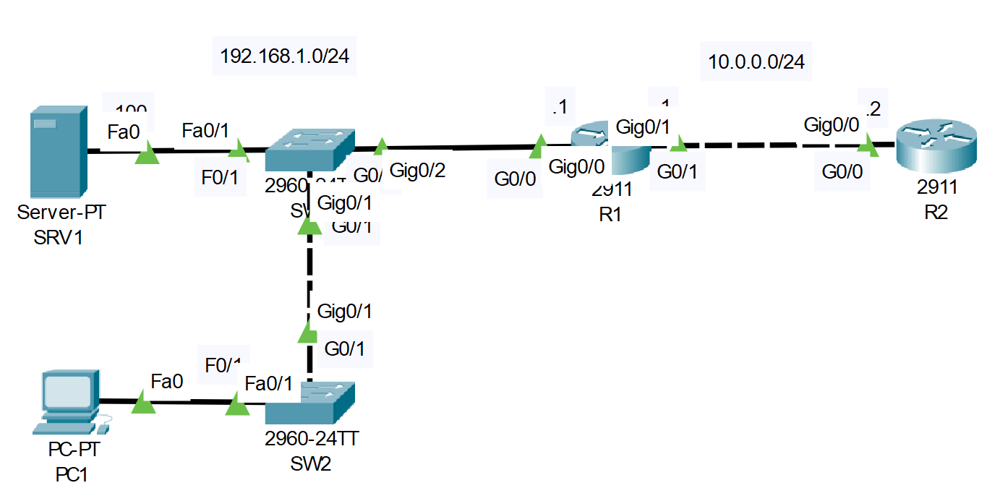

# OSI Model Lab
## Source (YouTube: Jeremy's IT Lab)
### Video Link: [Here](https://youtu.be/7nmYoL0t2tU?si=XRslb4Z6ywR0OgAH)
### Lab File Link (pkt): [Here Day-3](https://mega.nz/file/3xZQCJKD#2pjtg66QLlsiC6nOAPBuF7XFzwo0yhQwgcc30dnI4P8)
### Scenario:

1. Use 'simulation mode' to analyze the various traffic being sent throughout the network. What layers of the OSI model are being used?

2. Release and renew PC1's IP adress to generate some Layer 7 traffic. Analyze the traffic with simulation mode.

> Watch this video for answer:  

https://github.com/EZAZ-2281/freeCodeCamp/assets/81481142/228f6997-f6df-492b-b171-d39e5ebc777f

## **[The End]**

