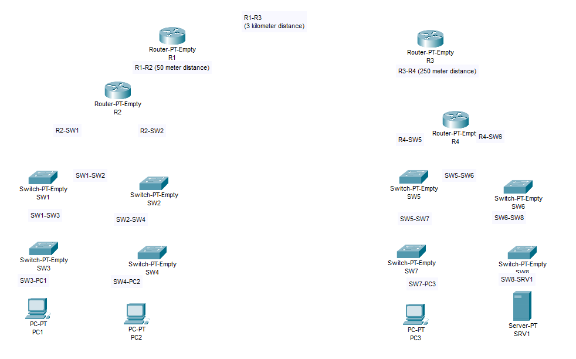
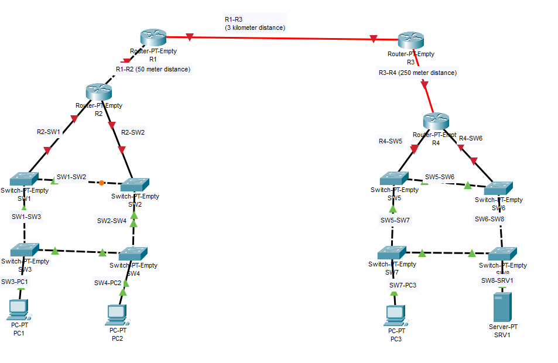

# Device Connectivity
## Source (YouTube: Jeremy's IT Lab)
### Video Link: [Here](https://youtu.be/K6Qt23sY68Y?si=zPdGXsVInRazs6_x)
### Lab File Link (pkt): [Here Day-2](https://mega.nz/file/K95FFaKK#juvC_v_oVIx09SWMq3aM48uD6w8FNQEfXaaJ7tiZL98)
### Scenario:


> Watch this video:  

https://github.com/EZAZ-2281/freeCodeCamp/assets/81481142/859833bd-af13-45bc-a7cc-dc696e864a01

```
R1 → R3 = Single Model Fiber.
R2 → R1 = Crossover cable. 
R3 → R4 = Multimode fiber (support upto 550m)
sw → sw = Crossover cable.
PC → sw = Copper Straigh-Through cable.
sw → R  = Copper Straing-Through cable.
sw → srv = Copper Straigh-Through cable.
```


## **[The End]**