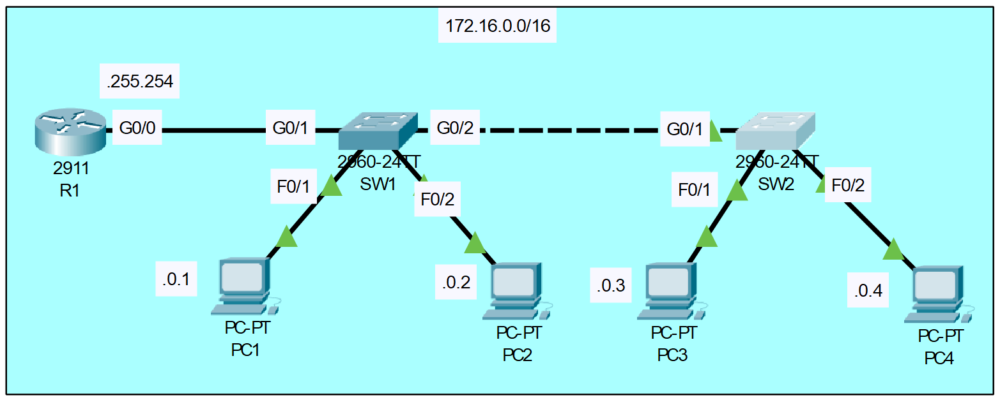

# DHCP Snooping Configuration
## Source (YouTube: Jeremy's IT Lab)
### Video Link: [Here](https://youtu.be/rzDb5DoBKRk?si=WaeoFOzx3poENm2O)
### Lab File Link (pkt): [Here Day-9](https://mega.nz/file/n04FkZAD#seMjDDrFKLJ2sKdsj4tq_3bSJWXfJe-Nj1JeBpFN-H8)
### Scenario:

## **1. Configure the hostname of R1, SW1, and SW2.**
```
Router(config)#hostname R1
R1(config)#
Switch(config)#hostname SW1
SW1(config)#
Switch(config)#hostname SW2
SW2(config)#
```
## **2. Configure the appropriate IP addresses on R1, PC1, PC2, PC3, PC4.**
```
R1(config)#int g0/0
R1(config-if)#ip address 172.16.255.254 255.255.0.0
R1(config-if)#no shut
```
> In PC1 to PC4 the dafault gateway is: 172.16.255.254
```
IP address of each pc's:  
PC1: 172.16.0.1 255.255.0.0
PC2: 172.16.0.2 255.255.0.0 
PC3: 172.16.0.3 255.255.0.0
PC4: 172.16.0.4 255.255.0.0
```
## **3. Manually configure the speed and duplex on interfaces connected to other networking devices (not end hosts)** 
```
R1(config)#int g0/0
R1(config-if)#speed 1000
R1(config-if)#duplex full

SW1(config)#int range g0/1-2
SW1(config-if-range)#speed 1000
SW1(config-if-range)#duplex full

SW2(config)#int g0/1
SW2(config-if)#speed 1000
SW2(config-if)#duplex full
```
## **4. Configure appropriate descriptions on each interface.**
```
R1(config)#int g0/1
R1(config-if)#description Link to SW1
R1(config)#int range g0/1-2
R1(config-if-range)#description Do not use.
----------------------------------------------------
SW1(config)#int g0/1
SW1(config-if)#description Link to R1
SW1(config-if)#int g0/2
SW1(config-if)#description Link to SW2
SW1(config)#int range f0/1-2
SW1(config-if-range)#description Link to End Hosts
SW1(config-if)#int range f0/3-24
SW1(config-if-range)#description Do not use.
----------------------------------------------------
SW2(config)#int g0/1
SW2(config-if)#description Link to SW1
SW2(config)#int range f0/1-2
SW2(config-if-range)#description Link to End Hosts
SW2(config)#int range f0/3-24, g0/2
SW2(config-if-range)#description Do not use
```
### **5. Disable interfaces which are not connected to other devices.**
```
R1(config)#int range g0/1-2
R1(config-if-range)#shutdown

SW1(config-if)#int range f0/3-24
SW1(config-if-range)#shut

SW2(config)#int range f0/3-24, g0/2
SW2(config-if-range)#shutdown
```
### **6. How to check the interfaces.**
```
R1#sh ip int brief
```
```
SW1#sh ip int brief 
SW1#sh int status (remember this command will not works in Router) 
```
## **7. Save the running configuration file to startup configuration (three different way).**
```
R1#copy running-config startup-config 
Destination filename [startup-config]? 
Building configuration...
[OK]
```
```
SW1#write memory 
Building configuration...
[OK]
```
```
SW2#write
Building configuration...
[OK]
```
```
R1#sh start
SW1#sh start
SW2#sh start
```

## **[The End]**