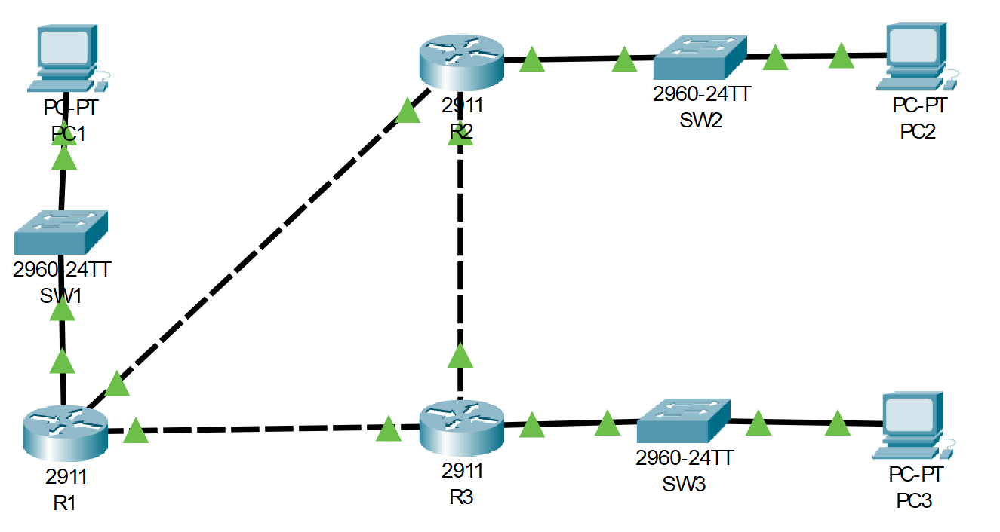

# CDP and LLDP Configuration
## Source (YouTube: Jeremy's IT Lab)
### Video Link: [Here](https://youtu.be/4s8qqL7R9W8?si=GybqozCK_MD5iNHf)
### Lab File Link (pkt): [Here Day-36](https://mega.nz/file/fkp2FRpA#QHBuq56BhHGAoqtzbxMDjrp-78sDikvmH8i3h33pyiw)
### Scenario:

### **1. Use CDP (and other commands) to identify and label the missing IP addresses and interface IDs of the devices in the network.**
> For identify PC's ip addresses use this command:  
```
ipconfig /all
```
> In switches and routers to see which interface is connected to another switches or router use this command: 
```
sh cdp neighbors 
```
> To see the ip address of neighbors router use this command:  
```
sh cdp entry R2 
```
> To see the switch interface which is connected to PCs use this command:  
```
sh int status
```
> To show the specific interface cdp status use this command:  
```
sh cdp int g0/1 
```
> After using this command the topology looks like this:  


### **2. Disable CDP on the switch interfaces currently connected to PCs.**
```
SW1(config)#int f0/10
SW1(config-if)#no cdp enable
SW1(config-if)#do sh cdp int f0/10
-------------------------------------
SW2(config)#int f0/1
SW2(config-if)#no cdp enable 
-------------------------------------
SW3(config)#int f0/24
SW3(config-if)#no cdp enable 
SW3(config-if)#do sh cdp int f0/24
```
### **3. Disable CDP globally on each network device.**
> Enable LLDP globally on each network device, and enable Tx/Rx on the interfaces connected to other network devices. Tx/Rx are currently disabled on all interfaces
```
SW1(config)#no cdp run
SW1(config)#lldp run
SW1(config)#int g0/1
SW1(config-if)#lldp transmit
SW1(config-if)#lldp receive
-------------------------------------
SW2(config)#no cdp run
SW2(config)#lldp run
SW2(config)#int g0/2
SW2(config-if)#lldp transmit
SW2(config-if)#lldp receive
-------------------------------------
SW3(config)#no cdp run
SW3(config)#lldp run
SW3(config)#int g0/1
SW3(config-if)#lldp transmit
SW3(config-if)#lldp receive
-------------------------------------
R1(config)#no cdp run
R1(config)#lldp run
R1(config)#int range g0/0-2
R1(config-if-range)#lldp transmit
R1(config-if-range)#lldp receive
-------------------------------------
R2(config)#no cdp run
R2(config)#lldp run
R2(config)#int range g0/0-2
R2(config-if-range)#lldp transmit
R2(config-if-range)#lldp receive
-------------------------------------
R3(config)#no cdp run
R3(config)#lldp run
R3(config)#int range g0/0-2
R3(config-if-range)#lldp transmit
R3(config-if-range)#lldp receive
``````
## **[The End]**