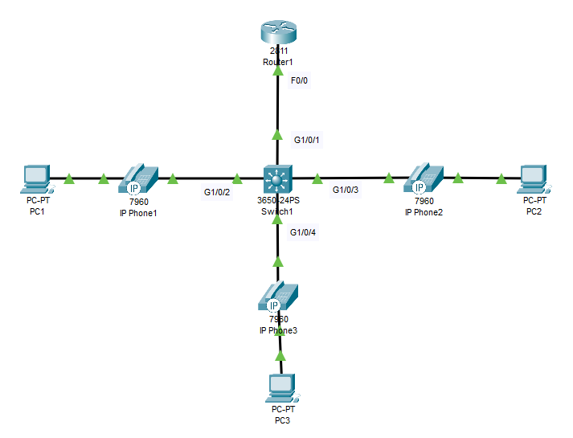

# Voice over IP Cnfiguration
## Source (Udemy: David Bombal Course)
### Lab File Link (pkt): [Here](https://mega.nz/file/aoYjiYTC#vXHLlE0nKgFeqiirGB_2GTUb1fQS5dtchXWQp-nU2v4)
### Scenario:


## **Configure Network and make calls between phones using the following:**

### **1) Configure the router with two DHCP Pools:**
```
  - PCs
    - Subnet: 10.1.100.0/24
    - Gateway: 10.1.100.254/24
    - DNS: 10.1.100.254/24
  - Phones
    - Subnet: 10.1.101.0/24
    - Gateway: 10.1.101.254/24
    - Option 150:10.1.101.254/24
```
> First enable cdp and no shut on int R1's f0/0:  
```
R1(config)#cdp run
R1(config)#int f0/0
R1(config-if)#no shut
```
> Now configure dhcp.  
```
R1(config)#ip dhcp pool pc
R1(dhcp-config)#network 10.1.100.0 255.255.255.0
R1(dhcp-config)#default-router 10.1.100.254
R1(dhcp-config)#dns-server 10.1.100.254

R1(dhcp-config)#ip dhcp pool phones
R1(dhcp-config)#network 10.1.101.0 255.255.255.0
R1(dhcp-config)#default-router 10.1.101.254
R1(dhcp-config)#option 150 ip 10.1.101.254 
```

### **2) Configure the router for inter-VLAN routing (router on a stick)**
```
  - VLAN 1: 10.1.1.254/24
  - VLAN 100: 10.1.100.254/24
  - VLAN 101: 10.1.101.254/24
```
```
R1(config)#int f0/0.1
R1(config-subif)#encapsulation dot1q 1 native 
R1(config-subif)#ip address 10.1.1.254 255.255.255.0

R1(config-subif)#int f0/0.100
R1(config-subif)#encapsulation dot1q 100
R1(config-subif)#ip address 10.1.100.254 255.255.255.0

R1(config-subif)#int f0/0.101
R1(config-subif)#encapsulation dot1q 101
R1(config-subif)#ip address 10.1.101.254 255.255.255.0
```
### **3) Configure Switch with Voice and Data VLANs**
```
SW1(config)#cdp run
```
```
SW1(config)#vlan 100
SW1(config-vlan)#name Data
SW1(config-vlan)#vlan 101
SW1(config-vlan)#name Voice
```
```
SW1(config)#int g1/0/1
SW1(config-if)#switchport mode trunk 

SW1(config-if)#int range g1/0/2-4
SW1(config-if-range)#switchport mode access
SW1(config-if-range)#switchport access vlan 100
SW1(config-if-range)#switchport voice vlan 101
```
### **4) Switch Management IP address = 10.1.1.253/24 and default gateway = router.**
```
SW1(config)#int vlan 1
SW1(config-if)#ip address 10.1.1.253 255.255.255.0
SW1(config-if)#no shut
SW1(config-if)#ip default-gateway 10.1.1.254
```
### **5) Verification**
- Verify phone power usage
```
SW1#sh power inline
Available:780.0(w)  Used:30.0(w)  Remaining:750.0(w)

Interface Admin  Oper       Power   Device              Class Max
                            (Watts)
--------- ------ ---------- ------- ------------------- ----- ----
Gig1/0/1  auto   off        0.0     n/a                 n/a   30.0
Gig1/0/2  auto   on         10.0    Switch 7960         3     30.0
Gig1/0/3  auto   on         10.0    Switch 7960         3     30.0
Gig1/0/4  auto   on         10.0    Switch 7960         3     30.0
```
- Verify that Phones are visible via CDP
```
SW1#sh cdp neighbors 
Capability Codes: R - Router, T - Trans Bridge, B - Source Route Bridge
                  S - Switch, H - Host, I - IGMP, r - Repeater, P - Phone
Device ID    Local Intrfce   Holdtme    Capability   Platform    Port ID
Switch       Gig 1/0/2        161            H P     7960         
Switch       Gig 1/0/4        161            H P     7960         
Switch       Gig 1/0/3        161            H P     7960         
R1           Gig 1/0/1        146            R       C2800       Fas 0/0
R1           Gig 1/0/1        146            R       C2800       Fas 0/0.1
R1           Gig 1/0/1        146            R       C2800       Fas 0/0.100
R1           Gig 1/0/1        146            R       C2800       Fas 0/0.101
```
- Make sure the IP Phones can call each other
```
It works
```
- Make sure that PCs can ping the switch
```
C:\>ping 10.1.1.253

Pinging 10.1.1.253 with 32 bytes of data:

Request timed out.
Reply from 10.1.1.253: bytes=32 time=1ms TTL=254
Reply from 10.1.1.253: bytes=32 time<1ms TTL=254
Reply from 10.1.1.253: bytes=32 time<1ms TTL=254

Ping statistics for 10.1.1.253:
    Packets: Sent = 4, Received = 3, Lost = 1 (25% loss),
Approximate round trip times in milli-seconds:
    Minimum = 0ms, Maximum = 1ms, Average = 0ms
```
> We can also use this command: **sh ephones**
## **[The End]**