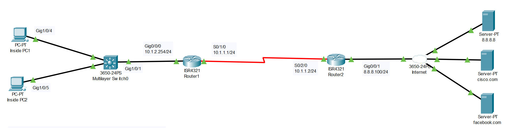

# QoS Cnfiguration
## Source (Udemy: David Bombal Course)
### Lab File Link (pkt): [Here](https://mega.nz/file/O4h0BCwA#5qJEt32mOOPTjbBXXoEorPTkCbzk8KLMfkAE6He1K5k)
### Scenario:

## **Configure QOS as follows:**

### **On Router1:**
```
1) Match traffic:
- Voice traffic using NBAR (rtp)
	-> Set DSCP to EF
- HTTP using NBAR (http)
	-> Set DSCP to AF31
- ICMP using NBAR (icmp)
	-> Set DSCP to AF11

2) Bind outbound on s0/1/0
- Voice should get priority bandwidth of 100kbps
- HTTP should get minimum bandwidth of 50kbps
- ICMP should get minimum bandwidth of 25kbps
```
```
R1(config)#class-map voice 
R1(config-cmap)#match protocol rtp
R1(config-cmap)#class-map http
R1(config-cmap)#match protocol http
R1(config-cmap)#class-map icmp 
R1(config-cmap)#match protocol icmp 
-----------------------------------------
R1(config)#policy-map mask 
R1(config-pmap)#class voice 
R1(config-pmap-c)#set ip dscp ef
R1(config-pmap-c)#priority 100
R1(config-pmap-c)#class http 
R1(config-pmap-c)#set ip dscp af31
R1(config-pmap-c)#bandwidth 50
R1(config-pmap-c)#class icmp 
R1(config-pmap-c)#set ip dscp af11
R1(config-pmap-c)#bandwidth 25
-----------------------------------------
R1(config)#int s0/1/0
R1(config-if)#service-policy output mask
```
```
R1#sh policy-map 
  Policy Map mask
    Class voice
      Strict Priority
      Bandwidth 100 (kbps) Burst 2500 (Bytes)
      set ip dscp ef
    Class http
      Bandwidth 50 (kbps) Max Threshold 64 (packets)
      set ip dscp af31
    Class icmp
      Bandwidth 25 (kbps) Max Threshold 64 (packets)
      set ip dscp af11
```
### **On Router2:**
```
1) Match traffic:
- Voice traffic using DSCP EF
-> Set IP Precedence to 5
- HTTP using DSCP AF31
-> Set IP Precedence to 3
- ICMP using DSCP AF11
-> Set IP Precedence to 0

2) Bind inbound on s0/2/0
```
```
R2(config)#class-map voice 
R2(config-cmap)#match ip dscp ef
R2(config-cmap)#class-map http
R2(config-cmap)#match ip dscp af31
R2(config-cmap)#class-map icmp 
R2(config-cmap)#match ip dscp af11
-----------------------------------------
R2(config)#policy-map remask
R2(config-pmap)#class voice 
R2(config-pmap-c)#set precedence 5
R2(config-pmap-c)#class http 
R2(config-pmap-c)#set precedence 3
R2(config-pmap-c)#class icmp 
R2(config-pmap-c)#set precedence 0
-----------------------------------------
R2(config)#int s0/2/0
R2(config-if)#service-policy input remask 
```
```
R2(config-if)#do sh policy-map
  Policy Map remask
    Class voice
      set precedence 5
    Class http
      set precedence 3
    Class icmp
      set precedence 0
```
```
R2(config-if)#do sh policy-map int s0/2/0
 Serial0/2/0

  Service-policy input: remask

    Class-map: voice (match-all)
      0 packets, 0 bytes
      5 minute offered rate 0 bps, drop rate 0 bps
      Match: ip dscp ef (46)
      QoS Set
        precedence 5
          Packets marked 0

    Class-map: http (match-all)
      0 packets, 0 bytes 🟩
      5 minute offered rate 0 bps, drop rate 0 bps
      Match: ip dscp af31 (26)
      QoS Set
        precedence 3
          Packets marked 0

    Class-map: icmp (match-all)
      0 packets, 0 bytes
      5 minute offered rate 0 bps, drop rate 0 bps
      Match: ip dscp af11 (10)
      QoS Set
        precedence 0
          Packets marked 0

    Class-map: class-default (match-any)
      11 packets, 396 bytes
      5 minute offered rate 14 bps, drop rate 0 bps
      Match: any
```
### **Verification:**
https://github.com/EZAZ-2281/Learning-JavaScript/assets/81481142/81748948-5ef7-4ea3-95d7-59d486d6d4fb

1) Open browser on PC1 and PC2 and browse to cisco.com and facebook.com
- Verify matches in policy
```
http://cisco.com
Class-map: http (match-all)
      72 packets, 2898 bytes 🟩
      5 minute offered rate 140 bps, drop rate 0 bps
      Match: ip dscp af31 (26)
      QoS Set
        precedence 3
          Packets marked 72
```
2) Ping cisco.com from PC1 and PC2
- Verify matches in policy
```
C:\>ping cisco.com
Class-map: icmp (match-all)
      4 packets, 512 bytes
      5 minute offered rate 16 bps, drop rate 0 bps
      Match: ip dscp af11 (10)
      QoS Set
        precedence 0
          Packets marked 4
```
## **[The End]**
 