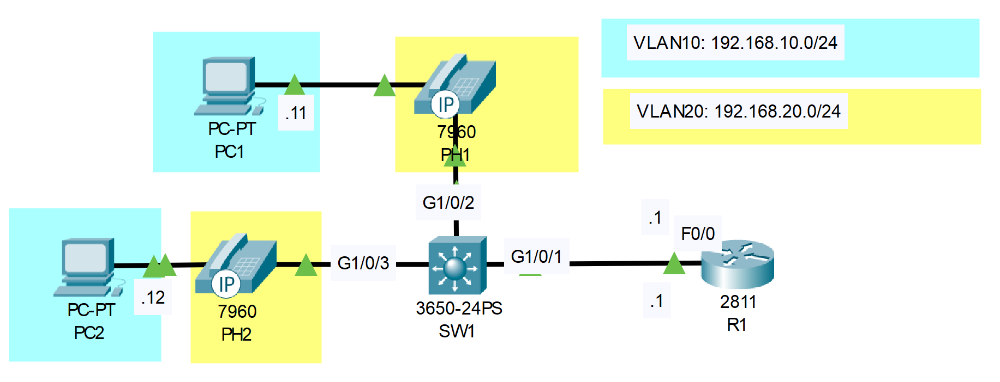

# QoS Configuration
## Source (YouTube: Jeremy's IT Lab)
### Video Link: [Here](https://youtu.be/kGX76QNIjsE?si=nR8oT-cqCXVjTKyW)
### Lab File Link (pkt): [Here Day-46](https://mega.nz/file/DwJBTQyR#h0-f9gjNULuUoumoi8euFNalM5W53t1Mhu0rzH_9pcc)
### Scenario:

## **Telephony configurations (not relevant to the CCNA) have been pre-configured on R1**
### **1. Configure SW1's interfaces in the appropriate VLANs.**
```
SW1(config)#int range g1/0/2-3
SW1(config-if-range)#switchport mode access 
SW1(config-if-range)#switchport access vlan 10 
SW1(config-if-range)#switchport voice vlan 20
```
### **2. Configure ROAS for the connection between SW1 and R1.**
```
SW1(config)#int g1/0/1
SW1(config-if)#switchport mode trunk 
SW1(config-if)#switchport trunk allowed vlan 10,20
```
```
R1(config)#int f0/0
R1(config-if)#no shut

R1(config-if)#int f0/0.10
R1(config-subif)#encapsulation dot1q 10
R1(config-subif)#ip address 192.168.10.1 255.255.255.0 

R1(config-subif)#int f0/0.20
R1(config-subif)#encapsulation dot1q 20
R1(config-subif)#ip address 192.168.20.1 255.255.255.0 
```
### **3. In simulation mode, ping PC2 from PC1. Is the traffic tagged with a VLAN ID?**
```
C:\>ping 192.168.10.12

Pinging 192.168.10.12 with 32 bytes of data:

Reply from 192.168.10.12: bytes=32 time<1ms TTL=128
Reply from 192.168.10.12: bytes=32 time=1ms TTL=128
Reply from 192.168.10.12: bytes=32 time=1ms TTL=128
Reply from 192.168.10.12: bytes=32 time<1ms TTL=128

Ping statistics for 192.168.10.12:
    Packets: Sent = 4, Received = 4, Lost = 0 (0% loss),
Approximate round trip times in milli-seconds:
    Minimum = 0ms, Maximum = 1ms, Average = 0ms
```
> There is no 802.1q tag in the outbound PDUs.  

### **4. In simulation mode, call PH1 from PH2. Is the traffic tagged with a VLAN ID?**
> Watch this video    

https://github.com/EZAZ-2281/freeCodeCamp/assets/81481142/dbec2427-6aca-4786-91bc-7e7bad4a505f

> Yes traffice is tagged with the vlan number. 
> That means data traffice is not tag (pc-pc) but the voice vlan is tagged.  
## **[The End]**