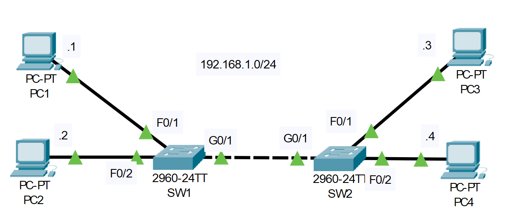

# Basic Ethernet LAN Switching
## Source (YouTube: Jeremy's IT Lab)
### Video Link: [Here](https://youtu.be/Ig0dSaOQDI8?si=lg58LMZBddSGYnAJ)
### Lab File Link (pkt): [Here Day-06](https://mega.nz/file/PpwABL4A#wv26vsU5h3ek3HL5qxnHscFiAEbFTtnZ7udUgmlZ4ck)
### Scenario:

## **Both switches have an empty MAC address table, and all PCs have an empty ARP table.**

1. If PC1 pings to PC3, what messages will be sent over the network, and which devices will receive them?

- arp request which is received by pc2, pc3 and pc4. 
- arp reply which is received by pc1. 
- icmp echo request which is received by pc3. 
- icmp echo reply which is received by pc1. 

2. Send the ping and use Packet Tracer's 'simulation mode' to verify your answer.

3. Use pings to generate network traffic and allow the switches to learn the MAC addresses of all PCs on the network.

4. Use 'show' commands on the switches to identify the MAC address of each PC.

5. Clear the dynamic MAC addresses from the MAC address table of each switch.

> Watch this short video for the answer of 2-5:  

https://github.com/EZAZ-2281/freeCodeCamp/assets/81481142/c4ce7c9b-8ae7-49bd-aedb-1710f823bdda

> All necessary commands:  
```
C:\>ping 192.168.1.3
SW2#sh mac address-table dynamic 
SW2#clear mac address-table dynamic 
```
## **[The End]**