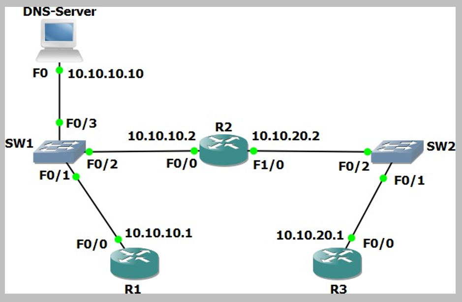

# Troubleshoot Connectivity to DNS Server (Source: Udemy)
## Instructor: Neil Anderson  
### **Pkt file:** [Here](https://mega.nz/file/W5wAAYpS#o0GLDCXFXvzLR-Gkp6p5HOoUcECLGUlwwbB9cmhzC_Q)
### Scenario: 


# **Troubleshoot Connectivity to DNS Server**
This configures the lab topology as shown above with R3 as a DNS server and adds static routes between R1 and R3.

Note that routers cannot be DNS servers in Packet Tracer (it does not support the ‘ip dns server’ command) so we are using a Packet Tracer server device as the DNS server.

1) The host with IP address 10.10.10.10 has been configured as a DNS server and should be able to resolve requests for ‘R1’, ‘R2’ and ‘R3’. Members of staff have complained that DNS is not working.

2) From R3, use Telnet to check if the DNS service appears operational on the DNS server at 10.10.10.10.
``````
R3#telnet 10.10.10.10
Trying 10.10.10.10 ...
% Connection timed out; remote host not responding
``````
3) When you have verified that DNS is not working, troubleshoot and fix the problem. You have fixed the problem when R3 can ping R1 by hostname. Note that there may be more than one issue causing the problem.

(You can click on the DNS server and then the ‘Services’ tab to check the server’s DNS configuration.)

Hint: you can use the show ip interface brief command to verify interfaces are operational on routers and switches. This command will be covered in more detail in the next section.

### **Solution**


> Watch this video:  

https://github.com/EZAZ-2281/CCNA-200-301-Lab/assets/81481142/bcc079f4-1275-463f-9770-bca1ef87bb07

## **[The End]**