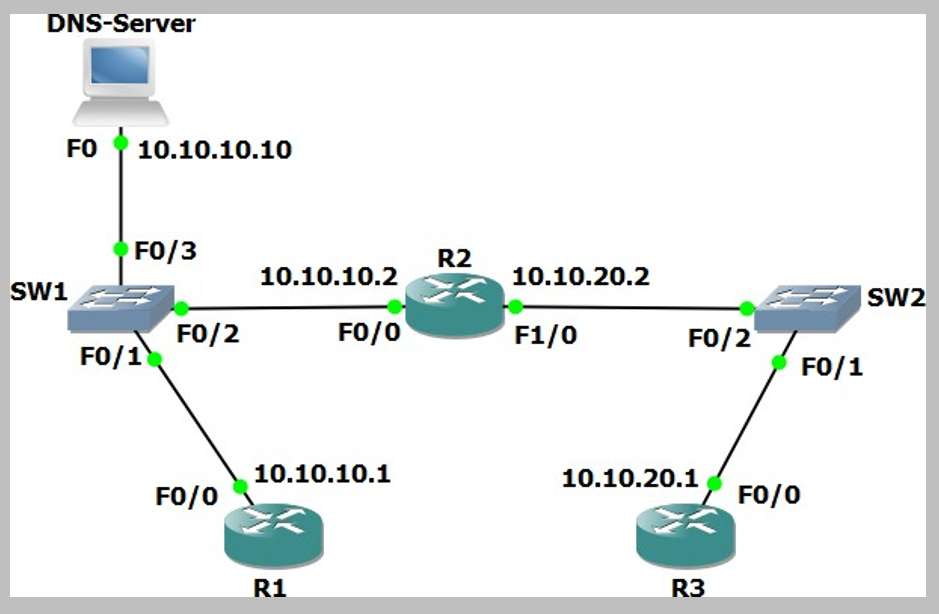

# Life of a Packet (Source: Udemy)
## Instructor: Neil Anderson  
### **Pkt file:** [Here](https://mega.nz/file/q4gUQaKA#uHjHLVy5yHovepr0KLrLcpG6uDqdeCvZ3nNowoHhP4w)
### Scenario: 


# **Configure the Routers as DNS Clients**

Note that routers cannot be DNS servers in Packet Tracer (it does not support the ‘ip dns server’ command) so we are using a Packet Tracer server device as the DNS server.

The host with IP address 10.10.10.10 has been configured as a DNS server and is able to resolve DNS requests for ‘R1’, ‘R2’ and ‘R3’.
A domain name is not in use.

1)	Configure R1, R2 and R3 to use 10.10.10.10 as their DNS server. You do not need to configure a domain-name or domain-list.
```
R1(config)#ip domain-lookup
R1(config)#ip name-server 10.10.10.10

R2(config)#ip domain-lookup
R2(config)#ip name-server 10.10.10.10

R3(config)#ip domain-lookup
R3(config)#ip name-server 10.10.10.10
```
2)	Verify that you can ping R2 and R3 from R1 using their hostnames ‘R1’ and ‘R3’ (it may take some time for the DNS server to resolve the DNS request).
```
R1#ping r2 ✅
Translating "r2"...domain server (10.10.10.10)
Type escape sequence to abort.
Sending 5, 100-byte ICMP Echos to 10.10.10.2, timeout is 2 seconds:
.!!!!
Success rate is 80 percent (4/5), round-trip min/avg/max = 0/2/10 ms

R1#ping r3 ✅
Translating "r3"...domain server (10.10.10.10)
Type escape sequence to abort.
Sending 5, 100-byte ICMP Echos to 10.10.20.1, timeout is 2 seconds:
.!!!!
Success rate is 80 percent (4/5), round-trip min/avg/max = 0/0/1 ms
```
3)	Verify that you can ping R1 and R2 from R3 using their hostnames ‘R1’ and ‘R2’.
- Also works.  

# **Examine the ARP Cache on the Routers**
4)	Do you expect to see an entry for R3 in the ARP cache of R1? Why or why not?
> ARP requests use broadcast traffic so they are not forwarded by a router. R1 will have entries in its ARP cache for all hosts it has seen on its directly connected networks (10.10.10.0/24). 
 
> R1 is not directly connected to the 10.10.20.0/24 network so it will not have an entry in the ARP cache for R3 at 10.10.20.1.  

> R1 can reach R3 via R2’s IP address 10.10.10.2 – this IP address is included in the ARP cache. The DNS server at 10.10.10.10 is also in the same IP subnet as R1 so will also appear in the ARP cache.  

5)	Verify the ARP cache on R1, R2 and R3. What do you see?
```
R1#sh arp
Protocol  Address          Age (min)  Hardware Addr   Type   Interface
Internet  10.10.10.1              -   0090.0CD7.0D01  ARPA   FastEthernet0/0
Internet  10.10.10.2              4   0004.9A96.A9A5  ARPA   FastEthernet0/0
Internet  10.10.10.10             4   0090.21C6.D284  ARPA   FastEthernet0/0
```
```
R2#sh arp
Protocol  Address          Age (min)  Hardware Addr   Type   Interface
Internet  10.10.10.1              4   0090.0CD7.0D01  ARPA   FastEthernet0/0
Internet  10.10.10.2              -   0004.9A96.A9A5  ARPA   FastEthernet0/0
Internet  10.10.20.1              4   0030.F2BA.30E7  ARPA   FastEthernet1/0
Internet  10.10.20.2              -   0060.2FCA.ACA0  ARPA   FastEthernet1/0
```
```
R3#sh arp
Protocol  Address          Age (min)  Hardware Addr   Type   Interface
Internet  10.10.20.1              -   0030.F2BA.30E7  ARPA   FastEthernet0/0
Internet  10.10.20.2              5   0060.2FCA.ACA0  ARPA   FastEthernet0/0
```

> R2 is directly connected to 10.10.10.0/24 and 10.10.20.0/24 so it has entries in its ARP cache for both networks.  

> R3 is directly connected to the 10.10.20.0/24 network so it has entries in its ARP cache for that network only. It does not have any entries for the 10.10.10.0/24 network.  

## **[The End]**