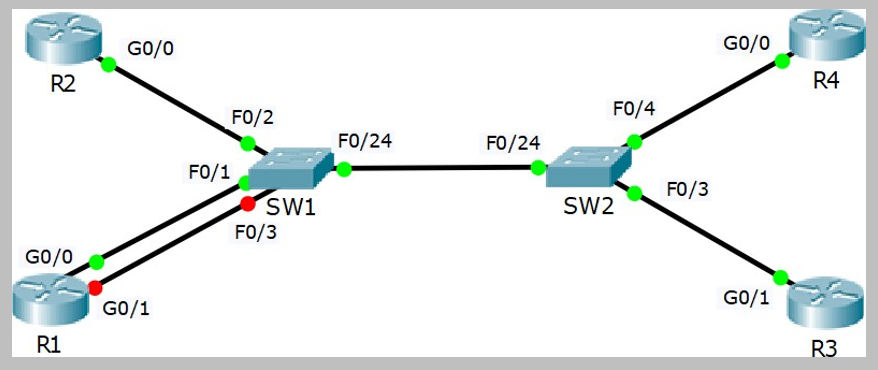
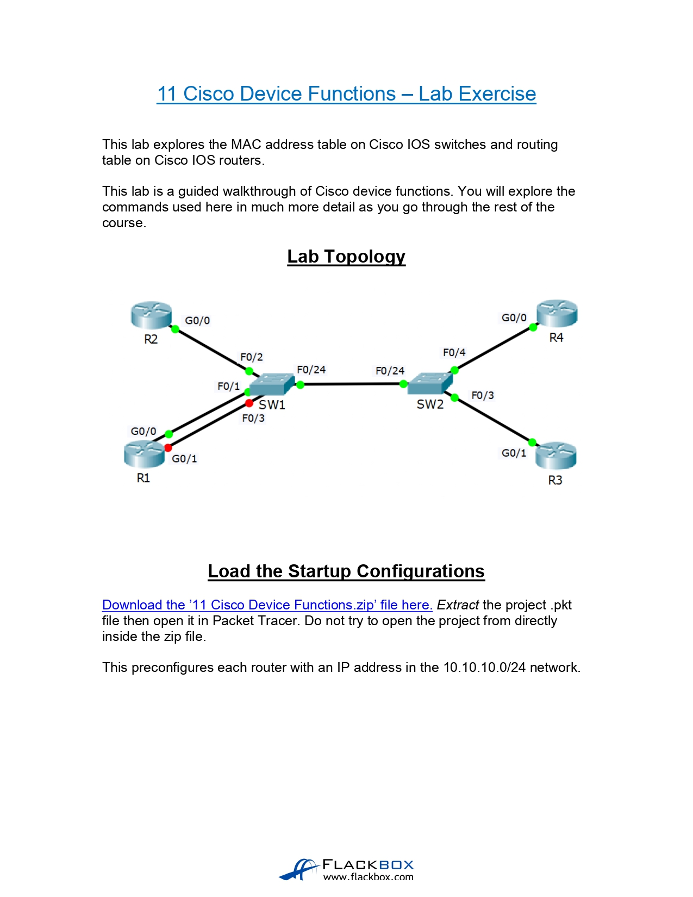
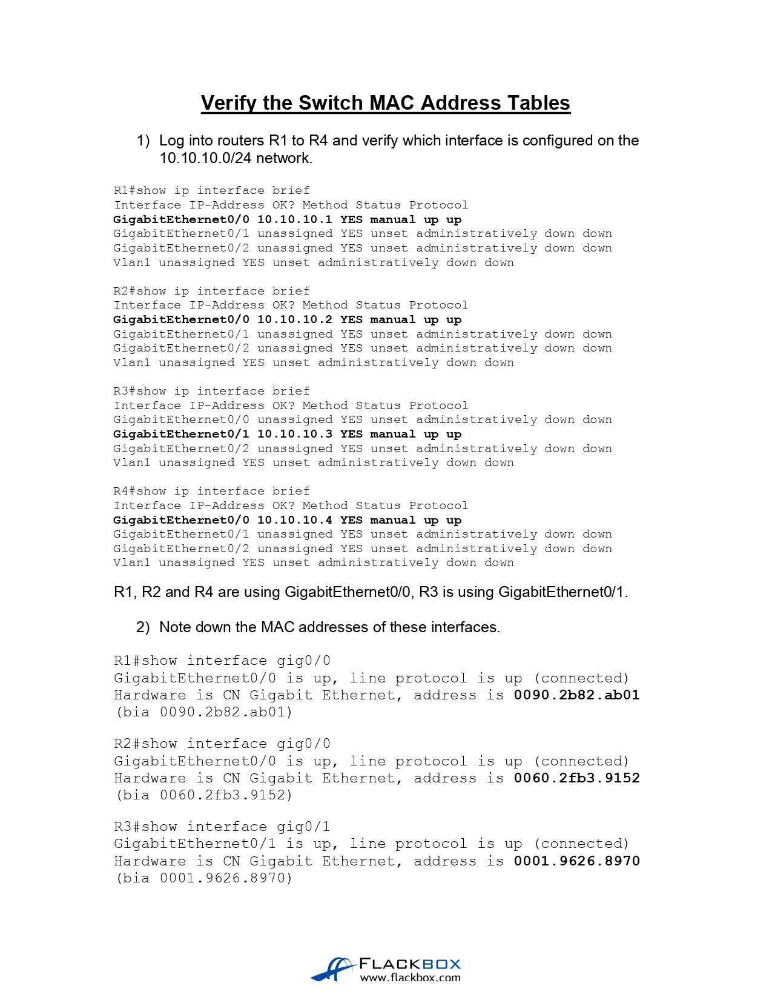
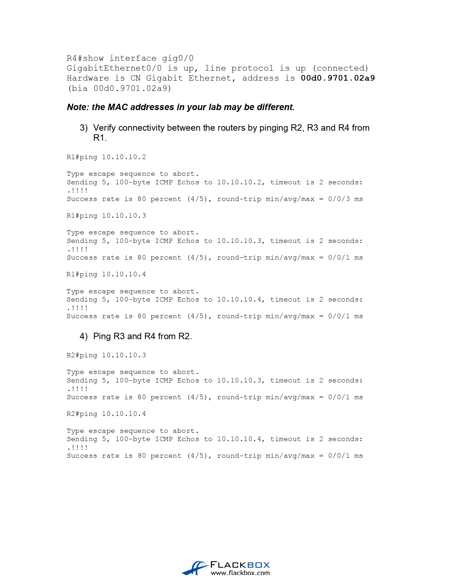
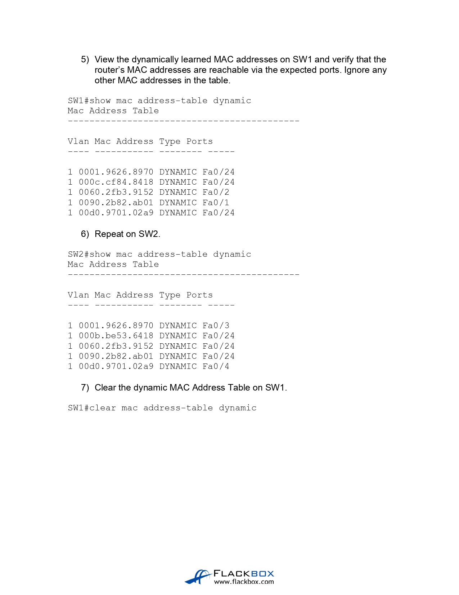
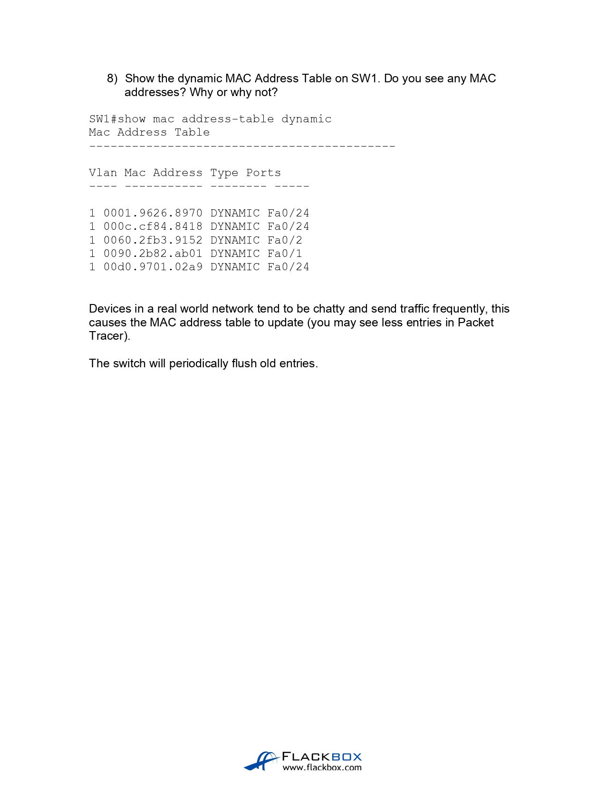
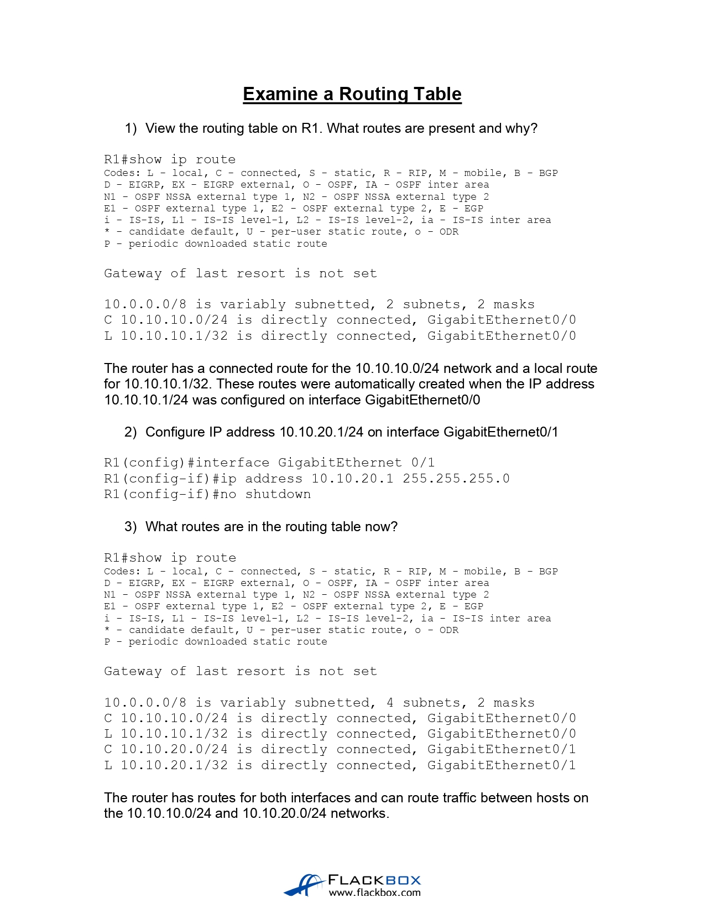
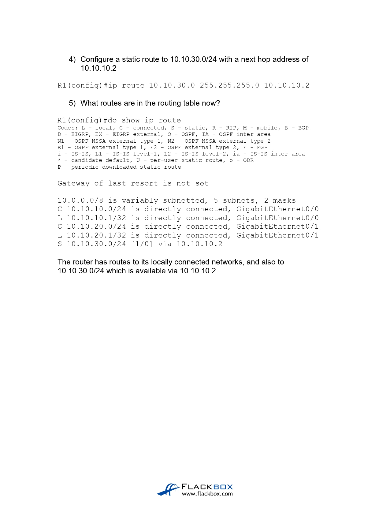

# Cisco Device Function (Source: Udemy)
## Instructor: Neil Anderson  
### **Pkt file:** [Here](https://mega.nz/file/CkAixbRI#UGbqtnapqlj4fYnbWF-i7HaO7qxbJaV2nc8WbOKY9Dc)
### Scenario: 

## **Solution**

## **[The End]**