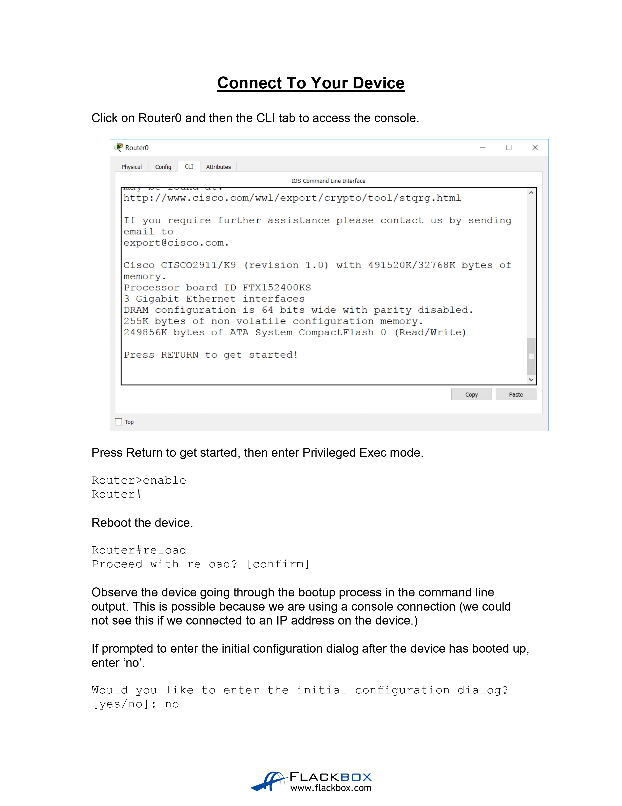
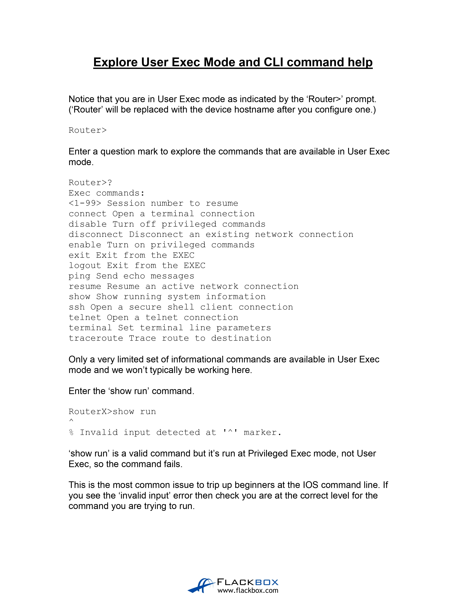
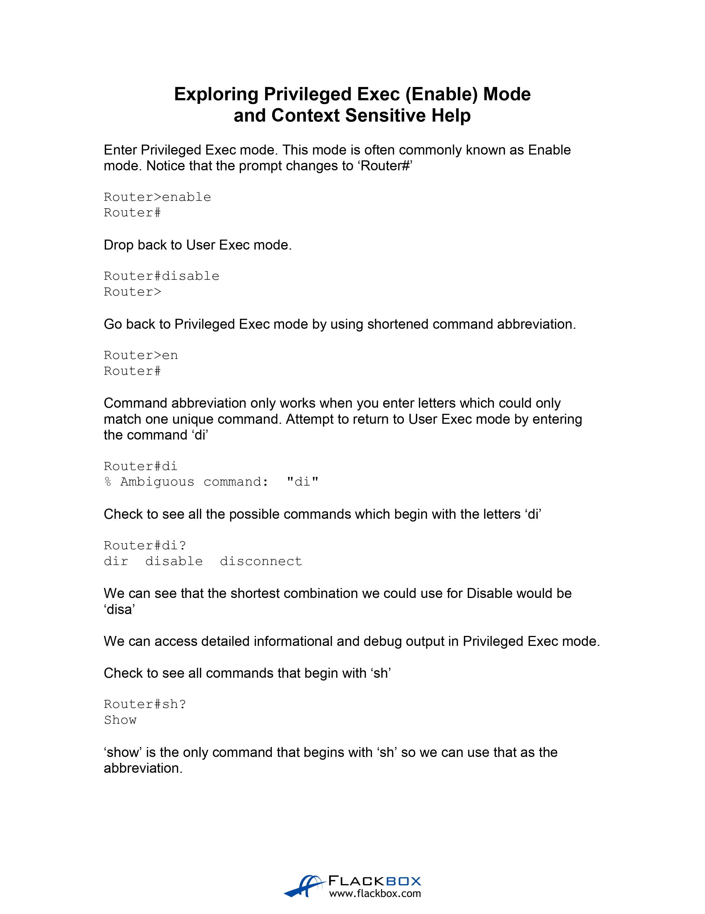
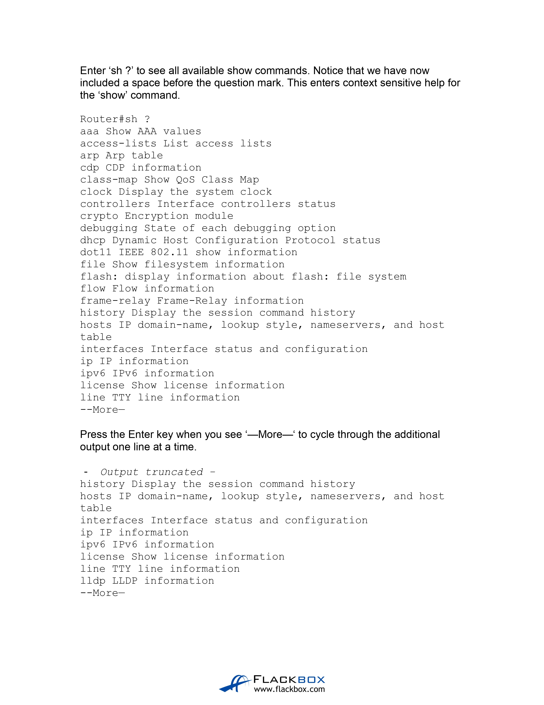
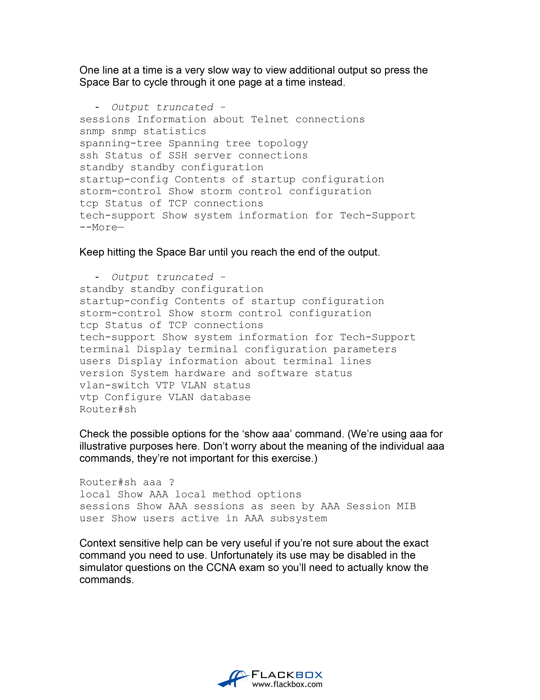
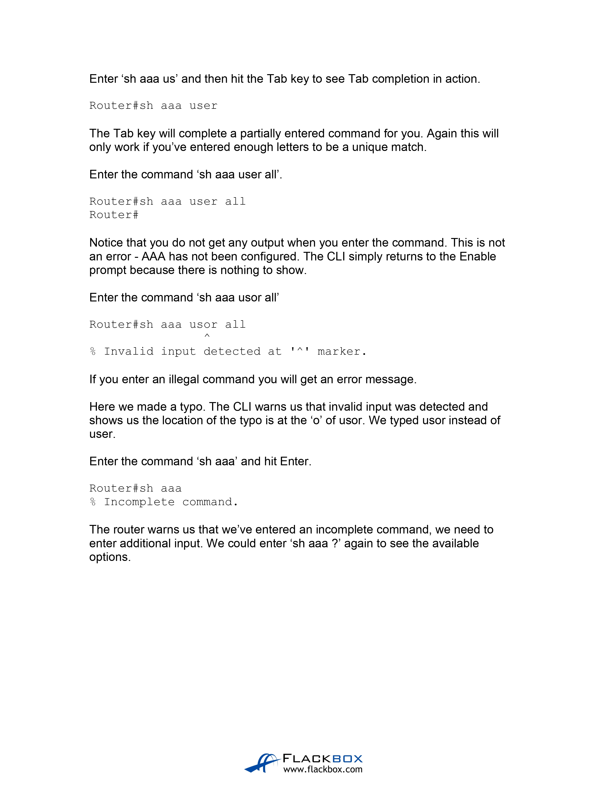
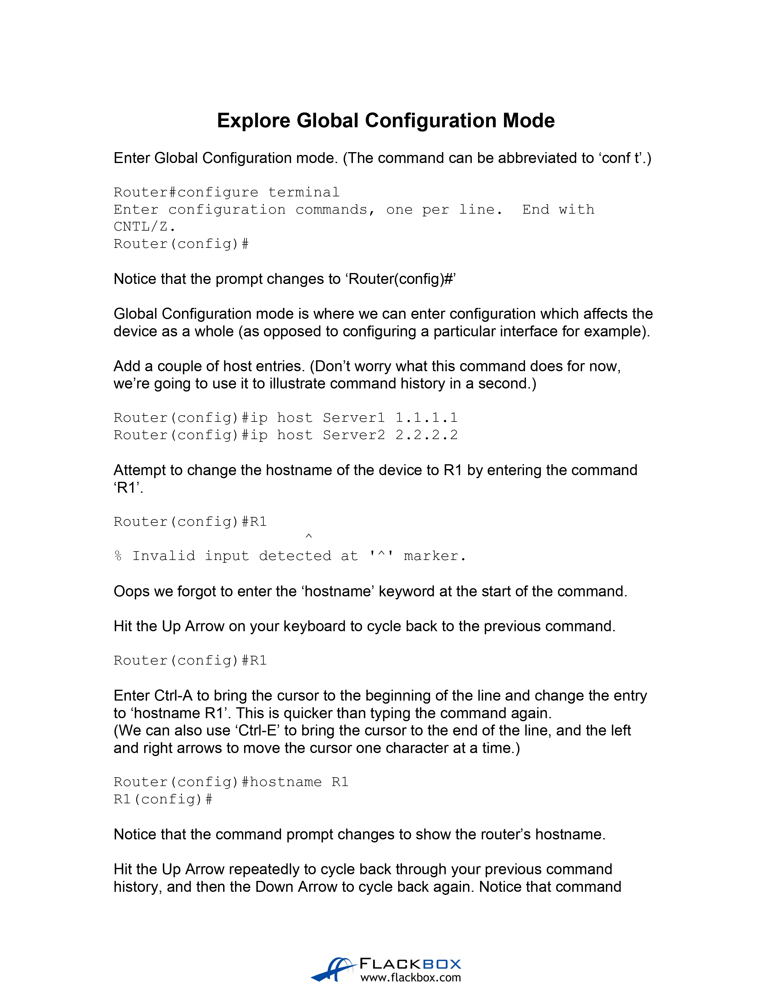
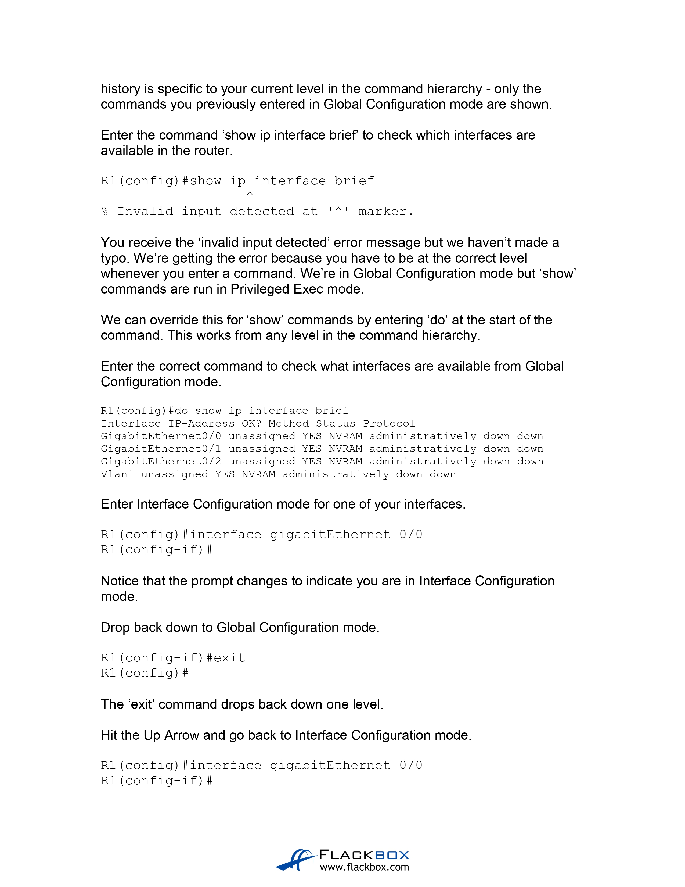
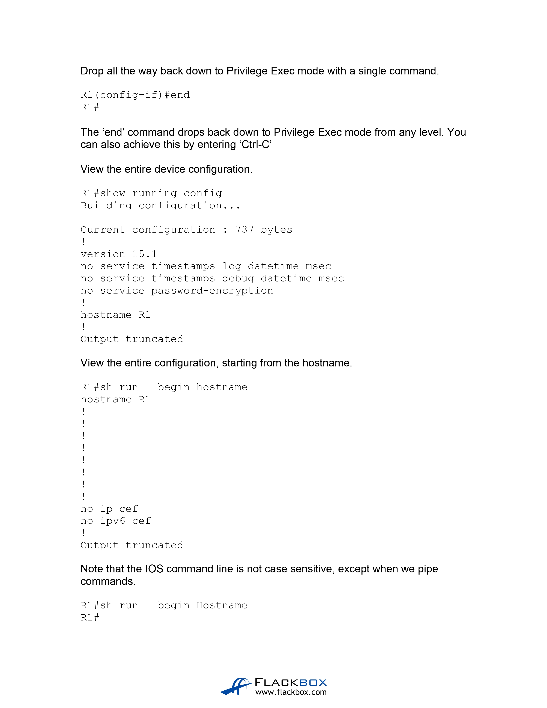
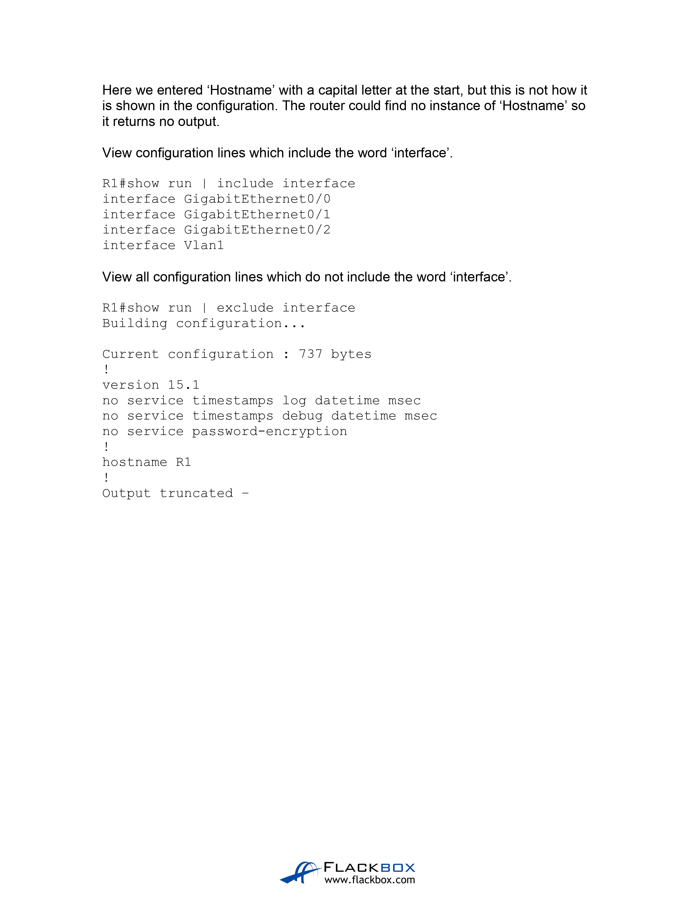

# The IOS Operating System (Source: Udemy)
## Instructor: Neil Anderson  
### **Pkt file:** [Here](https://mega.nz/file/PxIQAD6C#9JzamSKTh6aaZ0oB_YTeXCv9zXz9xZKxRpq84GvygQs)

## **[The End]**