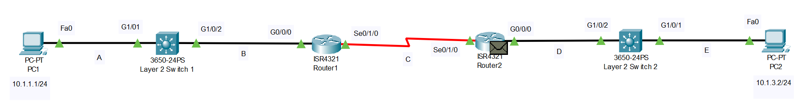

# Life of a Packet Simulation 
## Source (Udemy: David Bombal Course)
### Lab File Link (pkt): [Here](https://mega.nz/file/74hBDRxD#Tf47YUNaKy1MGJGXEZJxyVM03x20eiFd82hpLPeTNU4)
### Scenario:

```
Scenario:  
PC1 pings PC2. Answer the following questions based on the echo request message sent from PC1 to PC2.
```
```
1) What is the destination MAC address in the frame at A in the network?
  a) PC1's MAC address
  b) PC2's MAC address
  c) Switch1's G1/0/1 MAC address
  d) Switch2's G1/0/2 MAC address
  e) Router1's G0/0/0 MAC address ✅
  f) Router1's Se0/1/0 MAC address
  g) Router2's G0/0/0 MAC address
  h) Router2's Se0/1/0 MAC address
  i) Switch2's G1/0/1 MAC address
  j) Switch 2's G0/0/0 MAC address
  k) There is no MAC address
  Your Answer: e 

2) What is the destination MAC address at A in the network?
Your Answer: DEST ADDR:0010.AAAA.AAAA 

3) What encapsulation is used at A in the network?
   Your Answer: Ethernet II 
```
```
4) What is the destination MAC address in the frame at B in the network?
  a) PC1's MAC address
  b) PC2's MAC address
  c) Switch1's G1/0/1 MAC address
  d) Switch2's G1/0/2 MAC address
  e) Router1's G0/0/0 MAC address ✅
  f) Router1's Se0/1/0 MAC address
  g) Router2's G0/0/0 MAC address
  h) Router2's Se0/1/0 MAC address
  i) Switch2's G1/0/1 MAC address
  j) Switch 2's G0/0/0 MAC address
  k) There is no MAC address
  Your Answer: e

5) What is the destination MAC address at B in the network? 
   Your Answer: DEST ADDR:0010.AAAA.AAAA 
```
```
6) What is the destination MAC address in the frame at C in the network?
  a) PC1's MAC address
  b) PC2's MAC address
  c) Switch1's G1/0/1 MAC address
  d) Switch2's G1/0/2 MAC address
  e) Router1's G0/0/0 MAC address
  f) Router1's Se0/1/0 MAC address
  g) Router2's G0/0/0 MAC address
  h) Router2's Se0/1/0 MAC address
  i) Switch2's G1/0/1 MAC address
  j) Switch 2's G0/0/0 MAC address
  k) There is no MAC address ✅

7) What encapsulation is used at C in the network?
   Your Answer: HDLC. No mac-address because HDLC doesn't use mac-address in a point-to-point link. 
```
```
8) What is the destination MAC address in the frame at D in the network?
  a) PC1's MAC address
  b) PC2's MAC address ✅
  c) Switch1's G1/0/1 MAC address
  d) Switch2's G1/0/2 MAC address
  e) Router1's G0/0/0 MAC address
  f) Router1's Se0/1/0 MAC address
  g) Router2's G0/0/0 MAC address
  h) Router2's Se0/1/0 MAC address
  i) Switch2's G1/0/1 MAC address
  j) Switch 2's G0/0/0 MAC address
  k) There is no MAC address
  Your Answer: b

9) What is the destination MAC address at D in the network?
   Your Answer: DEST ADDR:0010.2222.2222 

10) What encapsulation is used at D in the network?
   Your Answer: Ethernet II 
```
```
11) What is the destination MAC address in the frame at E in the network?
  a) PC1's MAC address
  b) PC2's MAC address ✅
  c) Switch1's G1/0/1 MAC address
  d) Switch2's G1/0/2 MAC address
  e) Router1's G0/0/0 MAC address
  f) Router1's Se0/1/0 MAC address
  g) Router2's G0/0/0 MAC address
  h) Router2's Se0/1/0 MAC address
  i) Switch2's G1/0/1 MAC address
  j) Switch 2's G0/0/0 MAC address
  k) There is no MAC address
  Your Answer: b

12) What is the destination MAC address at E in the network?
   Your Answer: DEST ADDR:0010.2222.2222 

13) What encapsulation is used at E in the network?
   Your Answer: Ethernet II 
```

## **[The End]**