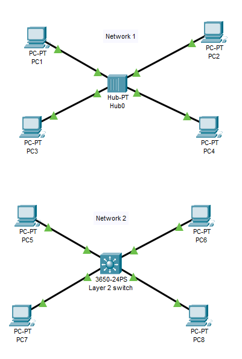

# Colliosion Domain 
## Source (Udemy: David Bombal Course)
### Lab File Link (pkt): [Here](https://mega.nz/file/rwQQTQBI#7kiMz_Jsa9a6YGVd2V7hKNDCW2YpHrXgaA_aUhK4EUo)
### Scenario:



```
Quiz Questions:
Assume that all devices have just rebooted (you can simulate this via the Power Cycle Devices Button in Pacet Tracer)

Don't just answer the questions. Prove it.
1) When PC1 pings PC4, what type of packet is sent to the hub initially? Can you prove it?
2) Who receives the packet? 
3) Who receives the return traffic from PC4 to PC1? 
4) When ping traffic is sent from PC1 to PC4, who receives the traffic? 

5) Assume that the Switch1's MAC address table is empty. 
When PC5 pings PC8, what type of packet is sent to the switch initially? Can you prove it?
6) Who receives the packet?
7) Who receives the return traffic from PC8 to PC5? 
8) When ping traffic is sent from PC5 to PC8, who receives the traffic?

9) How many broadcast domains are there in Network 1? Can you prove it?
10) How many broadcast domains are there in Network 2? Can you prove it?
11) How may collision domains in Network 1 and Network 2? Can you prove it?
```
## **Solution**

1) ARP packet which is Broadcast.
2) PC2, PC3, PC4
3) PC1, PC2, PC3
4) PC2, PC3, PC4 (but PC2 and PC3 will drop the traffic)

5) ARP packet which is Broadcast.
6) PC6, PC7, PC8
7) Only PC5 
8) Only PC8 

9) Single broadcast domain in Network 1. 
10) Single broadcast domain in Network 2.
11) Network 1 has a Single collision domain. And Network 2 has four collision domain. Beacuse a switch has one collision domain per interface. 


## **[The End]**