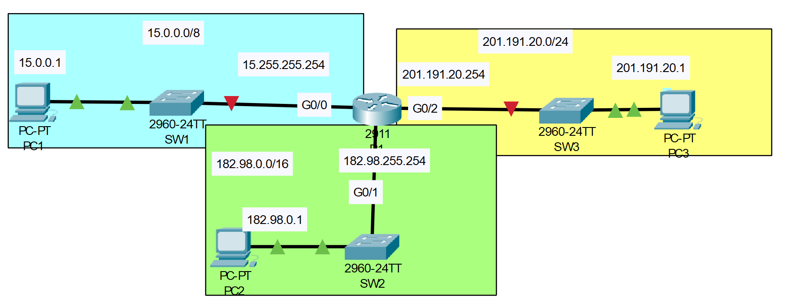

# Basic Router Configuration 
## Source (YouTube: Jeremy's IT Lab)
### Video Link: [Here](https://youtu.be/e1jbvyMeS5I?si=QUppE7XGYXwEvvnr)
### Lab File Link (pkt): [Here Day-08](https://mega.nz/file/qp5CgL6S#4BbdGjMX5T1-qTXzrgXovabPbWP_ropAZz-BTvvfat0)
### Scenario:

### **1. Configure R1's hostname.**
```
Router(config)#hostname R1
```
### **2. Use a 'show' command to view a list of R1's interfaces, their IP addresses, status, etc.**
```
R1(config)#do sh ip int brief
Interface              IP-Address      OK? Method Status                Protocol 
GigabitEthernet0/0     unassigned      YES unset  administratively down down 
GigabitEthernet0/1     unassigned      YES unset  administratively down down 
GigabitEthernet0/2     unassigned      YES unset  administratively down down 
Vlan1                  unassigned      YES unset  administratively down down
```
### **3. Configure the appropriate IP addresses on R1's interfaces, and enable the interfaces. Configure appropriate interface descriptions.**
```
R1(config)#int g0/0
R1(config-if)#ip address 15.255.255.254 255.0.0.0
R1(config-if)#description Link to SW1
R1(config-if)#no shut

R1(config-if)#int g0/1
R1(config-if)#ip address 182.168.255.254 255.255.0.0
R1(config-if)#description Link to SW2
R1(config-if)#no shut

R1(config-if)#int g0/2
R1(config-if)#ip address 201.191.20.254 255.255.255.0
R1(config-if)#description Link to SW3
R1(config-if)#no shut
```
### **4. Use a 'show' command to verify R1's interfaces again.**
```
R1#sh ip int brief
Interface              IP-Address      OK? Method Status                Protocol 
GigabitEthernet0/0     15.255.255.254  YES manual up                    up 
GigabitEthernet0/1     182.168.255.254 YES manual up                    up 
GigabitEthernet0/2     201.191.20.254  YES manual up                    up 
Vlan1                  unassigned      YES unset  administratively down down
```

### **5. View the running config to confirm the configuration changes, then save the config.**
```
R1#sh run 
interface GigabitEthernet0/0
 description Link to SW1
 ip address 15.255.255.254 255.0.0.0
 duplex auto
 speed auto
!
interface GigabitEthernet0/1
 description Link to SW2
 ip address 182.168.255.254 255.255.0.0
 duplex auto
 speed auto
!
interface GigabitEthernet0/2
 description Link to SW3
 ip address 201.191.20.254 255.255.255.0
 duplex auto
 speed auto
!
```
### **6. Configure the IP addresses of PC1, PC2, and PC3.**

### **7. Ping from PC1 to PC2 and PC3 to test connectivity.**
> Watch this video for answer 6 and 7.  

https://github.com/EZAZ-2281/CCNA-200-301-Lab/assets/81481142/4fbd5300-15b3-46e4-aa9f-5a401a25f02f

## **[The End]**

[](https://drive.google.com/file/d/1K792lWvMDiFQZlu8ImE2Sw3MNGsqCDhG/view?usp=sharing "tr")

