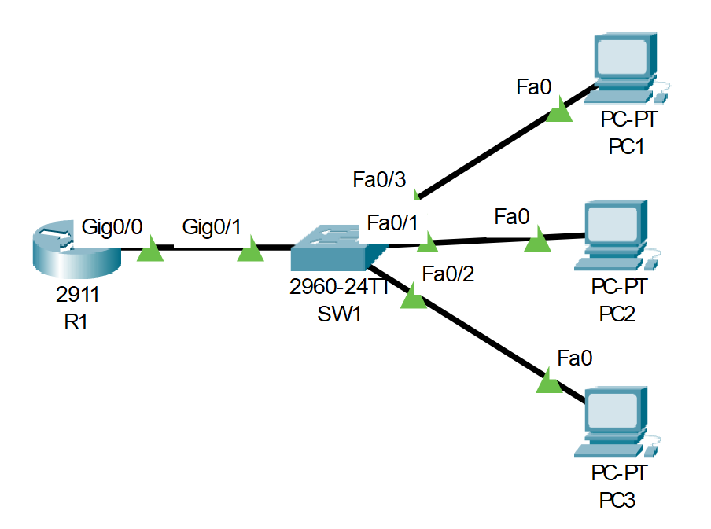

# Basic Device Security 
## Source (YouTube: Jeremy's IT Lab)
### Video Link: [Here](https://youtu.be/SDocmq1c05s?si=SLNR0Ky6uQhsl-Kk)
### Lab File Link (pkt): [Here Day-4](https://mega.nz/file/Op4ylIqI#TvrIskSgzSXLDZgFkeXAnwV_xnZtgHWCCk2Z28AKbT0)
### Scenario:

1. Change the hostnames of the router and switch to the appropriate names (R1, SW1)

2.  Configure an unencrypted enable password of 'CCNA' on both devices

3. Exit back to user EXEC mode and test the password

4.  View the password in the running configuration

5. Ensure that the current password, and all future passwords, are encrypted

6. View the password in the running configuration

7. Configure a more secure, encrypted enable password of 'Cisco' on both devices

8. Exit back to user EXEC mode and then return to privileged EXEC mode.
- Which password do you have to use?

9. View the passwords in the running configuration.
- What encryption type number is used for the encrypted 'enable password'?
- What encryption type number is used for the encrypted 'enable secret'?

10. Save the running configuration to the startup configuration

> Watch this short video for step 1 to 10:  

https://github.com/EZAZ-2281/CCNA-200-301-Lab/assets/81481142/42be66b9-65b3-451d-8530-3b7c01fcb210

## **[The End]**