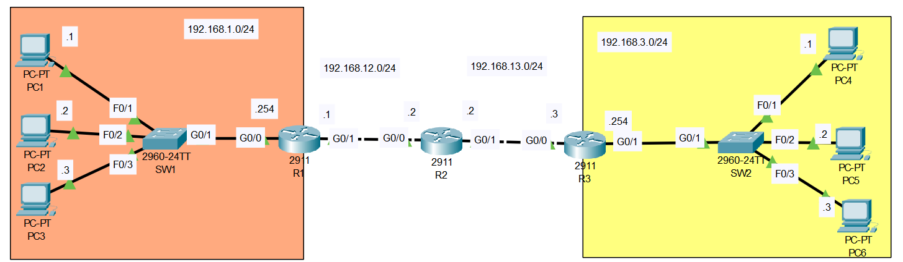

# Life of a Packet
## Source (YouTube: Jeremy's IT Lab)
### Video Link: [Here](https://youtu.be/bfsEqDeHbpI?si=1atQj1IDMJXV1jQg)
### Lab File Link (pkt): [Here Day-12](https://mega.nz/file/WxJklbTJ#o1_WTnIWmBFm8_gX3qQ9KRfxMtwJNRliNjsJD2uD3r4)
### Scenario:



## **1. PC1 pings PC4.** 
Identify the src/dst MAC address at each specified point in the route to PC4.
Identify the MAC address by the device and interface (ie. the MAC of R1 G0/0)
A. Source/Destination MAC at PC1 -> SW1 segment
- Src PC1 mac, Des R1 g0/0 int. 
B. Source/Destination MAC at SW1 -> R1 segment
- Src PC1 mac, Des R1 g0/0 int. 
C. Source/Destination MAC at R1 -> R2 segment
- Src R1 g0/0 int, Des R2 g0/0 int. 
D. Source/Destination MAC at R2 -> R3 segment
- Src R2 g0/1 int, Des R3 g0/0 int. 
E. Source/Destination MAC at R3 -> SW2 segment
- Src R3 g0/1 int, Des PC4 mac. 
F. Source/Destination MAC at SW2 -> PC4 segment
- Src R3 g0/1 int, Des PC4 mac. 

Use the CLI and Packet Tracer's simulation mode to verify your answers.
(Before you enter simulation mode, ping once to complete ARP/the MAC learning process.)
> Watch this video for this part: 

https://github.com/EZAZ-2281/CCNA-200-301-Lab/assets/81481142/7fa77df1-b12e-4607-9e79-30ac1c14bcb1

```
Mac address:
 
PC1    : 00D0.BA11.1111
R1 g0/0: 0000.01aa.aaaa
R1 g0/1: 0000.01bb.bbbb

R2 g0/0: 0000.01cc.cccc
R2 g0/1: 0000.01dd.dddd

R3 g0/0: 0000.01ee.eeee
R3 g0/1: 0000.01ff.ffff
PC4    : 000C.8544.4444
```
## **2. PC1 pings PC3.**
Identify the src/dst MAC address at each specified point in the route to PC3.
Identify the MAC address by the device and interface (ie. the MAC of R1 G0/0)
A. Source/Destination MAC at PC1 -> SW1
- Src PC1 mac, Des PC3 mac. 
B. Source/Destination MAC at SW1 -> PC3
- Src PC1 mac, Des PC3 mac.
Use the CLI and Packet Tracer's simulation mode to verify your answers.
(Before you enter simulation mode, ping once to complete ARP/the MAC learning process.)
> Watch this video for this part:   

https://github.com/EZAZ-2281/CCNA-200-301-Lab/assets/81481142/ed302023-7471-4cc8-9d53-e3eacc8596de


```
Mac address:
 
PC1: 00D0.BA11.1111
PC3: 0010.1133.3333
```
