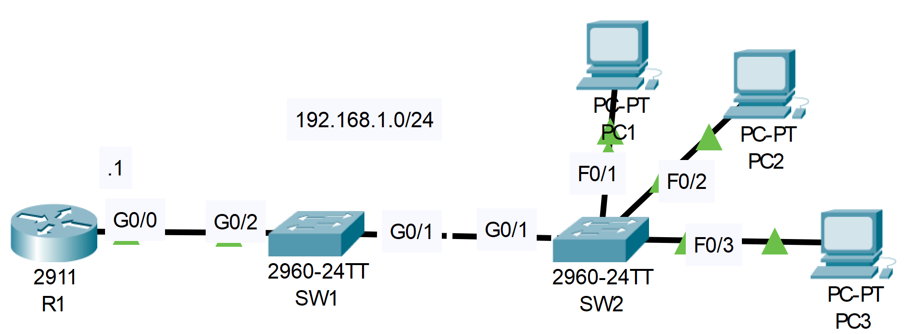

# Dynamic ARP Inspection (DAI)
## Source (YouTube: Jeremy's IT Lab)
### Video Link: [Here](https://youtu.be/oLF2mbmYMAk?si=43dM6Rj2eDh-6ixr)
### Lab File Link (pkt): [Here Day-51](https://mega.nz/file/iwoT3bLK#xMA8IVNdwzLBiTvMekhh75qAJiR1N-H84566QozzjV4)
### Scenario:


### **1. Configure R1 as a DHCP server. Exclude 192.168.1.1 - 192.168.1.9 from the pool. Default gateway: R1.**
```
R1#conf t
R1(config)#ip dhcp excluded-address 192.168.1.1 192.168.1.9
R1(config)#ip dhcp pool kibria 
R1(dhcp-config)#network 192.168.1.0 255.255.255.0 
R1(dhcp-config)#default-router 192.168.1.1 
```
### **2. Configure DHCP snooping on SW1 and SW2.***
> SW1:  
```
SW1(config)#ip dhcp snooping 
SW1(config)#ip dhcp snooping vlan 1
SW1(config)#no ip dhcp snooping information option 
SW1(config)#int g0/2 
SW1(config-if)#ip dhcp snooping trust 
```
> SW2:  
```
SW2(config)#ip dhcp snooping 
SW2(config)#ip dhcp snooping vlan 1 
SW2(config)#no ip dhcp snooping information option 
SW2(config)#int g0/1 
SW2(config-if)#ip dhcp snooping trust 
```
### **3. Configure DAI on SW1 and SW2.**
- Enable all additional validation checks
- Trust ports connected to a router or switch

> SW1:  
```
SW1(config)#ip arp inspection 
% Incomplete command.
SW1(config)#ip arp inspection vlan 1 
SW1(config)#ip arp inspection validate dst-mac ip src-mac 
SW1(config)#int range g0/1-2 
SW1(config-if-range)#ip arp inspection trust 
```
> SW2:  
```
SW2(config)#ip arp inspection 
% Incomplete command.
SW2(config)#ip arp inspection vlan 1 
SW2(config)#ip arp inspection validate dst-mac ip src-mac 
SW2(config)#int g0/1
SW2(config-if)#ip arp inspection trust 
```
<br>

- Watch this short video for testing connectivity:  

https://github.com/EZAZ-2281/freeCodeCamp/assets/81481142/03093f67-8427-4a96-b503-347733598a4a

## **[The End]**