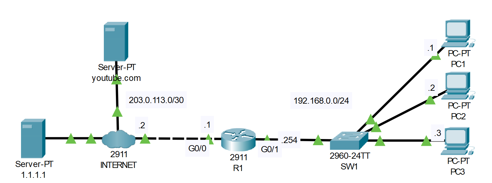

# DNS
## Source (YouTube: Jeremy's IT Lab)
### Video Link: [Here](https://youtu.be/7D_FapNrRUM?si=UkUbcCJMZqxTb85s)
### Lab File Link (pkt): [Here Day-38](https://mega.nz/file/K54yERAT#LFiu_wsTREtK5vFZWi4ehmneDRbClHHY34ZIeEr7n40)
### Scenario:

### **1. Configure a default route to the Internet on R1.**
```
R1(config)#ip route 0.0.0.0 0.0.0.0 203.0.113.2
```
```
R1(config)#do ping 1.1.1.1

Type escape sequence to abort.
Sending 5, 100-byte ICMP Echos to 1.1.1.1, timeout is 2 seconds:
..!!!
Success rate is 60 percent (3/5), round-trip min/avg/max = 0/3/10 ms
```
### **2. Configure R1 to use 1.1.1.1 as its DNS server.**
- Configure host entries on R1 for R1, PC1, PC2, and PC3.
- Ping PC1 by name from R1.
```
R1(config)#ip name-server 1.1.1.1
R1(config)#ip host R1 192.168.0.254
R1(config)#ip host PC1 192.168.0.1
R1(config)#ip host PC2 192.168.0.2
R1(config)#ip host PC3 192.168.0.3
```
```
R1(config)#do sh host
Default Domain is not set
Name/address lookup uses domain service
Name servers are 1.1.1.1

Codes: UN - unknown, EX - expired, OK - OK, ?? - revalidate
       temp - temporary, perm - permanent
       NA - Not Applicable None - Not defined

Host                      Port  Flags      Age Type   Address(es)
PC1                       None  (perm, OK)  0   IP      192.168.0.1
PC2                       None  (perm, OK)  0   IP      192.168.0.2
PC3                       None  (perm, OK)  0   IP      192.168.0.3
R1                        None  (perm, OK)  0   IP      192.168.0.254
```
```
R1(config)#do ping PC1

Type escape sequence to abort.
Sending 5, 100-byte ICMP Echos to 192.168.0.1, timeout is 2 seconds:
.!!!!
Success rate is 80 percent (4/5), round-trip min/avg/max = 0/0/1 ms
```
### **3. Configure PC1, PC2, and PC3 to use 1.1.1.1 as their DNS server.**

### **4. USE SIMULATION MODE FOR THIS STEP**
- From PC1, ping youtube.com by name.  Analyze the messages being sent.
<br>
> Watch this video for answer 3 and 4.    

https://github.com/EZAZ-2281/CCNA-200-301-Lab/assets/81481142/f5d71a32-6f6f-4580-b332-c57aa50426f9


### **Some important terms:**

- "ip host" is the command keyword indicating that you are configuring a static host mapping.
- "pc1" is the hostname you are assigning to the device or IP address.
- "192.168.0.1" is the IP address associated with the hostname "pc1".

`Router(config)# ip host pc1 192.168.0.1`  
After this configuration, if you want to ping "pc1" from the router, it will use the specified IP address:
`Router# ping pc1`  

## **[The End]**