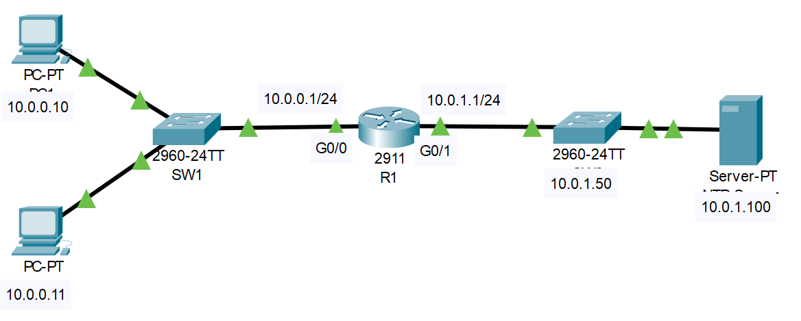

# Secure Priviledge Exec Mode (Source: Udemy)
## Instructor: Neil Anderson  
### **Pkt file:** [Here](https://mega.nz/file/L0QE1bKA#BS0Ve81wMMMdaBamOUpNQ921VYiLObo-nWEA_g6cA6k)
### Scenario: 


## **Secure Privileged Exec Mode**
```
1)	Set the enable password Flackbox2 on R1 to secure access to Privileged Exec (Enable) mode.
2)	Exit to User Exec mode.
3)	Enter Privileged Exec mode.
4)	Set the enable secret Flackbox1.
5)	Exit to User Exec mode.
6)	Do you expect to be able to enter Privileged Exec mode using the password Flackbox2? Why or why not? Verify this.
7)	Show the running configuration on R1. Can you read the enable password and secret in plain text?
8)	Ensure that passwords will not show in plain text in the output of ‘show’ commands.
9)	Verify the enable password is now encrypted when you show the running configuration.
```
### **1) Set the enable password Flackbox2 on R1 to secure access to Privileged Exec (Enable) mode.**
```
R1(config)#enable password Flackbox2
```
### **2) Exit to User Exec mode.**
```
R1#exit
```
### **3) Enter Privileged Exec mode.**
```
R1>enable 
Password:Flackbox2 
R1#
```
### **4) Set the enable secret Flackbox1.**
```
R1(config)#enable secret Flackbox1
```
### **5) Exit to User Exec mode.**
```
R1#exit
```
### **6) Do you expect to be able to enter Privileged Exec mode using the password Flackbox2? Why or why not? Verify this.**
- You cannot enter Privileged Exec mode using the enable password because it has been superseded by the enable secret.
```
R1>enable 
Password:Flackbox2 
Password:Flackbox1 
R1#
```
### **7) Show the running configuration on R1. Can you read the enable password and secret in plain text?**

- The enable password is shown in plain text but the enable secret is encrypted.
```
R1#show run
Building configuration...

Current configuration : 762 bytes
!
version 15.1
no service timestamps log datetime msec no service timestamps debug datetime msec no service password-encryption
!
hostname R1
!
enable secret 5 $1$mERr$J2XZHMOgpVVXdLjC9lYtE1 enable password Flackbox2
```
### **8) Ensure that passwords will not show in plain text in the output of ‘show’ commands.**
```
R1(config)#service password-encryption
```
### **9) Verify the enable password is now encrypted when you show the running configuration.**
```
R1#show running-config 
Building configuration...

Current configuration : 772 bytes
!
version 15.1
no service timestamps log datetime msec no service timestamps debug datetime msec service password-encryption
!
hostname R1
!
enable secret 5 $1$mERr$J2XZHMOgpVVXdLjC9lYtE1 
enable password 7 0807404F0A1207180A59
```

Watch this video also if necessary:  

https://github.com/EZAZ-2281/CCNA-200-301-Lab/assets/81481142/04d92792-bd1b-435f-893e-70f4812778be

## **[The End]**