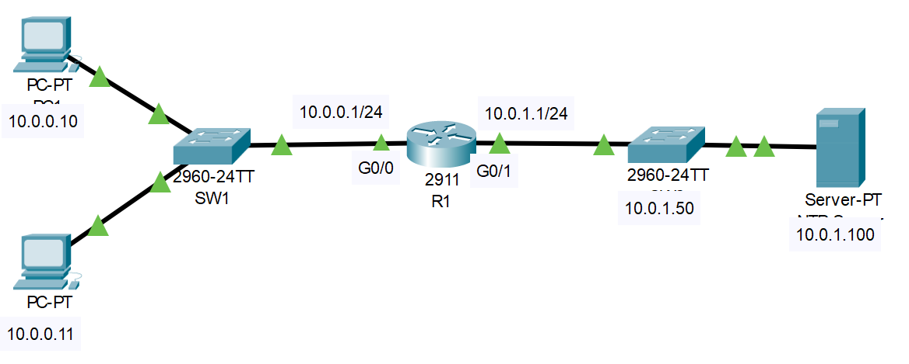

# Secure Remote Telnet and SSH Access 
## Source: Udemy
## Instructor: Neil Anderson  
### **Pkt file:** [Here](https://mega.nz/file/L0QE1bKA#BS0Ve81wMMMdaBamOUpNQ921VYiLObo-nWEA_g6cA6k)
### Scenario: 


### First visit this file for understand this lab: [Here](./anderson-01.md)
```
1) Enable synchronous logging on R1 and ensure administrators are logged out after 15 minutes of activity on the console and virtual terminal lines 0- 15.
2)	Allow the administrator workstation at 10.0.0.10 to Telnet into R1 using the password Flackbox3. Ensure no other host has Telnet access to the router.
3)	Ensure that users attempting to Telnet into the router see the message “Authorised users only”
4)	Verify you can Telnet into R1 from PC1 and enter Privileged Exec mode. Close the Telnet session when done.
5)	Verify Telnet access fails from PC2.
6)	Configure R1 so that administrators will be prompted to enter a username and password when they attempt to Telnet into the router. Use username admin and password Flackbox4.
7)	Verify you are prompted for a username and password when you attempt to Telnet to the router.
8)	Allow the administrator workstation at 10.0.0.10 to SSH into R1. Use the domain name flackbox.com and a 768 bit key.
9)	Verify you can SSH into R1 from PC1. Close the session when done.
10)	Do you expect to be able to SSH to R1 from PC2? Why or why not? Verify this.
11)	You can currently access R1 using either Telnet or SSH. Telnet is an insecure protocol as all communication is sent in plain text. Configure R1 so that only SSHv2 remote access is allowed.
12)	Verify you cannot Telnet into R1 from PC1 but can SSH. Exit when done.
13)	What username and password do you need to use to login when you connect directly to R1 with a console cable?
14)	Configure R1 to require no username but a password of Flackbox5 to login over the console connection.
15)	Verify you can access R1 over the console connection and enter Privileged Exec mode.
```

### **1) Enable synchronous logging on R1 and ensure administrators are logged out after 15 minutes of activity on the console and virtual terminal lines 0- 15.**
```
R1(config)#line console 0
R1(config-line)#logging synchronous 
R1(config-line)#exec-timeout 15

R1(config)#line vty 0 15
R1(config-line)#logging synchronous 
R1(config-line)#exec-timeout 15
```
### **2) Allow the administrator workstation at 10.0.0.10 to Telnet into R1 using the password Flackbox3. Ensure no other host has Telnet access to the router.**
```
R1(config)#access-list 1 permit host 10.0.0.10
R1(config)#line vty 0 15 
R1(config-line)#login
R1(config-line)#password Flackbox3 
R1(config-line)#access-class 1 in
```
### **3) Ensure that users attempting to Telnet into the router see the message “Authorised users only”**
```
R1(config)#banner login "Authorised users only"
```
### **4) Verify you can Telnet into R1 from PC1 and enter Privileged Exec mode. Close the Telnet session when done.**
```
C:\> telnet 10.0.0.1
Trying 10.0.0.1 …Open Authorised users only User Access Verification
Password: Flackbox3 R1>enable
Password: Flackbox1 R1#exit

[Connection to 10.0.0.1 closed by foreign host]
```
### **5) Verify Telnet access fails from PC2.**
```
C:\> telnet 10.0.0.1
Trying 10.0.0.1 …
% Connection refused by remote host
```
### **6) Configure R1 so that administrators will be prompted to enter a username and password when they attempt to Telnet into the router. Use username admin and password Flackbox4.**
```
R1(config)#username admin secret Flackbox4 
R1(config)#line vty 0 15
R1(config-line)#login local
```
### **7) Verify you are prompted for a username and password when you attempt to Telnet to the router.**
```
C:\> telnet 10.0.0.1
Trying 10.0.0.1 …Open Authorised users only User Access Verification Username: admin
Password: Flackbox4 R1>exit

[Connection to 10.0.0.1 closed by foreign host]
```
- Watch this video also if necessary for answering 1 to 7. 
Link: [Here](https://drive.google.com/file/d/1BiZ5MTqIJ1IQDGr4gZRDFOB2_iyy9mco/view?usp=sharing)  


### **8) Allow the administrator workstation at 10.0.0.10 to SSH into R1. Use the domain name flackbox.com and a 768 bit key.**
```
R1(config)#ip domain-name flackbox.com 
R1(config)#crypto key generate rsa
The name for the keys will be: R1.flackbox.com
Choose the size of the key modulus in the range of 360 to 2048 for your
General Purpose Keys. Choosing a key modulus greater than
512 may take
a few minutes.

How many bits in the modulus [512]: 768
% Generating 768 bit RSA keys, keys will be non- exportable...[OK]
```
### **9) Verify you can SSH into R1 from PC1. Close the session when done.**
```
C:\> ssh –l admin 10.0.0.1 Open
Password: Flackbox4 
R1>exit

[Connection to 10.0.0.1 closed by foreign host]
```
### **10) Do you expect to be able to SSH to R1 from PC2? Why or why not? Verify this.**
- You will not be able to SSH to R1 from PC2. Telnet and SSH access are both controlled by the ‘line vty’ configuration which has an access list applied only allowing access from PC1.
```
C:\> ssh –l admin 10.0.0.1 Trying 10.0.0.1 …
% Connection refused by remote host
```
### **11) You can currently access R1 using either Telnet or SSH. Telnet is an insecure protocol as all communication is sent in plain text. Configure R1 so that only SSHv2 remote access is allowed.***
```
R1(config)#line vty 0 15
R1(config-line)#transport input ssh 
R1(config-line)#exit
R1(config)#ip ssh version 2
```
### **12) Verify you cannot Telnet into R1 from PC1 but can SSH. Exit when done.**
```
C:\> telnet 10.0.0.1
Trying 10.0.0.1 …Open
[Connection to 10.0.0.1 closed by remote host] C:\> ssh –l admin 10.0.0.1
Open
Password: Flackbox4 
R1>exit

[Connection to 10.0.0.1 closed by foreign host]
```
### **13) What username and password do you need to use to login when you connect directly to R1 with a console cable?**
- No username and password are currently required to login to the console. The virtual terminal lines which control Telnet and SSH access have been secured but console access has not.

### **14) Configure R1 to require no username but a password of Flackbox5 to login over the console connection.**
```
R1(config)#line console 0 
R1(config-line)#login
% Login disabled on line 0, until 'password' is set 
R1(config-line)#password Flackbox5
```
### **15) Verify you can access R1 over the console connection and enter Privileged Exec mode.**
```
R1(config-line)#end 
R1#logout
R1 con0 is now available Press RETURN to get started. 
Authorised users only
User Access Verification 
Password: Flackbox5 
R1>enable
Password: Flackbox1 
R1#
```
- Watch this video also if necessary for 8-24 

https://github.com/EZAZ-2281/CCNA-200-301-Lab/assets/81481142/99f9e2e9-e358-4ce2-ad7b-b322734e6afd

### **[The End]**
