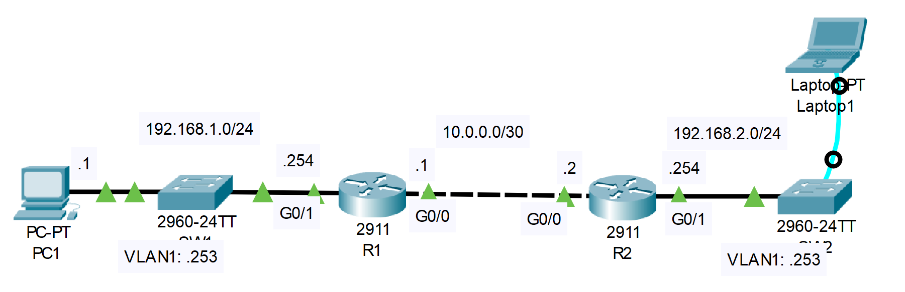

# SSH
## Source (YouTube: Jeremy's IT Lab)
### Video Link: [Here](https://youtu.be/QnHq7iCOtTc?si=iIh65xi8Og10t_-q)
### Lab File Link (pkt): [Here Day-42](https://mega.nz/file/HphzlQBK#xYKljUORAZrLoGUWJRnM_zntIzyRGp74CeiEa5_fpS4)
### Scenario:


### **SW2 has been newly added to the network, but has not yet been configured.**
### **1.Connect Laptop1 to SW2's console port to perform the following configurations:**
```
Host name: SW2
Enable secret: ccna
Username/PW: jeremy/ccna
VLAN1 SVI: 192.168.2.253/24
Default gateway: R2
```
```
Switch#conf t
Switch(config)#hostname SW2 
SW2(config)#enable secret ccna 
SW2(config)#username jeremy secret ccna 
SW2(config)#int vlan 1 
SW2(config-if)#ip address 192.168.2.253 255.255.255.0 
SW2(config-if)#no shut 
SW2(config-if)#ip default-gateway 192.168.2.254
```
> See this video for understand how to connect a console port to a laptor and sw2.  

https://github.com/EZAZ-2281/CCNA-200-301-Lab/assets/81481142/c8d68d24-fe66-483b-9cd5-7c20dc1da52e

### **2. Configure the following console line security settings on SW2:**
- Authentication: Local user
- Exec timeout: 5 minutes

```
SW2(config)#line console 0 
SW2(config-line)#login local 
SW2(config-line)#exec-timeout 5
SW2(config-line)#end
SW2#exit 
```
```
User Access Verification

Username: jeremy
Password: 

SW2>en
Password: 
SW2#
```
### **3. Configure SW2 for remote access via SSH:**

- Domain name: jeremysitlab.com
- RSA key size: 2048 bits
- Authentication: Local user
- Exec timeout: 5 minutes
- Protocols: SSH only
- Limit access to PC1 ONLY

```
SW2#conf t
SW2(config)#ip domain name jeremysitlab.com 
SW2(config)#crypto key generate rsa 
The name for the keys will be: SW2.jeremysitlab.com
How many bits in the modulus [512]: 2048 ✅
% Generating 2048 bit RSA keys, keys will be non-exportable...[OK]
SW2(config)#access-list 1 permit host 192.168.1.1 
SW2(config)#line vty 0 15
SW2(config-line)#login local 
SW2(config-line)#exec-timeout 5
SW2(config-line)#transport input ssh 
SW2(config-line)#access-class 1 in 
```
> Now go to R2 and check the connection:  
```
R2#ping 192.168.2.253

Type escape sequence to abort.
Sending 5, 100-byte ICMP Echos to 192.168.2.253, timeout is 2 seconds:
..!!!
Success rate is 60 percent (3/5), round-trip min/avg/max = 0/0/1 ms

R2#ssh -l jeremy 192.168.2.253
% Connection refused by remote host ✅
```
> SSH from R2 doesn't work because we only allow PC1 via access-list.  
> Now go to PC1 and check if everything works correctly:  
```
C:\>ping 192.168.2.253

Pinging 192.168.2.253 with 32 bytes of data:

Request timed out.
Reply from 192.168.2.253: bytes=32 time=1ms TTL=253
Reply from 192.168.2.253: bytes=32 time<1ms TTL=253
Reply from 192.168.2.253: bytes=32 time=1ms TTL=253

Ping statistics for 192.168.2.253:
    Packets: Sent = 4, Received = 3, Lost = 1 (25% loss),
Approximate round trip times in milli-seconds:
    Minimum = 0ms, Maximum = 1ms, Average = 0ms
```
```
C:\>ssh -l jeremy 192.168.2.253

Password: 


SW2>en
Password: 
SW2#sh ip int brief
```

## **[The End]**