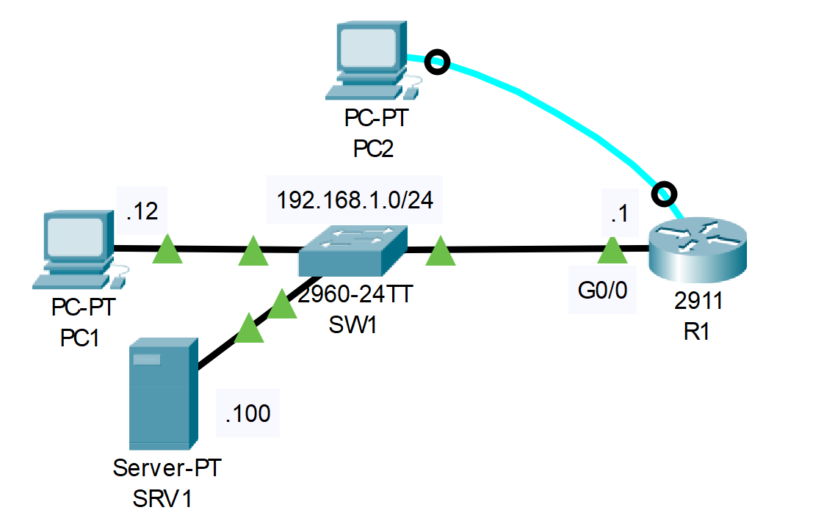

# Syslog 
## This configuration is not necessary for the CCNA
## Source (YouTube: Jeremy's IT Lab)
### Video Link: [Here](https://youtu.be/-R_CYM6Wm-Y?si=vHMuzs_ddpN4poJ_)
### Lab File Link (pkt): [Here Day-41](https://mega.nz/file/L5ZBVZQC#oeBOixC2cMTSjz8o2iEapjxzMUpZjyqcuvMcaM3cPAo)
### Scenario:


## **R1 username: jeremy, PW: ccna, enable PW: ccna**
### **1. Connect to R1's console port using PC2:**
- Shut down the G0/0 interface
- After you receive a syslog message, re-enable the interface.
- What is the severity level of the syslog messages?
- Enable timestamps for logging messages

Necessary command for this part: `R1(config)#service timestamps log datetime msec`  
Now watch this video:  
https://github.com/EZAZ-2281/CCNA-200-301-Lab/assets/81481142/e32bc84e-6910-4391-85ca-a13087c5cb00


### **2. Telnet from PC1 to R1's G0/0 interface**
- Enable the unused G0/1 interface
- Why does no syslog message appear?
- Enable logging to the VTY lines for the current session.
- There is no 'logging monitor' command in packet tracer, but it's enabled by default

For enable login in the VTY lines: `R1#terminal monitor`  
Now watch this video:  
https://github.com/EZAZ-2281/CCNA-200-301-Lab/assets/81481142/faad2277-454b-419a-8fed-5db171d66410

### **3. Enable logging to the buffer, and configure the buffer size to 8192 bytes.**
```
From PC1: 
R1(config)#logging buffer 8192
R1(config)#do sh logging
```
Now watch this video:  
https://github.com/EZAZ-2281/CCNA-200-301-Lab/assets/81481142/0252fb98-bde1-40d6-a7c6-802975b8378f

### **4. Enable logging to the syslog server SRV1 with a level of 'debugging'.**
```
R1(config)#logging host 192.168.1.100
R1(config)#logging trap debugging 
```
- Now R1 will send syslog message to SRV1

Now watch this video:  
https://github.com/EZAZ-2281/CCNA-200-301-Lab/assets/81481142/960bf2c1-d2d9-47b8-a9a5-7b195ae60b31


## **[The End]**