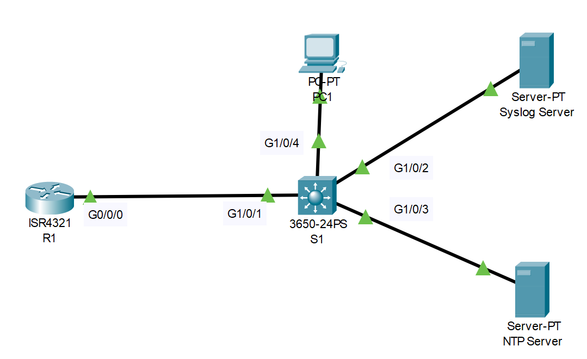

# Syslog and NTP Configuration
## Source (Udemy: David Bombal Course)
### Lab File Link (pkt): [Here](https://mega.nz/file/bwwAiLBb#9qytgSR1jpPMzhbPB90QMNu4ni_Pwy19x_miJ6mmGDE)
### Scenario:



# **Configure Syslog and NTP:**

## **Syslog:**
1) Configure the syslog server
2) Configure R1 and S1 to log messages to the syslog server
3) Create a loopback interface on R1 and verify that syslog messages are displayed
4) Shut the looback interface and verify that syslog messages are displayed. Then enable the loopback interface
5) Shut and then no shut the interface on the switch to the PC and verify that syslog messages are displayed

> Watch this video for answer 1 to 5:  

https://github.com/EZAZ-2281/CCNA-200-301-Lab/assets/81481142/ce318d13-c70b-4c21-96e3-051b5e7670f1

## **NTP:**
1) Configure the NTP server
2) Check the time on R1 and S1
3) Configure R1 and S1 to send timestamps to the syslog server
4) Configure R1 and S1 to get time from the NTP server
5) Verify that the clocks are set right
6) Shut the loopback and then enable it on R1 and verify that syslog messages show the correct time
7) Shut the interface on the switch to the PC and verify that syslog messages are displayed with the correct time

> Watch this video for answer 1 to 7:    

https://github.com/EZAZ-2281/CCNA-200-301-Lab/assets/81481142/93ad375a-63f3-4f84-a9ae-a13d2b21f110

> All commands at a glance:  
```
R1(config)#logging host 10.1.1.200
R1(config)#service timestamps log datetime msec 
R1(config)#ntp server 10.1.1.201
R1#sh clock
R1#sh ntp status
R1#sh ntp associations
```

## **[The End]**