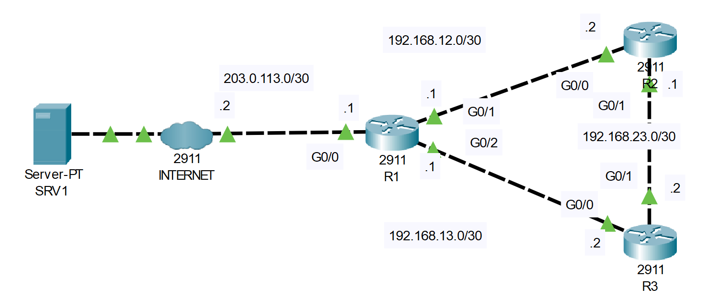

# NTP
## Source (YouTube: Jeremy's IT Lab)
### Video Link: [Here](https://youtu.be/Miys7Ft9wWI?si=LMNYV6szhdJvPXRK)
### Lab File Link (pkt): [Here Day-37](https://mega.nz/file/WwIGkRza#SWcyv8_SHdmr4ybt3M0_HLrIZqDue09kYeGlQv8O4H4)
### Scenario:

```
ROUTING HAS BEEN PRECONFIGURED
(default route on R1, OSPF on all routers with 'network 0.0.0.0 255.255.255.255 area 0')
```

### **1. Configure the software clock on R1, R2, and R3 to 12:00:00 Dec 15 2023 (UTC).**
```
R1#clock set 12:00:00 Dec 15 2023
R1#sh clock detail
12:0:5.1 UTC Fri Dec 15 2023
Time source is user configuration
```
```
R2#clock set 12:00:00 Dec 15 2023
R2#sh clock detail
12:0:3.697 UTC Fri Dec 15 2023
Time source is user configuration
```
```
R3#clock set 12:00:00 Dec 15 2023
R3#sh clock detail
12:0:3.895 UTC Fri Dec 15 2023
Time source is user configuration
```
### **2. Configure the time zone of R1, R2, and R3 to match your own.**
- Here `BST` means Banglsdesh Standard Time    
```
R1(config)#clock timezone BST 6
R2(config)#clock timezone BST 6
R3(config)#clock timezone BST 6
```
### **3. Configure R1 to synchronize to NTP server 1.1.1.1 over the Internet. What stratum is 1.1.1.1? What stratum is R1?**
```
R1(config)#ntp server 1.1.1.1
```
```
R1(config)#do sh ntp association

address         ref clock       st   when     poll    reach  delay          offset            disp
 ~1.1.1.1       .INIT.          16   -        64      0      0.00           0.00              0.01
 * sys.peer, # selected, + candidate, - outlyer, x falseticker, ~ configured
```
- Now fast-forward into packet tracer.  
```
R1(config)#do sh ntp association

address         ref clock       st   when     poll    reach  delay          offset            disp
*~1.1.1.1       127.127.1.1     1 ✅  27       32      377    0.00           0.00              0.24
 * sys.peer, # selected, + candidate, - outlyer, x falseticker, ~ configured
```
```
R1(config)#do sh ntp status
Clock is synchronized, stratum 2, ✅ reference is 1.1.1.1
nominal freq is 250.0000 Hz, actual freq is 249.9990 Hz, precision is 2**24
reference time is E369F211.000000CF (9:21:21.207 UTC Wed Dec 30 2020)
clock offset is 0.00 msec, root delay is 0.00  msec
root dispersion is 29.10 msec, peer dispersion is 0.24 msec.
loopfilter state is 'CTRL' (Normal Controlled Loop), drift is - 0.000001193 s/s system poll interval is 6, last update was 6 sec ago.
R1(config)#do sh clock detail
15:22:15.230 BST Wed Dec 30 2020
Time source is NTP ✅
```
### **4. Configure R1 as a stratum 8 NTP master. Synchronize R2 and R3 to R1 with authentication.**
- The 'ntp source' command is not available in Packet Tracer, so just use the physical interface IP addresses of R1.
```
R1(config)#ntp master
R1(config)#ntp authenticate
R1(config)#ntp authentication-key 1 md5 kibria	
R1(config)#ntp trusted-key 1
```
```
R2(config)#ntp authenticate
R2(config)#ntp authentication-key 1 md5 kibria
R2(config)#ntp trusted-key 1
R2(config)#ntp server 192.168.12.1 key 1 
Now fast forward in packet tracer and issue this command 
R2#sh ntp association

address         ref clock       st   when     poll    reach  delay          offset            disp
*~192.168.12.1  1.1.1.1         2 ✅  24       32      377    0.00           0.00              0.12
 * sys.peer, # selected, + candidate, - outlyer, x falseticker, ~ configured
R2#sh clock detail
15:34:37.696 BST Wed Dec 30 2020
Time source is NTP
```
```
R3(config)#ntp authenticate 
R3(config)#ntp authentication-key 1 md5 kibria
R3(config)#ntp trusted-key 1
R3(config)#ntp server 192.168.12.1 key 1
R3(config)#exit
R3#
%SYS-5-CONFIG_I: Configured from console by console

R3#sh ntp association 

address         ref clock       st   when     poll    reach  delay          offset            disp
 ~192.168.12.1  1.1.1.1         2    32       32      42     0.00           0.00              0.00
*~192.168.13.1  1.1.1.1         2    0        32      77     0.00           0.00              0.24
 * sys.peer, # selected, + candidate, - outlyer, x falseticker, ~ configured
R3#sh clock detail
15:41:52.197 BST Wed Dec 30 2020
Time source is NTP
```
### **5. Configure NTP to update the hardware calendars of R1, R2, and R3.***
- You can't view the calendar in Packet Tracer
```
R1(config)#ntp update-calendar 
R2(config)#ntp update-calendar 
R3(config)#ntp update-calendar 
```
- In step 4 we must configure R1 as a stratum 8 NTP master. Why would we do this? R1 is already acting as an NTP server because it is syncing to SRV1, so  R2 and R3 should be able to use R1 as an NTP server. However, what if R1 stops being able to sync to 1.1.1.1? If we configure R1 as an NTP master, that can serve as a backup clock for R2 and R3 to sync to. So let’s do that here on R1. 

## **[The End]**