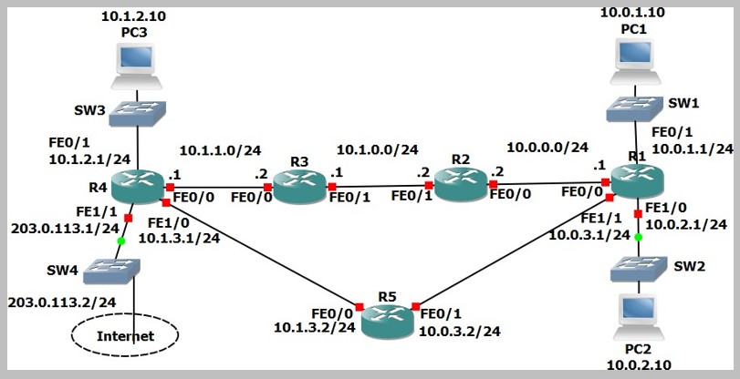

# Static Route (Source: Udemy)
## Instructor: Neil Anderson  
### **Pkt file:** [Here](https://mega.nz/file/GkhkRJaa#GXc4mpaUhEkROviMniei92BKI8xx4GdqccwAHayCimU)
### Scenario: 


## **Connected and Local Routes**

1)	Say no when asked if you would like to enter the initial configuration dialog on each router.
```
Would you like to enter the initial configuration dialog? [yes/no]: no
```
2)	Configure hostnames on the routers according to the Lab Topology diagram.
```
Router(config)# hostname R1
```
3)	Configure IP addresses on R1 according to the Lab Topology diagram
```
R1(config)#int f0/0
R1(config-if)#ip address 10.0.0.1 255.255.255.0 
R1(config-if)#no shut

R1(config-if)#int f0/1
R1(config-if)#ip address 10.0.1.1 255.255.255.0 
R1(config-if)#no shut

R1(config-if)#int f1/0
R1(config-if)#ip address 10.0.2.1 255.255.255.0
R1(config-if)#no shut

R1(config-if)#int f1/1
R1(config-if)#ip address 10.0.3.1 255.255.255.0
R1(config-if)#no shut
```
4)	Verify routes have been automatically added for the connected and local networks (note that local routes only appear from IOS 15)
```
R1#sh ip route
Codes: L - local, C - connected, S - static, R - RIP, M - mobile, B - BGP
       D - EIGRP, EX - EIGRP external, O - OSPF, IA - OSPF inter area
       N1 - OSPF NSSA external type 1, N2 - OSPF NSSA external type 2
       E1 - OSPF external type 1, E2 - OSPF external type 2, E - EGP
       i - IS-IS, L1 - IS-IS level-1, L2 - IS-IS level-2, ia - IS-IS inter area
       * - candidate default, U - per-user static route, o - ODR
       P - periodic downloaded static route

Gateway of last resort is not set

     10.0.0.0/8 is variably subnetted, 4 subnets, 2 masks
C       10.0.1.0/24 is directly connected, FastEthernet0/1
L       10.0.1.1/32 is directly connected, FastEthernet0/1
C       10.0.2.0/24 is directly connected, FastEthernet1/0
L       10.0.2.1/32 is directly connected, FastEthernet1/0
```
5)	Do you see routes for all networks that R1 is directly connected to? Why or why not?
- You cannot see routes for the links connected to R2 and R5 (10.0.0.0/24 and 10.0.3.0/24). The interfaces on R2 and R5 are shutdown by default so the links are down. Both sides of the link must be up for it to be live. A router will not insert routes in its routing table which use links which are down.
- You can see routes for the links which are connected to the switches SW1 and SW2 (10.0.1.0/24 and 10.0.2.0/24). Switch ports are not shutdown by default so those links are up.

6)	Should you be able to ping from PC1 to PC2? Verify this.
```
C:\>ping 10.0.2.10

Pinging 10.0.2.10 with 32 bytes of data:

Request timed out.
Reply from 10.0.2.10: bytes=32 time<1ms TTL=127
Reply from 10.0.2.10: bytes=32 time<1ms TTL=127
Reply from 10.0.2.10: bytes=32 time<1ms TTL=127

Ping statistics for 10.0.2.10:
    Packets: Sent = 4, Received = 3, Lost = 1 (25% loss),
Approximate round trip times in milli-seconds:
    Minimum = 0ms, Maximum = 0ms, Average = 0ms
```
7)	Verify the traffic path from PC1 to PC2. Use the ‘tracert’ command.
```
C:\>tracert 10.0.2.10

Tracing route to 10.0.2.10 over a maximum of 30 hops: 

  1   0 ms      1 ms      0 ms      10.0.1.1
  2   0 ms      0 ms      0 ms      10.0.2.10

Trace complete.
```
8)	Should you be able to ping from PC1 to PC3? Verify this.
- Ping from PC1 to PC3 should fail as R1 does not have a route to the 10.1.2.0 network.
```
C:\>ping 10.1.2.10

Pinging 10.1.2.10 with 32 bytes of data:

Reply from 10.0.1.1: Destination host unreachable. Request timed out.
Reply from 10.0.1.1: Destination host unreachable. Reply from 10.0.1.1: Destination host unreachable.

Ping statistics for 10.1.2.10:
Packets: Sent = 4, Received = 0, Lost = 4 (100% loss)
```
## **Static Routes**
9)	Configure IP addresses on R2, R3 and R4 according to the Lab Topology diagram. Do not configure the Internet FastEthernet 1/1 interface on R4. Do not configure R5.
```
R2(config)#int f0/0
R2(config-if)#ip address 10.0.0.2 255.255.255.0
R2(config-if)#no shut
R2(config-if)#int f0/1
R2(config-if)#ip address 10.1.0.2 255.255.255.0
R2(config-if)#no shut

R3(config)#int f0/1
R3(config-if)#ip address 10.1.0.1 255.255.255.0
R3(config-if)#no shut
R3(config-if)#int f0/0
R3(config-if)#ip address 10.1.1.2 255.255.255.0
R3(config-if)#no shut

R4(config)#int f0/0
R4(config-if)#ip address 10.1.1.1 255.255.255.0
R4(config-if)#no shut
R4(config-if)#int f0/1
R4(config-if)#ip address 10.1.2.1 255.255.255.0
R4(config-if)#no shut
R4(config-if)#int f1/0
R4(config-if)#ip address 10.1.3.1 255.255.255.0
R4(config-if)#no shut
```
10)	Verify PC3 can ping its default gateway at 10.1.2.1
```
C:\>ping 10.1.2.1

Pinging 10.1.2.1 with 32 bytes of data:

Reply from 10.1.2.1: bytes=32 time<1ms TTL=255
Reply from 10.1.2.1: bytes=32 time=1ms TTL=255
Reply from 10.1.2.1: bytes=32 time<1ms TTL=255
Reply from 10.1.2.1: bytes=32 time=1ms TTL=255

Ping statistics for 10.1.2.1:
    Packets: Sent = 4, Received = 4, Lost = 0 (0% loss),
Approximate round trip times in milli-seconds:
    Minimum = 0ms, Maximum = 1ms, Average = 0ms
```
11)	Configure static routes on R1, R2, R3 and R4 to allow connectivity between all their subnets. Use /24 prefixes for each network.
```
R1(config)#ip route 10.1.0.0 255.255.255.0 10.0.0.2
R1(config)#ip route 10.1.1.0 255.255.255.0 10.0.0.2
R1(config)#ip route 10.1.2.0 255.255.255.0 10.0.0.2
R1(config)#ip route 10.1.3.0 255.255.255.0 10.0.0.2

R2(config)#ip route 10.0.1.0 255.255.255.0 10.0.0.1
R2(config)#ip route 10.0.2.0 255.255.255.0 10.0.0.1
R2(config)#ip route 10.0.3.0 255.255.255.0 10.0.0.1
R2(config)#ip route 10.1.1.0 255.255.255.0 10.1.0.1
R2(config)#ip route 10.1.2.0 255.255.255.0 10.1.0.1
R2(config)#ip route 10.1.3.0 255.255.255.0 10.1.0.1

R3(config)#ip route 10.0.0.0 255.255.255.0 10.1.0.2
R3(config)#ip route 10.0.1.0 255.255.255.0 10.1.0.2
R3(config)#ip route 10.0.2.0 255.255.255.0 10.1.0.2
R3(config)#ip route 10.0.3.0 255.255.255.0 10.1.0.2
R3(config)#ip route 10.1.2.0 255.255.255.0 10.1.1.1
R3(config)#ip route 10.1.3.0 255.255.255.0 10.1.1.1

R4(config)#ip route 10.1.0.0 255.255.255.0 10.1.1.2
R4(config)#ip route 10.0.0.0 255.255.255.0 10.1.1.2
R4(config)#ip route 10.0.1.0 255.255.255.0 10.1.1.2
R4(config)#ip route 10.0.2.0 255.255.255.0 10.1.1.2
R4(config)#ip route 10.0.3.0 255.255.255.0 10.1.1.2
```
12)	Verify connectivity between PC1, PC2 and PC3. 
- PC1 to PC2 
```
C:\>ping 10.0.2.10

Pinging 10.0.2.10 with 32 bytes of data:

Reply from 10.0.2.10: bytes=32 time<1ms TTL=127
Reply from 10.0.2.10: bytes=32 time<1ms TTL=127
Reply from 10.0.2.10: bytes=32 time=1ms TTL=127
Reply from 10.0.2.10: bytes=32 time=1ms TTL=127

Ping statistics for 10.0.2.10:
    Packets: Sent = 4, Received = 4, Lost = 0 (0% loss),
Approximate round trip times in milli-seconds:
    Minimum = 0ms, Maximum = 1ms, Average = 0ms
```
- PC1 to PC3 
```
C:\>ping 10.1.2.10

Pinging 10.1.2.10 with 32 bytes of data:

Reply from 10.1.2.10: bytes=32 time<1ms TTL=124
Reply from 10.1.2.10: bytes=32 time<1ms TTL=124
Reply from 10.1.2.10: bytes=32 time=2ms TTL=124
Reply from 10.1.2.10: bytes=32 time=1ms TTL=124

Ping statistics for 10.1.2.10:
    Packets: Sent = 4, Received = 4, Lost = 0 (0% loss),
Approximate round trip times in milli-seconds:
    Minimum = 0ms, Maximum = 2ms, Average = 0ms
```
13) Verify the path traffic takes from PC1 to PC3.
- The traffic goes via the path R1 > R2 > R3 > R4. Note that IP return traffic (PC3 to PC1 in this case) does not necessarily have to come back along the same path, although it typically will.
```
C:\>tracert 10.1.2.10

Tracing route to 10.1.2.10 over a maximum of 30 hops: 

  1   0 ms      0 ms      0 ms      10.0.1.1
  2   0 ms      0 ms      1 ms      10.0.0.2
  3   0 ms      0 ms      0 ms      10.1.0.1
  4   0 ms      0 ms      0 ms      10.1.1.1
  5   0 ms      0 ms      0 ms      10.1.2.10

Trace complete.
```
## **Summary Routes**
14)	Remove all the static routes on R1
```
R1(config)#no ip route 10.1.0.0 255.255.255.0 10.0.0.2 
R1(config)#no ip route 10.1.1.0 255.255.255.0 10.0.0.2 
R1(config)#no ip route 10.1.2.0 255.255.255.0 10.0.0.2 
R1(config)#no ip route 10.1.3.0 255.255.255.0 10.0.0.2
```
15)	Verify that PC1 loses connectivity to PC3
```
C:\>ping 10.1.2.10

Pinging 10.1.2.10 with 32 bytes of data:

Reply from 10.0.1.1: Destination host unreachable.
Reply from 10.0.1.1: Destination host unreachable.
Request timed out.
Reply from 10.0.1.1: Destination host unreachable.

Ping statistics for 10.1.2.10:
    Packets: Sent = 4, Received = 0, Lost = 4 (100% loss),
```
16)	Restore connectivity to all subnets with a single command on R1.
```
R1(config)#ip route 10.1.0.0 255.255.0.0 10.0.0.2
```
17)	Verify the routing table on R1 does not contain /24 routes to remote subnets.
```
R1(config)#do sh ip route
Codes: L - local, C - connected, S - static, R - RIP, M - mobile, B - BGP
       D - EIGRP, EX - EIGRP external, O - OSPF, IA - OSPF inter area
       N1 - OSPF NSSA external type 1, N2 - OSPF NSSA external type 2
       E1 - OSPF external type 1, E2 - OSPF external type 2, E - EGP
       i - IS-IS, L1 - IS-IS level-1, L2 - IS-IS level-2, ia - IS-IS inter area
       * - candidate default, U - per-user static route, o - ODR
       P - periodic downloaded static route

Gateway of last resort is not set

     10.0.0.0/8 is variably subnetted, 7 subnets, 3 masks
C       10.0.0.0/24 is directly connected, FastEthernet0/0
L       10.0.0.1/32 is directly connected, FastEthernet0/0
C       10.0.1.0/24 is directly connected, FastEthernet0/1
L       10.0.1.1/32 is directly connected, FastEthernet0/1
C       10.0.2.0/24 is directly connected, FastEthernet1/0
L       10.0.2.1/32 is directly connected, FastEthernet1/0
S       10.1.0.0/16 [1/0] via 10.0.0.2 ✅
```
18)	Ensure that connectivity is restored between PC1 and PC3.
```
C:\>ping 10.1.2.10

Pinging 10.1.2.10 with 32 bytes of data:

Reply from 10.1.2.10: bytes=32 time=21ms TTL=124
Reply from 10.1.2.10: bytes=32 time=1ms TTL=124
Reply from 10.1.2.10: bytes=32 time<1ms TTL=124
Reply from 10.1.2.10: bytes=32 time<1ms TTL=124

Ping statistics for 10.1.2.10:
    Packets: Sent = 4, Received = 4, Lost = 0 (0% loss),
Approximate round trip times in milli-seconds:
    Minimum = 0ms, Maximum = 21ms, Average = 5ms
```
## **Longest Prefix Match**

19)	Configure IP addresses on R5 according to the Lab Topology diagram
```
R5(config)#int f0/0
R5(config-if)#ip address 10.1.3.2 255.255.255.0 
R5(config-if)#no shut

R5(config-if)#int f0/1
R5(config-if)#ip address 10.0.3.2 255.255.255.0
R5(config-if)#no shut
```
20)	Do not add any additional routes. Does PC1 have reachability to the FastEthernet 0/0 interface on R5? If so, which path will the traffic take?
- The summary route on R1 to 10.1.0.0/16 will provide a route to R5 over the path R1 > R2 > R3 > R4 > R5, but R5 does not have a route back to PC1.
```
C:\>
C:\>ping 10.1.3.2

Pinging 10.1.3.2 with 32 bytes of data:

Request timed out.
Request timed out.
Request timed out.
Request timed out.

Ping statistics for 10.1.3.2:
    Packets: Sent = 4, Received = 0, Lost = 4 (100% loss),

C:\>tracert 10.1.3.2

Tracing route to 10.1.3.2 over a maximum of 30 hops: 

  1   0 ms      0 ms      0 ms      10.0.1.1
  2   0 ms      0 ms      0 ms      10.0.0.2
  3   0 ms      0 ms      0 ms      10.1.0.1
  4   1 ms      0 ms      0 ms      10.1.1.1
  5   *         *         *         Request timed out.
  6   *         
Control-C
^C
```
21)	Ensure reachability over the shortest possible path from R5 to all directly connected networks on R1. Achieve this with a single command.
- Add a summary route on R5 for all the directly connected networks on R1.
```
R5(config)#ip route 10.0.0.0 255.255.0.0 10.0.3.1
```
22)	Verify the path traffic takes from PC1 to the FastEthernet 0/0 interface on R5.
- Traffic takes the path R1 > R2 > R3 > R4 > R5
```
C:\>tracert 10.1.3.2

Tracing route to 10.1.3.2 over a maximum of 30 hops: 

  1   0 ms      0 ms      1 ms      10.0.1.1
  2   0 ms      0 ms      0 ms      10.0.0.2
  3   0 ms      0 ms      0 ms      10.1.0.1
  4   0 ms      0 ms      1 ms      10.1.1.1
  5   *         2 ms      0 ms      10.1.3.2

Trace complete.
```
23)	Verify the path the return traffic takes from R5 to PC1.
- Traffic takes the path R5 > R1. This shows that routers make independent decisions based on their routing table and it is possible (though not common) for return traffic to take an asynchronous path.
```
R5#traceroute 10.0.1.10
Type escape sequence to abort.
Tracing the route to 10.0.1.10

  1   10.0.3.1        0 msec    0 msec    1 msec    
  2   10.0.1.10       0 msec    0 msec    0 msec 
```
24)	Ensure that traffic between PC1 and the FastEthernet 0/0 interface on R5 takes the most direct path in both directions.
```
R1(config)#ip route 10.1.3.0 255.255.255.0 10.0.3.2
```
```
R1(config)#do sh ip route
Codes: L - local, C - connected, S - static, R - RIP, M - mobile, B - BGP
       D - EIGRP, EX - EIGRP external, O - OSPF, IA - OSPF inter area
       N1 - OSPF NSSA external type 1, N2 - OSPF NSSA external type 2
       E1 - OSPF external type 1, E2 - OSPF external type 2, E - EGP
       i - IS-IS, L1 - IS-IS level-1, L2 - IS-IS level-2, ia - IS-IS inter area
       * - candidate default, U - per-user static route, o - ODR
       P - periodic downloaded static route

Gateway of last resort is not set

     10.0.0.0/8 is variably subnetted, 10 subnets, 3 masks
C       10.0.0.0/24 is directly connected, FastEthernet0/0
L       10.0.0.1/32 is directly connected, FastEthernet0/0
C       10.0.1.0/24 is directly connected, FastEthernet0/1
L       10.0.1.1/32 is directly connected, FastEthernet0/1
C       10.0.2.0/24 is directly connected, FastEthernet1/0
L       10.0.2.1/32 is directly connected, FastEthernet1/0
C       10.0.3.0/24 is directly connected, FastEthernet1/1
L       10.0.3.1/32 is directly connected, FastEthernet1/1
S       10.1.0.0/16 [1/0] via 10.0.0.2
S       10.1.3.0/24 [1/0] via 10.0.3.2 ✅ (The new route has a longer prefix match so will be preferred.)
```
25)	Verify that traffic between PC1 and the FastEthernet 0/0 interface on R5 takes the most direct path in both directions.
```
C:\>ping 10.1.3.2

Pinging 10.1.3.2 with 32 bytes of data:

Reply from 10.1.3.2: bytes=32 time<1ms TTL=254
Reply from 10.1.3.2: bytes=32 time<1ms TTL=254
Reply from 10.1.3.2: bytes=32 time<1ms TTL=254
Reply from 10.1.3.2: bytes=32 time<1ms TTL=254

Ping statistics for 10.1.3.2:
    Packets: Sent = 4, Received = 4, Lost = 0 (0% loss),
Approximate round trip times in milli-seconds:
    Minimum = 0ms, Maximum = 0ms, Average = 0ms
```
```
R5#traceroute 10.0.1.10
Type escape sequence to abort.
Tracing the route to 10.0.1.10

  1   10.0.3.1        0 msec    0 msec    0 msec    
  2   10.0.1.10       0 msec    0 msec    0 msec  
```
## **Default Route and Load Balancing**
26)	Configure an IP address on the Internet FastEthernet 1/1 interface on R4 according to the lab topology diagram.
```
R4(config)#int f1/1
R4(config-if)#ip address 203.0.113.1 255.255.255.0
R4(config-if)#no shut
```
27)	Ensure that all PCs have a route out to the internet through the Internet Service Provider connection on R4. (Note that the lab does not actually have Internet connectivity.)
```
R1(config)#ip route 0.0.0.0 0.0.0.0 10.0.0.2
R2(config)#ip route 0.0.0.0 0.0.0.0 10.1.0.1
R3(config)#ip route 0.0.0.0 0.0.0.0 10.1.1.1
R4(config)#ip route 0.0.0.0 0.0.0.0 203.0.113.2
R5(config)#ip route 0.0.0.0 0.0.0.0 10.1.3.1
```
```
R1(config)#do sh ip route 
Codes: L - local, C - connected, S - static, R - RIP, M - mobile, B - BGP
       D - EIGRP, EX - EIGRP external, O - OSPF, IA - OSPF inter area
       N1 - OSPF NSSA external type 1, N2 - OSPF NSSA external type 2
       E1 - OSPF external type 1, E2 - OSPF external type 2, E - EGP
       i - IS-IS, L1 - IS-IS level-1, L2 - IS-IS level-2, ia - IS-IS inter area
       * - candidate default, U - per-user static route, o - ODR
       P - periodic downloaded static route

Gateway of last resort is 10.0.0.2 to network 0.0.0.0 ✅

     10.0.0.0/8 is variably subnetted, 10 subnets, 3 masks
C       10.0.0.0/24 is directly connected, FastEthernet0/0
L       10.0.0.1/32 is directly connected, FastEthernet0/0
C       10.0.1.0/24 is directly connected, FastEthernet0/1
L       10.0.1.1/32 is directly connected, FastEthernet0/1
C       10.0.2.0/24 is directly connected, FastEthernet1/0
L       10.0.2.1/32 is directly connected, FastEthernet1/0
C       10.0.3.0/24 is directly connected, FastEthernet1/1
L       10.0.3.1/32 is directly connected, FastEthernet1/1
S       10.1.0.0/16 [1/0] via 10.0.0.2
S       10.1.3.0/24 [1/0] via 10.0.3.2
S*   0.0.0.0/0 [1/0] via 10.0.0.2 ✅
```
28)	Traffic from PC1 and PC2 going to the internet should be load balanced over R2 and R5.
Add an additional default route on R1 to send Internet traffic via R5.
```
R1(config)#ip route 0.0.0.0 0.0.0.0 10.0.3.2
```
```
R1(config)#do sh ip route
Gateway of last resort is 10.0.0.2 to network 0.0.0.0

     10.0.0.0/8 is variably subnetted, 10 subnets, 3 masks
C       10.0.0.0/24 is directly connected, FastEthernet0/0
L       10.0.0.1/32 is directly connected, FastEthernet0/0
C       10.0.1.0/24 is directly connected, FastEthernet0/1
L       10.0.1.1/32 is directly connected, FastEthernet0/1
C       10.0.2.0/24 is directly connected, FastEthernet1/0
L       10.0.2.1/32 is directly connected, FastEthernet1/0
C       10.0.3.0/24 is directly connected, FastEthernet1/1
L       10.0.3.1/32 is directly connected, FastEthernet1/1
S       10.1.0.0/16 [1/0] via 10.0.0.2
S       10.1.3.0/24 [1/0] via 10.0.3.2
S*   0.0.0.0/0 [1/0] via 10.0.0.2 ✅
               [1/0] via 10.0.3.2 ✅
```
- Add additional routes on R4 to load balance the return traffic to PC1 and PC2 from the Internet.
```
R4(config)#ip route 10.0.1.0 255.255.255.0 10.1.3.2
R4(config)#ip route 10.0.2.0 255.255.255.0 10.1.3.2
```
```
R4(config)#do sh ip route

Gateway of last resort is 203.0.113.2 to network 0.0.0.0

     10.0.0.0/8 is variably subnetted, 11 subnets, 2 masks
S       10.0.0.0/24 [1/0] via 10.1.1.2
S       10.0.1.0/24 [1/0] via 10.1.1.2
                    [1/0] via 10.1.3.2
S       10.0.2.0/24 [1/0] via 10.1.1.2
                    [1/0] via 10.1.3.2
S       10.0.3.0/24 [1/0] via 10.1.1.2
S       10.1.0.0/24 [1/0] via 10.1.1.2
C       10.1.1.0/24 is directly connected, FastEthernet0/0
L       10.1.1.1/32 is directly connected, FastEthernet0/0
C       10.1.2.0/24 is directly connected, FastEthernet0/1
L       10.1.2.1/32 is directly connected, FastEthernet0/1
C       10.1.3.0/24 is directly connected, FastEthernet1/0
L       10.1.3.1/32 is directly connected, FastEthernet1/0
     203.0.113.0/24 is variably subnetted, 2 subnets, 2 masks
C       203.0.113.0/24 is directly connected, FastEthernet1/1
L       203.0.113.1/32 is directly connected, FastEthernet1/1
S*   0.0.0.0/0 [1/0] via 203.0.113.2
```

## **[The End]**