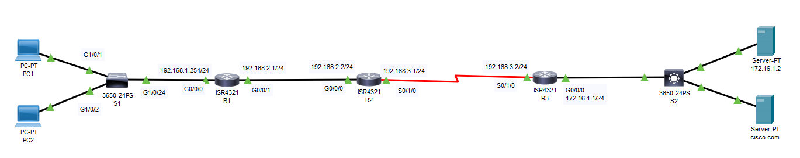

# Static Route
## Source (Udemy: David Bombal Course)
### Lab File Link (pkt): [Here](https://mega.nz/file/K0wxAbiR#afogK-3ISWF7zm7wwPIOYappw9b3Iaob0gujpdCwz1M)
### Scenario:


### **Configure static routes as follows:**

1) Passwords = cisco
2) Configure static routes using next hop IP addresses. Do not use default routes.

```
R1(config)#ip route 192.168.3.0 255.255.255.0 192.168.2.2
R1(config)#ip route 172.16.1.0 255.255.255.0 192.168.2.2

R2(config)#ip route 192.168.1.0 255.255.255.0 192.168.2.1
R2(config)#ip route 172.16.1.0 255.255.255.0 192.168.3.2 

R3(config)#ip route 192.168.2.0 255.255.255.0 192.168.3.1
R3(config)#ip route 192.168.1.0 255.255.255.0 192.168.3.1
```
### **Verification:**
1) Verify that PC1 and PC2 can browse to cisco.com (using DNS name)
2) Make sure S1 can ping the DNS server 172.16.1.2
 
- Watch this video for Verification: 

https://github.com/EZAZ-2281/CCNA-200-301-Lab/assets/81481142/618310bd-7a8d-496a-8305-d75031cc9090


```
Can you imagine trying to do that for the internet? That would be an absolute impossible task because networks are added and removed all the time and there are hundreds of thousands of routes. You don't want to do that statically. That's why we use dynamic routing protocols such as OSPF, IP, BGP and so forth.
```
## **[The End]**