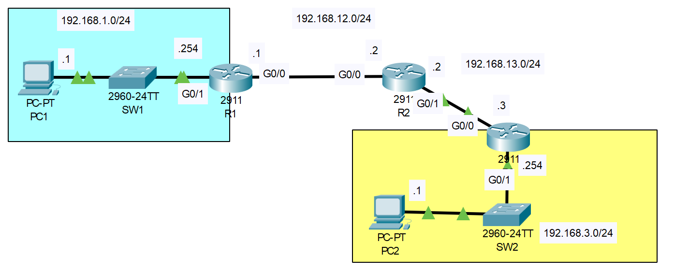
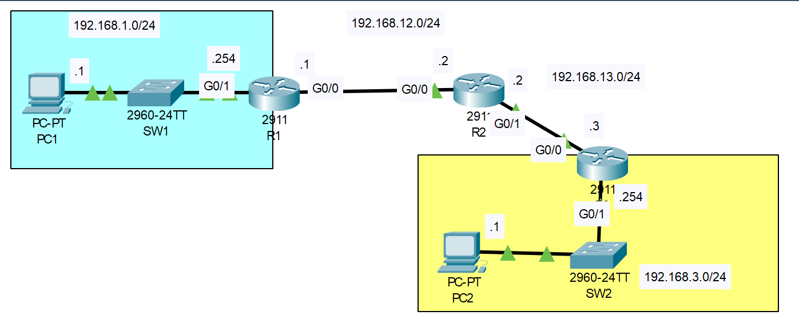

# Static Route
## Source (YouTube: Jeremy's IT Lab)
### Video Link-01: [Here](https://youtu.be/XHxOtIav2k8?si=Cl1TpBjXHFpmgTE5)
### Video Link-02: [Here](https://youtu.be/3z8YGEVFTiA?si=mZcbS7s9CWpXbVvp)
### Lab File Link (pkt)-01: [Here Day-11](https://mega.nz/file/Xh4zQDIJ#1AzQZzon5TJ67Mzj0Ya_Cy5QZ3kim6R16YgL5zYpGB0)
### Lab File Link (pkt)-02: [Here Day-11](https://mega.nz/file/rl5jVRyA#18DfFzB-XzBEnnw_2J1wMqxtslYXSljbL0SmFh2pOxs)
### Scenario:


## **All devices have NO pre-configurations:**

### **1. Configure the PCs and routers according to the network diagram (hostnames, IP addresses, etc.)**
- Remember to configure the gateway on the PCs. (You don't have to configure the switches)

Watch this video for question-1: [Here](https://drive.google.com/file/d/1c2Ft0U08rCESy-0VFKVeMGpbNeV_dWe7/view?usp=sharing)


### **2. Configure static routes on the routers to enable PC1 to successfully ping PC2.**
```
R1(config)#ip route 192.168.3.0 255.255.255.0 192.168.12.2

R2(config)#ip route 192.168.1.0 255.255.255.0 192.168.12.1
R2(config)#ip route 192.168.3.0 255.255.255.0 192.168.13.3

R3(config)#ip route 192.168.1.0 255.255.255.0 192.168.13.2
```
> Now ping from PC1 to PC2:  
```
C:\>ping 192.168.3.1

Pinging 192.168.3.1 with 32 bytes of data:

Reply from 192.168.3.1: bytes=32 time<1ms TTL=125
Reply from 192.168.3.1: bytes=32 time<1ms TTL=125
Reply from 192.168.3.1: bytes=32 time<1ms TTL=125
Reply from 192.168.3.1: bytes=32 time<1ms TTL=125

Ping statistics for 192.168.3.1:
    Packets: Sent = 4, Received = 4, Lost = 0 (0% loss),
Approximate round trip times in milli-seconds:
    Minimum = 0ms, Maximum = 0ms, Average = 0ms
```
## **[The End]**

## **Static Route Troubleshooting**
### Scenario:

```
PC1 and PC2 are unable to ping eachother.
There is one misconfiguration on each router.
Find and fix the misconfigurations.
You have successfully completed the lab when PC1 and PC2 can ping eachother.
```
- Watch this video for solve this.  [Here](https://drive.google.com/file/d/1OLpoU265GdWxvVUem0Qz2xeigrcJ7gRf/view?usp=sharing)
## **[The End]**