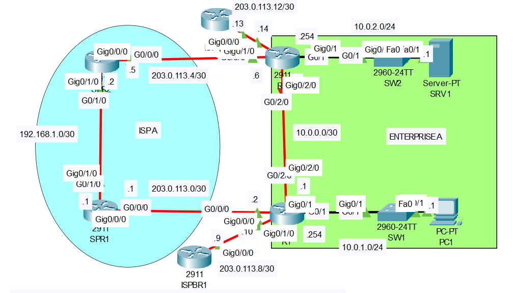

# Floating Static Route
## Source (YouTube: Jeremy's IT Lab)
### Video Link: [Here](https://youtu.be/KuKC0G3LZc8?si=iT4RiFxtBl1zb5j9)
### Lab File Link (pkt): [Here Day-24](https://mega.nz/file/ihxCVLQT#oQh5WyvfdsWZief4oKRSwfd7awUZrImjaZu0OP8XC94)
### Scenario:

## **1. Check the routing tables of R1 and R2.**
```
R1#sh ip route

Gateway of last resort is 203.0.113.9 to network 0.0.0.0

     10.0.0.0/8 is variably subnetted, 5 subnets, 3 masks
C       10.0.0.0/30 is directly connected, GigabitEthernet0/2/0
L       10.0.0.1/32 is directly connected, GigabitEthernet0/2/0
C       10.0.1.0/24 is directly connected, GigabitEthernet0/1
L       10.0.1.254/32 is directly connected, GigabitEthernet0/1
O       10.0.2.0/24 [110/2] via 10.0.0.2, 00:03:42, GigabitEthernet0/2/0 ✅
     203.0.113.0/24 is variably subnetted, 4 subnets, 2 masks
C       203.0.113.0/30 is directly connected, GigabitEthernet0/0/0
L       203.0.113.2/32 is directly connected, GigabitEthernet0/0/0
C       203.0.113.8/30 is directly connected, GigabitEthernet0/1/0
L       203.0.113.10/32 is directly connected, GigabitEthernet0/1/0
S*   0.0.0.0/0 [1/0] via 203.0.113.9 ✅
```
- Which dynamic routing protocol is Enterprise A using? (OSPF)
- Which route will be used if PC1 tries to access SRV1? (R1 > R2 > SRV1)
- Which route will be used if PC1 tries to access remote server 1.1.1.1 over the Internet? (R1 > R2 > SRV1) 
- Test by pinging SRV1 and 1.1.1.1 (R1 > ISPBR1)

## **2. Configure floating static routes on R1 and R2 that allow PC1 to reach SRV1 if the link between R1 and R2 fails.**
```
R1(config)#ip route 10.0.2.0 255.255.255.0 203.0.113.1 111
R2(config)#ip route 10.0.1.0 255.255.255.0 203.0.113.5 111
```
- Do the routes enter the routing tables of R1 and R2? (No) 
```
R1#sh ip route
     10.0.0.0/8 is variably subnetted, 5 subnets, 3 masks
C       10.0.0.0/30 is directly connected, GigabitEthernet0/2/0
L       10.0.0.1/32 is directly connected, GigabitEthernet0/2/0
C       10.0.1.0/24 is directly connected, GigabitEthernet0/1
L       10.0.1.254/32 is directly connected, GigabitEthernet0/1
O       10.0.2.0/24 [110/2] via 10.0.0.2, 00:09:20, GigabitEthernet0/2/0 ✅
     203.0.113.0/24 is variably subnetted, 4 subnets, 2 masks
C       203.0.113.0/30 is directly connected, GigabitEthernet0/0/0
L       203.0.113.2/32 is directly connected, GigabitEthernet0/0/0
C       203.0.113.8/30 is directly connected, GigabitEthernet0/1/0
L       203.0.113.10/32 is directly connected, GigabitEthernet0/1/0
S*   0.0.0.0/0 [1/0] via 203.0.113.9
```
## **3. Shut down the G0/2/0 interface of R1 or R2.**
```
R1(config)#int g0/2/0
R1(config-if)#shut
```
- Do the floating static routes enter the routing tables of R1 and R2? (Yes) 
```
R1#sh ip route

Gateway of last resort is 203.0.113.9 to network 0.0.0.0

     10.0.0.0/8 is variably subnetted, 3 subnets, 2 masks
C       10.0.1.0/24 is directly connected, GigabitEthernet0/1
L       10.0.1.254/32 is directly connected, GigabitEthernet0/1
S       10.0.2.0/24 [111/0] via 203.0.113.0
     203.0.113.0/24 is variably subnetted, 4 subnets, 2 masks
C       203.0.113.0/30 is directly connected, GigabitEthernet0/0/0
L       203.0.113.2/32 is directly connected, GigabitEthernet0/0/0
C       203.0.113.8/30 is directly connected, GigabitEthernet0/1/0
L       203.0.113.10/32 is directly connected, GigabitEthernet0/1/0
S*   0.0.0.0/0 [1/0] via 203.0.113.9
```
- Ping from PC1 to SRV1 to confirm.
```
C:\>ping 10.0.2.1

Pinging 10.0.2.1 with 32 bytes of data:

Reply from 10.0.2.1: bytes=32 time=11ms TTL=124
Reply from 10.0.2.1: bytes=32 time=10ms TTL=124
Reply from 10.0.2.1: bytes=32 time<1ms TTL=124
Reply from 10.0.2.1: bytes=32 time<1ms TTL=124

Ping statistics for 10.0.2.1:
    Packets: Sent = 4, Received = 4, Lost = 0 (0% loss),
Approximate round trip times in milli-seconds:
    Minimum = 0ms, Maximum = 11ms, Average = 5ms
```
- R1 > SPR1 > SPR2 > R2 > SRV1

## **[The End]**