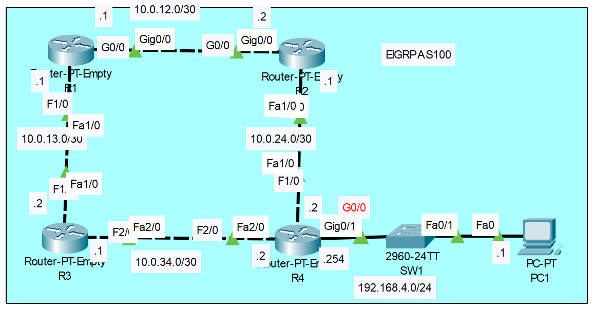

# **EIGRP Configuration**
## This is not necessary for the CCNA exam. Just for practice.
## Source (YouTube: Jeremy's IT Lab)
### Video Link: [Here](https://youtu.be/ffnJ5oBIObY?si=lt_B9P5CSkHdJT9F)
### Lab File Link (pkt): [Here Day-25](https://mega.nz/file/zlxngS4I#adrOEjmNz13wDSVk7H43RmQrUEhAmI3pOU4X9gamCJk)
### Scenario:



## **1. Configure the appropriate hostnames and IP addresses on each device.  Enable router interfaces.**
```
R1(config)#int g0/0
R1(config-if)#ip address 10.0.12.1 255.255.255.252
R1(config-if)#no shut
R1(config-if)#int f1/0
R1(config-if)#ip address 10.0.13.1 255.255.255.252
R1(config-if)#no shut
------------------------------------------------------
R2(config)#int g0/0
R2(config-if)#ip address 10.0.12.2 255.255.255.252
R2(config-if)#no shut
R2(config-if)#int f1/0
R2(config-if)#ip address 10.0.24.1 255.255.255.252
R2(config-if)#no shut
------------------------------------------------------
R3(config)#int f1/0
R3(config-if)#ip address 10.0.13.2 255.255.255.252
R3(config-if)#no shut
R3(config-if)#int f2/0
R3(config-if)#ip address 10.0.34.1 255.255.255.252
R3(config-if)#no shut
------------------------------------------------------
R4(config)#int f1/0
R4(config-if)#ip address 10.0.24.2 255.255.255.252
R4(config-if)#no shut
R4(config-if)#int f2/0
R4(config-if)#ip address 10.0.34.2 255.255.255.252
R4(config-if)#no shut
R4(config)#int g0/0
R4(config-if)#ip address 192.168.4.254 255.255.255.0
R4(config-if)#no shut
```
## **2. Configure a loopback interface on each router (1.1.1.1/32 for R1, 2.2.2.2/32 for R2, etc.)**
```
R1(config)#int loopback 0
R1(config-if)#ip address 1.1.1.1 255.255.255.255
R1(config-if)#no shut
------------------------------------------------------
R2(config)#int loopback 0
R2(config-if)#ip address 2.2.2.2 255.255.255.255
R2(config-if)#no shut
------------------------------------------------------
R3(config)#int loopback 0
R3(config-if)#ip address 3.3.3.3 255.255.255.255
R3(config-if)#no shut
------------------------------------------------------
R4(config)#int loopback 0
R4(config-if)#ip address 4.4.4.4 255.255.255.255
R4(config-if)#no shut
```
```
R1#sh ip int brief
Interface              IP-Address      OK? Method Status                Protocol 
GigabitEthernet0/0     10.0.12.1       YES manual up                    up 
FastEthernet1/0        10.0.13.1       YES manual up                    up 
FastEthernet2/0        unassigned      YES unset  administratively down down 
Loopback0              1.1.1.1         YES manual up                    up ✅
```
## **3. Configure EIGRP on each router.**
- Disable auto-summary.
- Enable EIGRP on each interface (including loopback interfaces).
- Configure passive interfaces where appropriate (including loopback interfaces).
```
R1(config)#router eigrp 1 
R1(config-router)#no auto-summary
R1(config-router)#network 10.0.12.0 0.0.0.255
R1(config-router)#network 10.0.13.0 0.0.0.255
R1(config-router)#network 1.1.1.1 0.0.0.0
R1(config-router)#passive-interface loopback 0
------------------------------------------------------
R2(config)#router eigrp 1 
R2(config-router)#no auto-summary
R2(config-router)#network 10.0.12.0 0.0.0.255
R2(config-router)#network 10.0.24.0 0.0.0.255
R2(config-router)#network 2.2.2.2 0.0.0.0
R2(config-router)#passive-interface loopback 0
------------------------------------------------------
R3(config)#router eigrp 1 
R3(config-router)#no auto-summary
R3(config-router)#network 10.0.13.0 0.0.0.255
R3(config-router)#network 10.0.34.0 0.0.0.255
R3(config-router)#network 3.3.3.3 0.0.0.0
R3(config-router)#passive-interface loopback 0
------------------------------------------------------
R4(config)#router eigrp 1 
R4(config-router)#no auto-summary
R4(config-router)#network 0.0.0.0 255.255.255.255
R4(config-router)#passive-interface g0/0
R4(config-router)#passive-interface loopback 0
```
```
R1#sh ip protocols

Routing Protocol is "eigrp  1 " ✅
  Outgoing update filter list for all interfaces is not set 
  Incoming update filter list for all interfaces is not set 
  Default networks flagged in outgoing updates  
  Default networks accepted from incoming updates 
  EIGRP metric weight K1=1, K2=0, K3=1, K4=0, K5=0
  EIGRP maximum hopcount 100
  EIGRP maximum metric variance 1
Redistributing: eigrp 1
  Automatic network summarization is not in effect  
  Maximum path: 4
  Routing for Networks: ✅ 
     10.0.12.0/24
     10.0.13.0/24
     1.1.1.1/32
  Passive Interface(s): ✅
    Loopback0
  Routing Information Sources: ✅ 
    Gateway         Distance      Last Update 
    10.0.12.2       90            873191     
    10.0.13.2       90            913562     
  Distance: internal 90 external 170
```
```
R1#sh ip route

Gateway of last resort is not set

     1.0.0.0/32 is subnetted, 1 subnets
C       1.1.1.1 is directly connected, Loopback0
     2.0.0.0/32 is subnetted, 1 subnets
D       2.2.2.2 [90/130816] via 10.0.12.2, 00:04:34, GigabitEthernet0/0
     3.0.0.0/32 is subnetted, 1 subnets
D       3.3.3.3 [90/156160] via 10.0.13.2, 00:03:54, FastEthernet1/0
     4.0.0.0/32 is subnetted, 1 subnets
D       4.4.4.4 [90/156416] via 10.0.12.2, 00:02:01, GigabitEthernet0/0
     10.0.0.0/30 is subnetted, 4 subnets
C       10.0.12.0 is directly connected, GigabitEthernet0/0
C       10.0.13.0 is directly connected, FastEthernet1/0
D       10.0.24.0 [90/28416] via 10.0.12.2, 00:04:34, GigabitEthernet0/0
D       10.0.34.0 [90/30720] via 10.0.13.2, 00:03:54, FastEthernet1/0
D    192.168.4.0/24 [90/28672] via 10.0.12.2, 00:02:01, GigabitEthernet0/0
```
```
R1#sh ip route eigrp 
R1#sh ip route connected 
R1#sh ip route static
We can also use this command. 
```
## **4. Configure R1 to perform unequal-cost load-balancing when sending network traffic to 192.168.4.0/24**
```
R1#sh ip eigrp neighbors 
IP-EIGRP neighbors for process 1
H   Address         Interface      Hold Uptime    SRTT   RTO   Q   Seq
                                   (sec)          (ms)        Cnt  Num
0   10.0.12.2       Gig0/0         14   00:06:18  40     1000  0   15
1   10.0.13.2       Fa1/0          14   00:05:38  40     1000  0   19
```
```
R1#sh ip eigrp topology 
IP-EIGRP Topology Table for AS 1/ID(1.1.1.1)

Codes: P - Passive, A - Active, U - Update, Q - Query, R - Reply,
       r - Reply status

P 1.1.1.1/32, 1 successors, FD is 128256
         via Connected, Loopback0
P 2.2.2.2/32, 1 successors, FD is 130816
         via 10.0.12.2 (130816/128256), GigabitEthernet0/0
P 3.3.3.3/32, 1 successors, FD is 156160
         via 10.0.13.2 (156160/128256), FastEthernet1/0
P 4.4.4.4/32, 1 successors, FD is 156416
         via 10.0.12.2 (156416/156160), GigabitEthernet0/0
         via 10.0.13.2 (158720/156160), FastEthernet1/0
P 10.0.12.0/30, 1 successors, FD is 2816
         via Connected, GigabitEthernet0/0
P 10.0.13.0/30, 1 successors, FD is 28160
         via Connected, FastEthernet1/0
P 10.0.24.0/30, 1 successors, FD is 28416
         via 10.0.12.2 (28416/28160), GigabitEthernet0/0
P 10.0.34.0/30, 1 successors, FD is 30720
         via 10.0.13.2 (30720/28160), FastEthernet1/0
P 192.168.4.0/24, 1 successors, FD is 28672
         via 10.0.12.2 (28672/28416), GigabitEthernet0/0 ✅
         via 10.0.13.2 (30976/28416), FastEthernet1/0 ✅
```
## **[The End]**