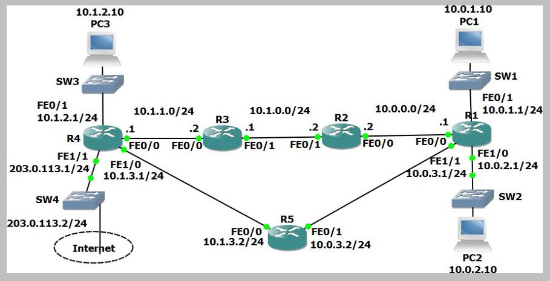

# Connectivity Troubleshooting (Source: Udemy)
## Instructor: Neil Anderson  
### **Pkt file:** [Here](https://mega.nz/file/64p2kS4S#l3Ev9ykxUYV6TMuBZLovT13z_FiLZa0qwZF2-QaxWYk)
### Scenario: 


## **Troubleshoot Connectivity**
1)	Use ping to test connectivity from PC1 to PC3.
```
C:\>ping 10.1.2.10

Pinging 10.1.2.10 with 32 bytes of data:

Reply from 10.0.1.1: Destination host unreachable.
Reply from 10.0.1.1: Destination host unreachable.
Reply from 10.0.1.1: Destination host unreachable.
Reply from 10.0.1.1: Destination host unreachable.

Ping statistics for 10.1.2.10:
    Packets: Sent = 4, Received = 0, Lost = 4 (100% loss),
```
2)	Use traceroute to determine where the problem is likely to be.
```
C:\>tracert 10.1.2.10

Tracing route to 10.1.2.10 over a maximum of 30 hops: 

  1   0 ms      0 ms      0 ms      10.0.1.1
  2   1 ms      *         0 ms      10.0.1.1
  3   *         0 ms      *         Request timed out.
  4   1 ms      
Control-C
^C
```
3)	Determine the issue and fix it to restore connectivity between PC1 and PC3.
- The traffic is go through to R1 and can't go further. So we need to configure static route of PC3 nework on R1, R2 and R3. 
```
R1#sh run | include ip route
ip route 10.1.2.0 255.255.255.0 10.0.0.2 

R2#sh run | include ip route 
ip route 10.1.2.0 255.255.255.0 10.1.0.1 
ip route 10.0.1.0 255.255.255.0 10.0.0.1 

R3#sh run | include ip route
ip route 10.1.2.0 255.255.255.0 10.1.1.1 
ip route 10.0.1.0 255.255.255.0 10.1.0.2 

R4#sh run | include ip route
ip route 10.0.1.0 255.255.255.0 10.1.1.2 
```
```
C:\>ping 10.1.2.10

Pinging 10.1.2.10 with 32 bytes of data:

Reply from 10.1.2.10: bytes=32 time=1ms TTL=124
Reply from 10.1.2.10: bytes=32 time=1ms TTL=124
Reply from 10.1.2.10: bytes=32 time<1ms TTL=124
Reply from 10.1.2.10: bytes=32 time=11ms TTL=124

Ping statistics for 10.1.2.10:
    Packets: Sent = 4, Received = 4, Lost = 0 (0% loss),
Approximate round trip times in milli-seconds:
    Minimum = 0ms, Maximum = 11ms, Average = 3ms
```
## **[The End]**