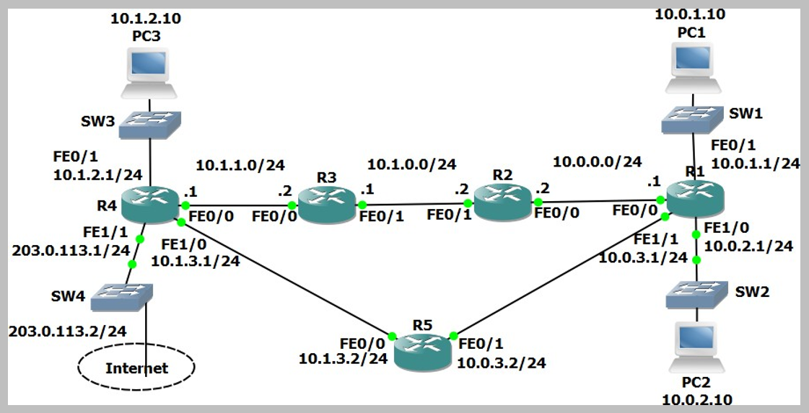
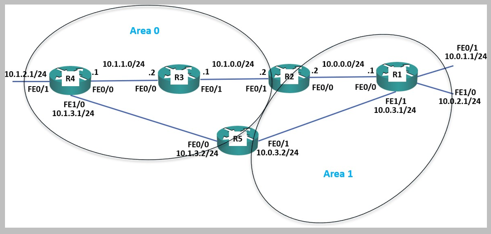
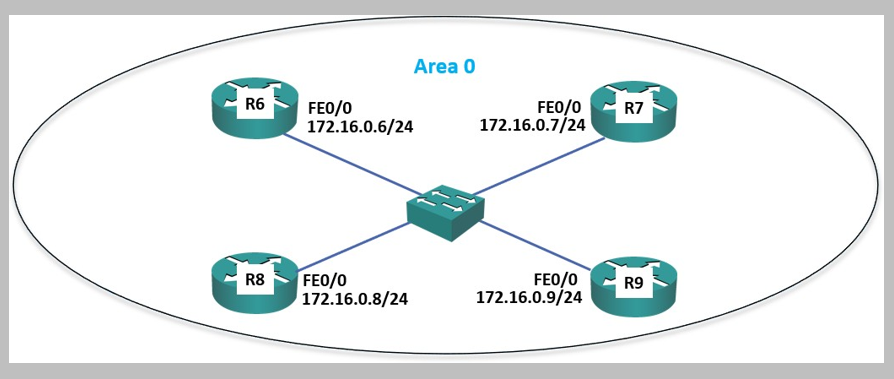

# OSPF Configuration (Source: Udemy)
## Instructor: Neil Anderson  
### **Pkt file:** [Here](https://mega.nz/file/D4R1BYDY#Wno8jPqXCpIbUm8R6Ey8VusjsMEMk0TOb6FT7HB7WIg)
### Scenario: 


## **OSPF Basic Configuration**

1)	Enable a loopback interface on each router. Use the IP address 192.168.0.x/32, where ‘x’ is the router number. For example 192.168.0.3/32 on R3.
- On router R1 to R5: 
```
R1(config)#int l0
R1(config-if)#ip address 192.168.0.1 255.255.255.255
R1(config-if)#no shut
```
2)	Enable single area OSPF on every router. Ensure all networks except 203.0.113.0/24 are advertised.
- On router R1 to R5: 
```
R1(config)#router ospf 1
R1(config-router)#network 10.0.0.0 0.255.255.255 area 0
R1(config-router)#network 192.168.0.0 0.0.0.255 area 0
```
3)	What do you expect the OSPF Router ID to be on R1? Verify this.
- The loopback address is used for the Router ID, 192.168.0.1
```
R1#sh ip protocols

Routing Protocol is "ospf 1"
  Outgoing update filter list for all interfaces is not set 
  Incoming update filter list for all interfaces is not set 
  Router ID 192.168.0.1 ✅
  Number of areas in this router is 1. 1 normal 0 stub 0 nssa
  Maximum path: 4
  Routing for Networks:
    192.168.0.0 0.0.0.255 area 0
    10.0.0.0 0.255.255.255 area 0
  Routing Information Sources:  
    Gateway         Distance      Last Update 
    192.168.0.1          110      00:00:44
    192.168.0.2          110      00:00:37
    192.168.0.3          110      00:00:26
    192.168.0.4          110      00:00:17
    192.168.0.5          110      00:00:17
  Distance: (default is 110)
```
4)	Verify the routers have formed adjacencies with each other.
```
R1#sh ip ospf neighbor


Neighbor ID     Pri   State           Dead Time   Address         Interface
192.168.0.2       1   FULL/DR         00:00:36    10.0.0.2        FastEthernet0/0
192.168.0.5       1   FULL/BDR        00:00:31    10.0.3.2        FastEthernet1/1
```
5)	Verify all 10.x.x.x networks and loopbacks are in the router’s routing tables.
```
R1#sh ip route ospf
     10.0.0.0/8 is variably subnetted, 12 subnets, 2 masks
O       10.1.0.0 [110/2] via 10.0.0.2, 00:02:00, FastEthernet0/0
O       10.1.1.0 [110/3] via 10.0.0.2, 00:01:40, FastEthernet0/0
                 [110/3] via 10.0.3.2, 00:01:40, FastEthernet1/1
O       10.1.2.0 [110/3] via 10.0.3.2, 00:01:40, FastEthernet1/1
O       10.1.3.0 [110/2] via 10.0.3.2, 00:01:40, FastEthernet1/1
     192.168.0.0/32 is subnetted, 5 subnets
O       192.168.0.2 [110/2] via 10.0.0.2, 00:02:10, FastEthernet0/0
O       192.168.0.3 [110/3] via 10.0.0.2, 00:01:50, FastEthernet0/0
O       192.168.0.4 [110/3] via 10.0.3.2, 00:01:40, FastEthernet1/1
O       192.168.0.5 [110/2] via 10.0.3.2, 00:02:00, FastEthernet1/1
```
6)	Set the reference bandwidth so that a 100 Gbps interface will have a cost of 1.
- Remember to do this on all routers R1 to R5.
```
R1(config)#router ospf 1
R1(config-router)#auto-cost reference-bandwidth 100000
```
7)	What will the OSPF cost be on the FastEthernet links? Verify this.
```
OSPF Cost = Reference bandwidth / Interface bandwidth. So, 100000 / 100 = 1000
```
```
R1#sh ip ospf int f0/0

FastEthernet0/0 is up, line protocol is up
  Internet address is 10.0.0.1/24, Area 0
  Process ID 1, Router ID 192.168.0.1, Network Type BROADCAST, Cost: 1000 ✅
```
8)	What effect does this have on the cost to the 10.1.2.0/24 network from R1?
- See step-5. Here the cost is 3. But for manually configuring cost the cost is 3000 now. The cost changes from 3 to 3000.
```
R1#sh ip route ospf
     10.0.0.0/8 is variably subnetted, 12 subnets, 2 masks
O       10.1.0.0 [110/2000] via 10.0.0.2, 00:01:23, FastEthernet0/0
O       10.1.1.0 [110/3000] via 10.0.0.2, 00:01:23, FastEthernet0/0
                 [110/3000] via 10.0.3.2, 00:01:23, FastEthernet1/1
O       10.1.2.0 [110/3000] via 10.0.3.2, 00:01:23, FastEthernet1/1 ✅
O       10.1.3.0 [110/2000] via 10.0.3.2, 00:01:23, FastEthernet1/1
     192.168.0.0/32 is subnetted, 5 subnets
O       192.168.0.2 [110/1012] via 10.0.0.2, 00:01:23, FastEthernet0/0
O       192.168.0.3 [110/2012] via 10.0.0.2, 00:01:23, FastEthernet0/0
O       192.168.0.4 [110/2012] via 10.0.3.2, 00:01:23, FastEthernet1/1
O       192.168.0.5 [110/1012] via 10.0.3.2, 00:01:23, FastEthernet1/1
```
## **[The End]**

## **OSPF Cost**
9)	There are two possible paths which R1 could use to reach the 10.1.2.0/24 network – either through R2 or R5. Which route is in the routing table?
- The path via R5 at 10.0.3.2. See the step-8 output. Here we see `via 10.0.3.2` that means R5. 
10)	Change this so that traffic from R1 to 10.1.2.0/24 will be load balanced via both R2 and R5.
- Since we changed the reference bandwidth, all interfaces have a cost of 1000. The current path from R1 > R5 > R4 has a cost of 3000 (the cost of the destination interface itself is also counted in the total cost). The path from R1 > R2 > R3 > R4 has a cost of 4000. The easiest way to configure both paths to have the same cost is to configure the links from R1 > R5 and R5 > R4 to have a cost of 1500 each. (R1 > R5 = 1500, plus R5 > R4 = 1500, plus cost of 10.1.2.0/24 interface on R4 = 1000. Total = 4000).
```
R1(config)#int f1/1
R1(config-if)#ip ospf cost 1500
--------------------------------
R5(config)#int f0/0
R5(config-if)#ip ospf cost 1500
R5(config-if)#int f0/1
R5(config-if)#ip ospf cost 1500
--------------------------------
R4(config)#int f1/0
R4(config-if)#ip ospf cost 1500
```
11)	Verify that traffic to the 10.1.2.0/24 network from R1 is load balanced via both R2 and R5.
```
R1#sh ip route ospf
     10.0.0.0/8 is variably subnetted, 12 subnets, 2 masks
O       10.1.0.0 [110/2000] via 10.0.0.2, 00:11:20, FastEthernet0/0
O       10.1.1.0 [110/3000] via 10.0.0.2, 00:02:17, FastEthernet0/0
O       10.1.2.0 [110/4000] via 10.0.3.2, 00:01:56, FastEthernet1/1 ✅
                 [110/4000] via 10.0.0.2, 00:01:56, FastEthernet0/0 ✅
O       10.1.3.0 [110/3000] via 10.0.3.2, 00:01:56, FastEthernet1/1
     192.168.0.0/32 is subnetted, 5 subnets
O       192.168.0.2 [110/1012] via 10.0.0.2, 00:11:20, FastEthernet0/0
O       192.168.0.3 [110/2012] via 10.0.0.2, 00:11:20, FastEthernet0/0
O       192.168.0.4 [110/3012] via 10.0.3.2, 00:01:56, FastEthernet1/1
                    [110/3012] via 10.0.0.2, 00:01:56, FastEthernet0/0
O       192.168.0.5 [110/1512] via 10.0.3.2, 00:02:17, FastEthernet1/1
```
## **[The End]**
## **Default Route Injection**

12)	Ensure that all routers have a route to the 203.0.113.0/24 network. Internal routes must not be advertised to the Service Provider at 203.0.113.2.
- The 203.0.113.0/24 network must be added to the OSPF process on R4, and interface FastEthernet 1/1 facing the service provider configured as a passive interface to avoid sending out internal network information.
```
R4(config)#router ospf 1
R4(config-router)#network 203.0.113.0 0.0.0.255 area 0
R4(config-router)#passive-interface f1/1
```
13)	Verify that all routers have a path to the 203.0.113.0/24 network.
```
R1#sh ip route ospf
     10.0.0.0/8 is variably subnetted, 12 subnets, 2 masks
O       10.1.0.0 [110/2000] via 10.0.0.2, 00:15:50, FastEthernet0/0
O       10.1.1.0 [110/3000] via 10.0.0.2, 00:06:47, FastEthernet0/0
O       10.1.2.0 [110/4000] via 10.0.3.2, 00:06:26, FastEthernet1/1
                 [110/4000] via 10.0.0.2, 00:06:26, FastEthernet0/0
O       10.1.3.0 [110/3000] via 10.0.3.2, 00:06:26, FastEthernet1/1
     192.168.0.0/32 is subnetted, 5 subnets
O       192.168.0.2 [110/1012] via 10.0.0.2, 00:15:50, FastEthernet0/0
O       192.168.0.3 [110/2012] via 10.0.0.2, 00:15:50, FastEthernet0/0
O       192.168.0.4 [110/3012] via 10.0.3.2, 00:06:26, FastEthernet1/1
                    [110/3012] via 10.0.0.2, 00:06:26, FastEthernet0/0
O       192.168.0.5 [110/1512] via 10.0.3.2, 00:06:47, FastEthernet1/1
O    203.0.113.0 [110/4000] via 10.0.3.2, 00:00:30, FastEthernet1/1 ✅
                 [110/4000] via 10.0.0.2, 00:00:30, FastEthernet0/0 ✅
```
14)	Configure a default static route on R4 to the Internet via the service provider at 203.0.113.2
```
R4(config)#ip route 0.0.0.0 0.0.0.0 203.0.113.2
R4(config)#router ospf 1
R4(config-router)#default-information originate
```
15)	Ensure that all other routers learn via OSPF how to reach the Internet.
- See step-14 command. 
16)	Verify all routers have a route to the Internet.
```
R1#sh ip route
 
Gateway of last resort is 10.0.3.2 to network 0.0.0.0 ✅

     10.0.0.0/8 is variably subnetted, 12 subnets, 2 masks
C       10.0.0.0/24 is directly connected, FastEthernet0/0
L       10.0.0.1/32 is directly connected, FastEthernet0/0
C       10.0.1.0/24 is directly connected, FastEthernet0/1
L       10.0.1.1/32 is directly connected, FastEthernet0/1
C       10.0.2.0/24 is directly connected, FastEthernet1/0
L       10.0.2.1/32 is directly connected, FastEthernet1/0
C       10.0.3.0/24 is directly connected, FastEthernet1/1
L       10.0.3.1/32 is directly connected, FastEthernet1/1
O       10.1.0.0/24 [110/2000] via 10.0.0.2, 00:17:09, FastEthernet0/0
O       10.1.1.0/24 [110/3000] via 10.0.0.2, 00:08:06, FastEthernet0/0
O       10.1.2.0/24 [110/4000] via 10.0.3.2, 00:07:45, FastEthernet1/1
                    [110/4000] via 10.0.0.2, 00:07:45, FastEthernet0/0
O       10.1.3.0/24 [110/3000] via 10.0.3.2, 00:07:45, FastEthernet1/1
     192.168.0.0/32 is subnetted, 5 subnets
C       192.168.0.1/32 is directly connected, Loopback0
O       192.168.0.2/32 [110/1012] via 10.0.0.2, 00:17:09, FastEthernet0/0
O       192.168.0.3/32 [110/2012] via 10.0.0.2, 00:17:09, FastEthernet0/0
O       192.168.0.4/32 [110/3012] via 10.0.3.2, 00:07:45, FastEthernet1/1
                       [110/3012] via 10.0.0.2, 00:07:45, FastEthernet0/0
O       192.168.0.5/32 [110/1512] via 10.0.3.2, 00:08:06, FastEthernet1/1
O    203.0.113.0/24 [110/4000] via 10.0.3.2, 00:01:49, FastEthernet1/1
                    [110/4000] via 10.0.0.2, 00:01:49, FastEthernet0/0
O*E2 0.0.0.0/0 [110/1] via 10.0.3.2, 00:00:18, FastEthernet1/1 ✅
               [110/1] via 10.0.0.2, 00:00:18, FastEthernet0/0 ✅
```
## **[The End]**
## **Multi-area OSPF**
 
17)	Convert the network to use multi-area OSPF. R3 and R4 should be backbone routers, R1 a normal router in Area 1, and R2 and R5 ABRs as shown in the diagram below. Save your changes to the startup config and reboot the routers to ensure the changes take effect.

- R3 and R4 require no change as all their interfaces are already in Area 0. 
- R1’s interfaces need to be reconfigured to be in Area 1 rather than Area 0.
```
R1#show run | section ospf ip ospf cost 1500
router ospf 1
log-adjacency-changes
auto-cost reference-bandwidth 100000
network 10.0.0.0 0.255.255.255 area 0
network 192.168.0.0 0.0.0.255 area 0

R1(config)#router ospf 1
R1(config-router)#network 10.0.0.0 0.255.255.255 area 1
R1(config-router)#network 192.168.0.0 0.0.0.255 area 1 
R1#copy run start
R1#reload
 ```
- R2 interface FastEthernet 0/1 should remain in Area 0. FastEthernet 0/0 needs to be reconfigured to be in Area 1. I used a 10.0.0.0/8 network statement originally so I need to remove that and add more granular statements.
```
R2#sh run | section ospf router ospf 1
log-adjacency-changes
auto-cost reference-bandwidth 100000
network 10.0.0.0 0.255.255.255 area 0
network 192.168.0.0 0.0.0.255 area 0

R2(config)#router ospf 1
R2(config-router)#no network 10.0.0.0 0.255.255.255 area 0
R2(config-router)#network 10.1.0.0 0.0.255.255 area 0
R2(config-router)#network 10.0.0.0 0.0.255.255 area 1 R2#copy run start
R2#reload
```
- R5 interface FastEthernet 0/0 should remain in Area 0. FastEthernet 0/1 needs to be reconfigured to be in Area 1.
```
R5#sh run | section ospf 
ip ospf cost 1500 
router ospf 1
log-adjacency-changes
auto-cost reference-bandwidth 100000
network 10.0.0.0 0.255.255.255 area 0
network 192.168.0.0 0.0.0.255 area 0

R5(config)#router ospf 1
R5(config-router)#no network 10.0.0.0 0.255.255.255 area 0
R5(config-router)#network 10.1.3.0 0.0.0.255 area 0
R5(config-router)#network 10.0.3.0 0.0.0.255 area 1 R5#copy run start
R5#reload
```
18)	Verify the router’s interfaces are in the correct areas.
- We can also use `sh ip ospf int` command 
```
R2#sh run | section ospf
router ospf 1
 log-adjacency-changes
 auto-cost reference-bandwidth 100000
 network 192.168.0.0 0.0.0.255 area 0
 network 10.1.0.0 0.0.255.255 area 0
 network 10.0.0.0 0.0.255.255 area 1
```
19)	Verify the routers have formed adjacencies with each other.
```
R1#sh ip ospf nei

Neighbor ID     Pri   State           Dead Time   Address         Interface
192.168.0.2       1   FULL/DR         00:00:37    10.0.0.2        FastEthernet0/0
192.168.0.5       1   FULL/DR         00:00:35    10.0.3.2        FastEthernet1/1
```
20)	What change do you expect to see on R1’s routing table? Verify this (give the routing table a few seconds to converge).
- The networks beyond R2 and R5 will appear as Inter Area routes (apart from the default route which will appear as an external route as it was redistributed into OSPF).
```
R1#sh ip route

Gateway of last resort is 10.0.3.2 to network 0.0.0.0

     10.0.0.0/8 is variably subnetted, 12 subnets, 2 masks
C       10.0.0.0/24 is directly connected, FastEthernet0/0
L       10.0.0.1/32 is directly connected, FastEthernet0/0
C       10.0.1.0/24 is directly connected, FastEthernet0/1
L       10.0.1.1/32 is directly connected, FastEthernet0/1
C       10.0.2.0/24 is directly connected, FastEthernet1/0
L       10.0.2.1/32 is directly connected, FastEthernet1/0
C       10.0.3.0/24 is directly connected, FastEthernet1/1
L       10.0.3.1/32 is directly connected, FastEthernet1/1
O IA    10.1.0.0/24 [110/2000] via 10.0.0.2, 00:08:51, FastEthernet0/0
O IA    10.1.1.0/24 [110/3000] via 10.0.0.2, 00:08:51, FastEthernet0/0
O IA    10.1.2.0/24 [110/4000] via 10.0.0.2, 00:08:51, FastEthernet0/0
                    [110/4000] via 10.0.3.2, 00:06:24, FastEthernet1/1
O IA    10.1.3.0/24 [110/3000] via 10.0.3.2, 00:06:24, FastEthernet1/1
     192.168.0.0/32 is subnetted, 5 subnets
C       192.168.0.1/32 is directly connected, Loopback0
O IA    192.168.0.2/32 [110/1012] via 10.0.0.2, 00:08:51, FastEthernet0/0
O IA    192.168.0.3/32 [110/2012] via 10.0.0.2, 00:08:51, FastEthernet0/0
O IA    192.168.0.4/32 [110/3012] via 10.0.0.2, 00:08:51, FastEthernet0/0
                       [110/3012] via 10.0.3.2, 00:06:24, FastEthernet1/1
O IA    192.168.0.5/32 [110/1512] via 10.0.3.2, 00:06:24, FastEthernet1/1
O IA 203.0.113.0/24 [110/4000] via 10.0.0.2, 00:08:51, FastEthernet0/0
                    [110/4000] via 10.0.3.2, 00:06:24, FastEthernet1/1
O*E2 0.0.0.0/0 [110/1] via 10.0.3.2, 00:06:13, FastEthernet1/1
```
21)	Do you see less routes in R1’s routing table? Why or why not?
- R1 has the same amount of routes in its routing table because OSPF does not perform automatic summarisation. We must configure manual summarisation to reduce the size of the routing table.
22)	Configure summary routes on the Area Border Routers for the 10.0.0.0/16 and 10.1.0.0/16 networks.
```
R2(config)#router ospf 1
R2(config-router)#area 0 range 10.1.0.0 255.255.0.0
R2(config-router)#area 1 range 10.0.0.0 255.255.0.0

R5(config-if)#router ospf 1
R5(config-router)#area 0 range 10.1.0.0 255.255.0.0
R5(config-router)#area 1 range 10.0.0.0 255.255.0.0
```
23)	Verify R1 now sees a single summary route for 10.1.0.0/16 rather than individual routes for the 10.1.x.x networks.
```
R1#sh ip route

Gateway of last resort is 10.0.3.2 to network 0.0.0.0

     10.0.0.0/8 is variably subnetted, 9 subnets, 3 masks
C       10.0.0.0/24 is directly connected, FastEthernet0/0
L       10.0.0.1/32 is directly connected, FastEthernet0/0
C       10.0.1.0/24 is directly connected, FastEthernet0/1
L       10.0.1.1/32 is directly connected, FastEthernet0/1
C       10.0.2.0/24 is directly connected, FastEthernet1/0
L       10.0.2.1/32 is directly connected, FastEthernet1/0
C       10.0.3.0/24 is directly connected, FastEthernet1/1
L       10.0.3.1/32 is directly connected, FastEthernet1/1
O IA    10.1.0.0/16 [110/3000] via 10.0.3.2, 00:00:22, FastEthernet1/1 ✅
                    [110/3000] via 10.0.0.2, 00:00:22, FastEthernet0/0
     192.168.0.0/32 is subnetted, 5 subnets
C       192.168.0.1/32 is directly connected, Loopback0
O IA    192.168.0.2/32 [110/1012] via 10.0.0.2, 00:13:27, FastEthernet0/0
O IA    192.168.0.3/32 [110/2012] via 10.0.0.2, 00:13:27, FastEthernet0/0
O IA    192.168.0.4/32 [110/3012] via 10.0.0.2, 00:13:27, FastEthernet0/0
                       [110/3012] via 10.0.3.2, 00:11:00, FastEthernet1/1
O IA    192.168.0.5/32 [110/1512] via 10.0.3.2, 00:11:00, FastEthernet1/1
O IA 203.0.113.0/24 [110/4000] via 10.0.0.2, 00:13:27, FastEthernet0/0
                    [110/4000] via 10.0.3.2, 00:11:00, FastEthernet1/1
O*E2 0.0.0.0/0 [110/1] via 10.0.3.2, 00:10:49, FastEthernet1/1
```
24)	Verify R1 is receiving a summary route for the 10.1.0.0/16 network from both R2 and R5.
```
R1#sh ip ospf database
            OSPF Router with ID (192.168.0.1) (Process ID 1)

                Router Link States (Area 1)

Link ID         ADV Router      Age         Seq#       Checksum Link count
192.168.0.2     192.168.0.2     972         0x80000003 0x007305 1
192.168.0.5     192.168.0.5     842         0x80000002 0x00d0a6 1
192.168.0.1     192.168.0.1     759         0x8000000e 0x00b815 5

                Net Link States (Area 1)
Link ID         ADV Router      Age         Seq#       Checksum
10.0.0.2        192.168.0.2     906         0x80000002 0x001e8c
10.0.3.2        192.168.0.5     759         0x80000002 0x0097e8

                Summary Net Link States (Area 1)
Link ID         ADV Router      Age         Seq#       Checksum
192.168.0.2     192.168.0.2     979         0x80000005 0x001c5c
192.168.0.3     192.168.0.2     979         0x80000006 0x004446
192.168.0.4     192.168.0.2     979         0x80000008 0x006932
203.0.113.0     192.168.0.2     979         0x80000009 0x00c228
192.168.0.5     192.168.0.5     849         0x80000001 0x00f382
192.168.0.4     192.168.0.5     830         0x80000007 0x00bfcf
203.0.113.0     192.168.0.5     830         0x80000008 0x0019c5
192.168.0.3     192.168.0.5     830         0x80000009 0x00f8a9
192.168.0.2     192.168.0.5     830         0x8000000a 0x003482
192.168.0.5     192.168.0.2     759         0x80000004 0x003488
10.1.0.0        192.168.0.5     135         0x80000007 0x00936a ✅
10.1.0.0        192.168.0.2     128         0x80000015 0x0023d9 ✅

                Summary ASB Link States (Area 1)
Link ID         ADV Router      Age         Seq#       Checksum
192.168.0.4     192.168.0.5     830         0x80000003 0x00415d
192.168.0.4     192.168.0.2     749         0x80000005 0x00e8c0

                Type-5 AS External Link States
Link ID         ADV Router      Age         Seq#       Checksum Tag
0.0.0.0         192.168.0.4     1656        0x80000001 0x00f86c 1
```
25)	R1 is routing traffic to 10.1.0.0/16 via R2 only. Why is it not load balancing the traffic through both R2 and R5?
- We configured the link from R1 to R5 to have a higher cost than the link from R1 to R2 earlier.
```
R1#sh ip ospf int f1/1

FastEthernet1/1 is up, line protocol is up
  Internet address is 10.0.3.1/24, Area 1
  Process ID 1, Router ID 192.168.0.1, Network Type BROADCAST, Cost: 1500 ✅
```
```
R1#sh ip ospf int f0/0

FastEthernet0/0 is up, line protocol is up
  Internet address is 10.0.0.1/24, Area 1
  Process ID 1, Router ID 192.168.0.1, Network Type BROADCAST, Cost: 1000 ✅
```
## **[The End]**
## **DR and BDR Designated Router** 

26)	Enable a loopback interface on routers R6 to R9. Use the IP address 192.168.0.x/32, where ‘x’ is the router number. For example 192.168.0.6/32 on R6.
On routers R6 to R9:
```
R6(config)#interface loopback0
R6(config-if)#ip address 192.168.0.6 255.255.255.255
```
27)	Enable OSPF for Area 0 on the Loopback 0 and FastEthernet 0/0 interfaces on routers R6 to R9.
```
R6(config)#router ospf 1
R6(config-router)#network 172.16.0.0 0.0.0.255 area 0
R6(config-router)#network 192.168.0.0 0.0.0.255 area 0
```
28)	Set the reference bandwidth on routers R6 to R9 so that a 100 Gbps interface will have a cost of 1.
- Remember to do this on all routers R6 to R9.
```
R6(config)#router ospf 1
R6(config-router)#auto-cost reference-bandwidth 100000
```
29)	Which routers do you expect to be the DR and BDR on the Ethernet segment? Verify this.
```
R6#sh ip ospf nei

Neighbor ID     Pri   State           Dead Time   Address         Interface
192.168.0.7       1   2WAY/DROTHER    00:00:35    172.16.0.7      FastEthernet0/0
192.168.0.8       1   FULL/BDR        00:00:32    172.16.0.8      FastEthernet0/0
192.168.0.9       1   FULL/DR         00:00:38    172.16.0.9      FastEthernet0/0
```
```
R6#sh ip ospf int f0/0

FastEthernet0/0 is up, line protocol is up
  Internet address is 172.16.0.6/24, Area 0
  Process ID 1, Router ID 192.168.0.6, Network Type BROADCAST, Cost: 1000
  Transmit Delay is 1 sec, State DROTHER, Priority 1 ✅
  Designated Router (ID) 192.168.0.9, Interface address 172.16.0.9 ✅
  Backup Designated Router (ID) 192.168.0.8, Interface address 172.16.0.8 ✅
  Timer intervals configured, Hello 10, Dead 40, Wait 40, Retransmit 5
    Hello due in 00:00:07
  Index 1/1, flood queue length 0
  Next 0x0(0)/0x0(0)
  Last flood scan length is 1, maximum is 1
  Last flood scan time is 0 msec, maximum is 0 msec
  Neighbor Count is 3, Adjacent neighbor count is 2
    Adjacent with neighbor 192.168.0.9  (Designated Router)
    Adjacent with neighbor 192.168.0.8  (Backup Designated Router)
  Suppress hello for 0 neighbor(s)
```
30)	Set R6 as the Designated Router without changing any IP addresses.
- Configure a higher OSPF priority on R6.
```
R6(config)#interface FastEthernet0/0 
R6(config-if)#ip ospf priority 100 
R6(config-if)#end
R6#clear ip ospf process
```
31)	Verify R6 is the Designated Router.
```
R6#sh ip ospf int f0/0

FastEthernet0/0 is up, line protocol is up
  Internet address is 172.16.0.6/24, Area 0
  Process ID 1, Router ID 192.168.0.6, Network Type BROADCAST, Cost: 1000
  Transmit Delay is 1 sec, State DR, Priority 100
  Designated Router (ID) 192.168.0.6, Interface address 172.16.0.6 ✅
  Backup Designated Router (ID) 192.168.0.8, Interface address 172.16.0.8
  Timer intervals configured, Hello 10, Dead 40, Wait 40, Retransmit 5
```
## **[The End]**