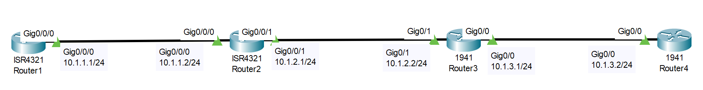
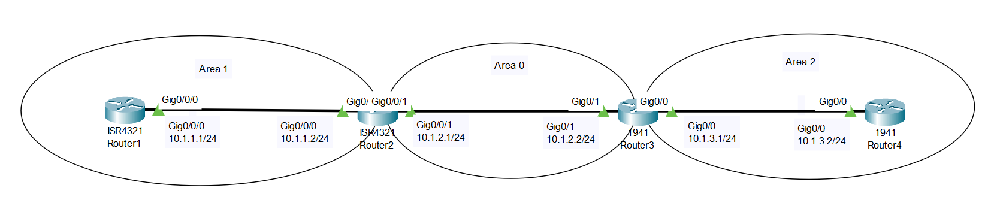

# OSPF Configuration (Source: Udemy)
## Instructor: David Bombal  
### **Pkt file:** [Here](https://mega.nz/file/GkAlgawQ#891X-CjPsCangRNhW0de40ilgmLdRQnEN7bUefKktVc)
### Scenario: 

## **Configure OSPF in a single area as follows:**
1) Use OSPF process ID 1
2) R1 - enable OSPF using the network command with exact IP match
2) R2 - enable OSPF using the network command based on subnet mask
3) R3 - enable OSPF using the interface command
4) R4 - enble OSPF on all interfaces with a single network command

https://github.com/EZAZ-2281/CCNA-200-301-Lab/assets/81481142/e0d527a2-a0ea-4e18-8d58-2fa8cb3e7902

- In step-4 I made a mistake. The command will be `network 0.0.0.0 255.255.255.255 area 0`. 
## **[The End]**
## **Configure OSPF in multiple areas as shown in the diagram and as follows:**
### **Pkt file:** [Here](https://mega.nz/file/LpggiJID#aHkRkPMjEDmgHqnc7ez9y20YfwCKP0Adm4aunsKzzgI)
### Scenario: 

1) Use OSPF process ID 1
2) R1 - enable OSPF using the network command with exact IP match
2) R2 - enable OSPF using the network command based on subnet mask
3) R3 - enable OSPF using the interface command
4) R4 - enble OSPF on all interfaces with a single network command

https://github.com/EZAZ-2281/CCNA-200-301-Lab/assets/81481142/7bb7896a-fa1f-4989-83b6-e8402cd65623

- OSPF Show Command 
```
R1#sh ip ospf neighbor
R1#sh ip ospf int brief
R1#sh ip ospf database
R1#sh ip protocols
```
## **[The End]**