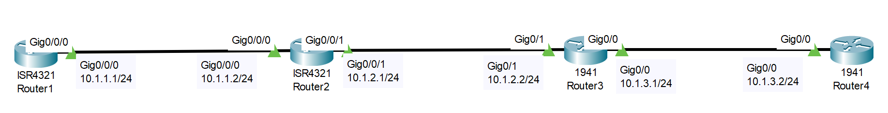

# OSPF Configuration Troubleshooting (Source: Udemy)
## Instructor: David Bombal  
### **Pkt file:** [Here](https://mega.nz/file/jgIHCZ7I#oZwvR-fVHyqo0nyZiQroQ8Prt43hpe0QLAttZgQUluw)
### Scenario-01: 

```
Troubleshooting ticket:  
Customer has told you that Router1 is not able to ping the loopback of Router4.  
Your job: Fix the network!
```
## **Solution:** [Here](https://drive.google.com/file/d/1q6R8rC_rotKcXe3Dxin5faNH9Ddl3V7J/view?usp=sharing)
❈────────•✦•❅•✦•───────❈
### Scenario-02:
### **Pkt file:** [Here](https://mega.nz/file/HgZAFb4C#mnaRuflp81ar0Wn_VF_14TlsySboJZqMo1fFCw6n46g) 

```
Troubleshooting ticket:  
Customer has told you that Router1 is not able to ping the loopback of Router4.  
Your job: Fix the network!
```
## **Solution:** [Here](https://drive.google.com/file/d/1ykokOXXmx6Vj9k7dWefTkLsql-62cuc8/view?usp=sharing)
❈────────•✦•❅•✦•───────❈
### Scenario-03:
### **Pkt file:** [Here](https://mega.nz/file/b4gXQIgC#Gg9heqJVDi7KlEKk__vUGPjkGNGlhwKodlFd00aYWg8)

```
Troubleshooting ticket:  
Customer has told you that Router1 is not able to ping the loopback of Router4.  
Your job: Fix the network!
```
## **Solution:** [Here](https://drive.google.com/file/d/1GtMJeru-mhJypdheAoT-qeRhYjdY108X/view?usp=sharing)

## **[The End]**