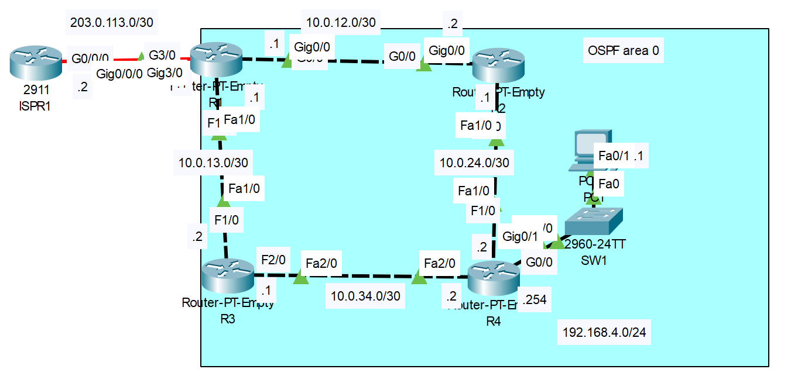

# **OSPF Configuration Part-01**
## Source (YouTube: Jeremy's IT Lab)
### Video Link: [Here](https://youtu.be/LeLRWjfylcs?si=WkB4f1eEkZq3NT3f)
### Lab File Link (pkt): [Here Day-26](https://mega.nz/file/X4IASLRK#h3TUgAGpP_VB9le9tywwkRMcfNxRNiYnfFAP_j0Vqtk)
### Scenario:


## OSPF Configuration Part-01

1. Configure the appropriate hostnames and IP addresses on each device. Enable router interfaces.
- (You don't have to configure ISPR1)
```
R1(config)#int f1/0
R1(config-if)#ip address 10.0.13.1 255.255.255.252
R1(config-if)#no shut
R1(config-if)#int g0/0
R1(config-if)#ip address 10.0.12.1 255.255.255.252
R1(config-if)#no shut
R1(config)#int g3/0
R1(config-if)#ip address 203.0.113.1 255.255.255.252
R1(config-if)#no shut
---------------------------------------------------
R2(config)#int f1/0
R2(config-if)#ip address 10.0.24.1 255.255.255.252
R2(config-if)#no shut
R2(config-if)#int g0/0
R2(config-if)#ip address 10.0.12.2 255.255.255.252
R2(config-if)#no shut
---------------------------------------------------
R3(config)#int f1/0
R3(config-if)#ip address 10.0.13.2 255.255.255.252
R3(config-if)#no shut
R3(config-if)#int f2/0
R3(config-if)#ip address 10.0.34.1 255.255.255.252
R3(config-if)#no shut
---------------------------------------------------
R4(config)#int f1/0
R4(config-if)#ip address 10.0.24.2 255.255.255.252
R4(config-if)#no shut
R4(config-if)#int f2/0
R4(config-if)#ip address 10.0.34.2 255.255.255.252
R4(config-if)#no shut
R4(config-if)#int g0/0
R4(config-if)#ip address 192.168.4.254 255.255.255.0
R4(config-if)#no shut
```
2. Configure a loopback interface on each router (1.1.1.1/32 for R1, 2.2.2.2/32 for R2, etc.)
```
R1(config)#int loopback 0
R1(config-if)#ip address 1.1.1.1 255.255.255.255
R1(config-if)#no shut
---------------------------------------------------
R2(config)#int loopback 0
R2(config-if)#ip address 2.2.2.2 255.255.255.255
R2(config-if)#no shut
---------------------------------------------------
R3(config)#int loopback 0
R3(config-if)#ip address 3.3.3.3 255.255.255.255
R3(config-if)#no shut
---------------------------------------------------
R4(config)#int loopback 0
R4(config-if)#ip address 4.4.4.4 255.255.255.255
R4(config-if)#no shut
```
3. Configure OSPF on each router.
- Enable OSPF on each interface (including loopback interfaces).(Do not enable OSPF on R1's Internet link)
- Configure passive interfaces where appropriate (including loopback interfaces).
```
R1(config)#router ospf 1
R1(config-router)#network 10.0.12.0 0.0.0.3 area 0
R1(config-router)#network 10.0.13.0 0.0.0.3 area 0
R1(config-router)#network 1.1.1.1 0.0.0.0 area 0
R1(config-router)#passive-interface loopback 0
------------------------------------------------------
R2(config)#router ospf 1
R2(config-router)#network 10.0.0.0 0.0.255.255 area 0
R2(config-router)#network 2.2.2.2 0.0.0.0 area 0
R2(config-router)#passive-interface loopback 0
------------------------------------------------------
R3(config)#router ospf 1
R3(config-router)#network 10.0.13.2 0.0.0.0 area 0
R3(config-router)#network 10.0.34.1 0.0.0.0 area 0
R3(config-router)#network 3.3.3.3 0.0.0.0 area 0
R3(config-router)#passive-interface loopback 0
------------------------------------------------------
R4(config)#router ospf 1
R4(config-router)#network 0.0.0.0 255.255.255.255 area 0
R4(config-router)#passive-interface g0/0
R4(config-router)#passive-interface loopback 0
```
4. Configure R1 as an ASBR that advertises a default route in to the OSPF domain.
```
R1(config)#ip route 0.0.0.0 0.0.0.0 203.0.113.2
R1(config)#router ospf 1
R1(config-router)#default-information originate
```
5. Check the routing tables of R2, R3, and R4.  What default route(s) were added?
```
R1#sh ip route

Gateway of last resort is 203.0.113.2 to network 0.0.0.0 ✅

     1.0.0.0/32 is subnetted, 1 subnets
C       1.1.1.1 is directly connected, Loopback0
     2.0.0.0/32 is subnetted, 1 subnets
O       2.2.2.2 [110/2] via 10.0.12.2, 00:05:07, GigabitEthernet0/0
     3.0.0.0/32 is subnetted, 1 subnets
O       3.3.3.3 [110/2] via 10.0.13.2, 00:04:57, FastEthernet1/0
     4.0.0.0/32 is subnetted, 1 subnets
O       4.4.4.4 [110/3] via 10.0.12.2, 00:04:57, GigabitEthernet0/0
                [110/3] via 10.0.13.2, 00:04:57, FastEthernet1/0
     10.0.0.0/30 is subnetted, 4 subnets
C       10.0.12.0 is directly connected, GigabitEthernet0/0
C       10.0.13.0 is directly connected, FastEthernet1/0
O       10.0.24.0 [110/2] via 10.0.12.2, 00:05:07, GigabitEthernet0/0
O       10.0.34.0 [110/2] via 10.0.13.2, 00:04:57, FastEthernet1/0
O    192.168.4.0/24 [110/3] via 10.0.12.2, 00:04:57, GigabitEthernet0/0
                    [110/3] via 10.0.13.2, 00:04:57, FastEthernet1/0
     203.0.113.0/30 is subnetted, 1 subnets
C       203.0.113.0 is directly connected, GigabitEthernet3/0
S*   0.0.0.0/0 [1/0] via 203.0.113.2 ✅
```
```
R1#sh ip protocols

Routing Protocol is "ospf 1" ✅
  Outgoing update filter list for all interfaces is not set 
  Incoming update filter list for all interfaces is not set 
  Router ID 1.1.1.1
  It is an autonomous system boundary router ✅
  Redistributing External Routes from,
  Number of areas in this router is 1. 1 normal 0 stub 0 nssa
  Maximum path: 4
  Routing for Networks:
    10.0.12.0 0.0.0.3 area 0
    10.0.13.0 0.0.0.3 area 0
    1.1.1.1 0.0.0.0 area 0
  Passive Interface(s): ✅
    Loopback0
  Routing Information Sources:  
    Gateway         Distance      Last Update 
    1.1.1.1              110      00:02:45
    2.2.2.2              110      00:06:35
    3.3.3.3              110      00:06:18
    4.4.4.4              110      00:07:43
  Distance: (default is 110) ✅

```
```
R1#sh ip ospf neighbor


Neighbor ID     Pri   State           Dead Time   Address         Interface
2.2.2.2           1   FULL/DR         00:00:33    10.0.12.2       GigabitEthernet0/0
3.3.3.3           1   FULL/DR         00:00:33    10.0.13.2       FastEthernet1/0
```
```
R1#sh ip ospf database
            OSPF Router with ID (1.1.1.1) (Process ID 1)

                Router Link States (Area 0) ✅

Link ID         ADV Router      Age         Seq#       Checksum Link count
4.4.4.4         4.4.4.4         485         0x80000006 0x0007d4 4
2.2.2.2         2.2.2.2         417         0x80000005 0x00aef1 3
3.3.3.3         3.3.3.3         400         0x80000005 0x00c8b5 3
1.1.1.1         1.1.1.1         187         0x80000006 0x00724e 3

                Net Link States (Area 0) ✅
Link ID         ADV Router      Age         Seq#       Checksum
10.0.34.2       4.4.4.4         545         0x80000001 0x004448
10.0.24.2       4.4.4.4         485         0x80000002 0x00475b
10.0.12.2       2.2.2.2         417         0x80000001 0x007d4a
10.0.13.2       3.3.3.3         400         0x80000001 0x006ed3

                Type-5 AS External Link States ✅
Link ID         ADV Router      Age         Seq#       Checksum Tag
0.0.0.0         1.1.1.1         134         0x80000001 0x00fecf 1
```
```
R1#sh ip ospf int 

GigabitEthernet0/0 is up, line protocol is up
  Internet address is 10.0.12.1/30, Area 0 ✅
  Process ID 1, Router ID 1.1.1.1, Network Type BROADCAST, Cost: 1
  Transmit Delay is 1 sec, State BDR, Priority 1
  Designated Router (ID) 2.2.2.2, Interface address 10.0.12.2
  Backup Designated Router (ID) 1.1.1.1, Interface address 10.0.12.1
  Timer intervals configured, Hello 10, Dead 40, Wait 40, Retransmit 5 ✅
    Hello due in 00:00:09
  Index 1/1, flood queue length 0
  Next 0x0(0)/0x0(0)
  Last flood scan length is 1, maximum is 1
  Last flood scan time is 0 msec, maximum is 0 msec
  Neighbor Count is 1, Adjacent neighbor count is 1
    Adjacent with neighbor 2.2.2.2  (Designated Router)
  Suppress hello for 0 neighbor(s)
FastEthernet1/0 is up, line protocol is up
  Internet address is 10.0.13.1/30, Area 0
  Process ID 1, Router ID 1.1.1.1, Network Type BROADCAST, Cost: 1
  Transmit Delay is 1 sec, State BDR, Priority 1
  Designated Router (ID) 3.3.3.3, Interface address 10.0.13.2
  Backup Designated Router (ID) 1.1.1.1, Interface address 10.0.13.1
  Timer intervals configured, Hello 10, Dead 40, Wait 40, Retransmit 5
    Hello due in 00:00:03
  Index 2/2, flood queue length 0
  Next 0x0(0)/0x0(0)
  Last flood scan length is 1, maximum is 1
  Last flood scan time is 0 msec, maximum is 0 msec
  Neighbor Count is 1, Adjacent neighbor count is 1
    Adjacent with neighbor 3.3.3.3  (Designated Router)
  Suppress hello for 0 neighbor(s)
Loopback0 is up, line protocol is up
  Internet address is 1.1.1.1/32, Area 0
  Process ID 1, Router ID 1.1.1.1, Network Type LOOPBACK, Cost: 1
  Loopback interface is treated as a stub Host
```
## **[The End]**