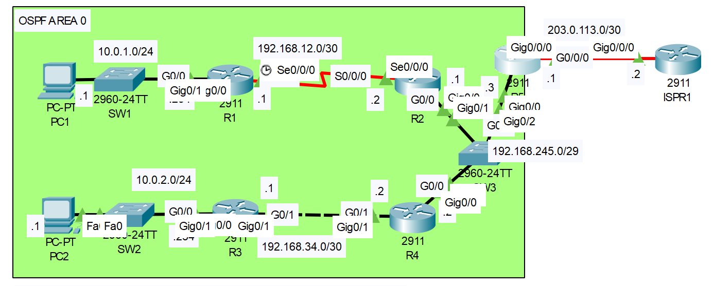

# **OSPF Configuration Part-03**
## Source (YouTube: Jeremy's IT Lab)
### Video Link: [Here](https://youtu.be/Goekjm3bK5o?si=3zBsPNEDKz7zy9L6)
### Lab File Link (pkt): [Here Day-28](https://mega.nz/file/31xnARTT#kHbm7qdSiYn-l22JtjCmwo2kysfYrFdXJRNJr_47bys)
### Scenario:



## **The network has been pre-configured (IP addresses, OSPF)**

## **1. The connection between R1 and R2 has been newly added.**
- Configure the serial connection between R1 and R2 (clock rate of 128000).
- Configure OSPF on R1 and R2.
```
R1(config)#int s0/0/0
R1(config-if)#ip address 192.168.12.1 255.255.255.252

R1#sh controllers s0/0/0
Interface Serial0/0/0
Hardware is PowerQUICC MPC860
✅ DCE V.35, clock rate 2000000

R1(config)#int s0/0/0
R1(config-if)#clock rate 128000
R1(config-if)#no shut
```
```
R2(config)#int s0/0/0
R2(config-if)#ip address 192.168.12.2 255.255.255.252
R2(config-if)#no shut

R2#sh controllers s0/0/0
Interface Serial0/0/0
Hardware is PowerQUICC MPC860
✅ DTE V.35 TX and RX clocks detected
```
```
R2(config-if)#do sh ip int brief
Interface              IP-Address      OK? Method Status                Protocol 
GigabitEthernet0/0     192.168.245.1   YES manual up                    up 
GigabitEthernet0/1     unassigned      YES unset  administratively down down 
GigabitEthernet0/2     unassigned      YES unset  administratively down down 
Serial0/0/0            192.168.12.2    YES manual up                    up ✅
Serial0/0/1            unassigned      YES unset  administratively down down 
Vlan1                  unassigned      YES unset  administratively down down
```
```
R1(config)#int s0/0/0
R1(config-if)#ip ospf 1 area 0
R1(config)#int g0/0
R1(config-if)#ip ospf 1 area 0

R2(config)#int s0/0/0
R2(config-if)#ip ospf 1 area 0
```
```
R1#sh ip route ospf
     192.168.34.0/30 is subnetted, 1 subnets
O       192.168.34.0 [110/66] via 192.168.12.2, 00:05:39, Serial0/0/0
     192.168.245.0/29 is subnetted, 1 subnets
O       192.168.245.0 [110/65] via 192.168.12.2, 00:05:39, Serial0/0/0
```
```
R1#sh ip ospf int s0/0/0

Serial0/0/0 is up, line protocol is up
  Internet address is 192.168.12.1/30, Area 0
  Process ID 1, Router ID 192.168.12.1, Network Type ✅ POINT-TO-POINT, Cost: 64
  Transmit Delay is 1 sec, State POINT-TO-POINT,
  Timer intervals configured, Hello 10, Dead 40, Wait 40, Retransmit 5 ✅
    Hello due in 00:00:06
  Index 1/1, flood queue length 0
  Next 0x0(0)/0x0(0)
  Last flood scan length is 1, maximum is 1
  Last flood scan time is 0 msec, maximum is 0 msec
  Neighbor Count is 1 , Adjacent neighbor count is 1
    Adjacent with neighbor 192.168.245.1
  Suppress hello for 0 neighbor(s)
```
```
R1#sh ip ospf int g0/0

GigabitEthernet0/0 is up, line protocol is up
  Internet address is 10.0.1.254/24, Area 0
  Process ID 1, Router ID 192.168.12.1, Network Type ✅ BROADCAST, Cost: 1
  Transmit Delay is 1 sec, State DR, Priority 1
  Designated Router (ID) 192.168.12.1, Interface address 10.0.1.254
  No backup designated router on this network
  Timer intervals configured, Hello 10, Dead 40, Wait 40, Retransmit 5 ✅
    Hello due in 00:00:08
  Index 2/2, flood queue length 0
  Next 0x0(0)/0x0(0)
  Last flood scan length is 1, maximum is 1
  Last flood scan time is 0 msec, maximum is 0 msec
  Neighbor Count is 0, Adjacent neighbor count is 0
  Suppress hello for 0 neighbor(s)
```
## **2. Only R3 has a route to 10.0.2.0/24.  Why?  Fix the problem.**
- From PC1 to PC2: (fails)
```
C:\>ping 10.0.2.1

Pinging 10.0.2.1 with 32 bytes of data:

Reply from 10.0.1.254: Destination host unreachable.
Reply from 10.0.1.254: Destination host unreachable.
Reply from 10.0.1.254: Destination host unreachable.
Request timed out.

Ping statistics for 10.0.2.1:
    Packets: Sent = 4, Received = 0, Lost = 4 (100% loss),
```
- Notice the network type on R4. This is Broadcast. 
```
R4#sh ip ospf int g0/0

GigabitEthernet0/0 is up, line protocol is up
  Internet address is 192.168.245.2/29, Area 0
  Process ID 1, Router ID 192.168.245.2, Network Type ✅ BROADCAST, Cost: 1
  Transmit Delay is 1 sec, State DR, Priority 1
  Designated Router (ID) 192.168.245.2, Interface address 192.168.245.2
  Backup Designated Router (ID) 192.168.245.1, Interface address 192.168.245.1
  Timer intervals configured, Hello 10, Dead 40, Wait 40, Retransmit 5 ✅
```
- Here there is no route for 10.0.2.0/24 subnet on R4. 
```
R4#sh ip route

Gateway of last resort is not set

     10.0.0.0/24 is subnetted, 1 subnets
O       10.0.1.0/24 [110/66] via 192.168.245.1, 00:12:14, GigabitEthernet0/0
     192.168.12.0/30 is subnetted, 1 subnets
O       192.168.12.0/30 [110/65] via 192.168.245.1, 00:13:38, GigabitEthernet0/0
     192.168.34.0/24 is variably subnetted, 2 subnets, 2 masks
C       192.168.34.0/30 is directly connected, GigabitEthernet0/1
L       192.168.34.2/32 is directly connected, GigabitEthernet0/1
     192.168.245.0/24 is variably subnetted, 2 subnets, 2 masks
C       192.168.245.0/29 is directly connected, GigabitEthernet0/0
L       192.168.245.2/32 is directly connected, GigabitEthernet0/0
```
- Now check the R3: 
```
R3#sh ip ospf nei


Neighbor ID     Pri   State           Dead Time   Address         Interface
192.168.245.2     0   FULL/  -        00:00:36    192.168.34.2    GigabitEthernet0/1
```
- Here the network type is point-to-point on R3. This is the problem. Network type must be match in both side. 
```
R3#sh ip ospf int g0/1

GigabitEthernet0/1 is up, line protocol is up
  Internet address is 192.168.34.1/30, Area 0
  Process ID 1, Router ID 192.168.34.1, Network Type ✅ POINT-TO-POINT, Cost: 1
  Transmit Delay is 1 sec, State POINT-TO-POINT,
  Timer intervals configured, Hello 10, Dead 40, Wait 40, Retransmit 5 ✅
```
- Remove this point-to-point type 
```
R3(config)#int g0/1
R3(config-if)#no ip ospf network point-to-point
```
- Now the route for 10.0.2.0/24 comes into R4 
```
R4#sh ip route ospf
     10.0.0.0/24 is subnetted, 2 subnets
O       10.0.1.0 [110/66] via 192.168.245.1, 00:17:52, GigabitEthernet0/0
O       10.0.2.0 [110/2] via 192.168.34.1, 00:00:32, GigabitEthernet0/1 ✅
     192.168.12.0/30 is subnetted, 1 subnets
O       192.168.12.0 [110/65] via 192.168.245.1, 00:19:16, GigabitEthernet0/0
```
## **3. R2 and R4 won't become OSPF neighbors with R5.  Why?  Fix the problem.**
- On R2 Network Type and Hello-Dead interval is correct.
```
R2#sh ip ospf int g0/0

GigabitEthernet0/0 is up, line protocol is up
  Internet address is 192.168.245.1/29, Area 0
  Process ID 1, Router ID 192.168.245.1, Network Type ✅ BROADCAST, Cost: 1
  Transmit Delay is 1 sec, State BDR, Priority 1
  Designated Router (ID) 192.168.245.2, Interface address 192.168.245.2
  Backup Designated Router (ID) 192.168.245.1, Interface address 192.168.245.1
  Timer intervals configured, Hello 10, Dead 40, Wait 40, Retransmit 5 ✅
```
- On R4 Network Type and Hello-Dead interval is also correct.
```
R4#sh ip ospf int g0/0

GigabitEthernet0/0 is up, line protocol is up
  Internet address is 192.168.245.2/29, Area 0
  Process ID 1, Router ID 192.168.245.2, Network Type ✅ BROADCAST, Cost: 1
  Transmit Delay is 1 sec, State DR, Priority 1
  Designated Router (ID) 192.168.245.2, Interface address 192.168.245.2
  Backup Designated Router (ID) 192.168.245.1, Interface address 192.168.245.1
  Timer intervals configured, Hello 10, Dead 40, Wait 40, Retransmit 5 ✅
```
- On R5 Network type is correct but the problem is Hello and Dead interval. Let's fix it. 
```
R5#sh ip ospf int g0/0

GigabitEthernet0/0 is up, line protocol is up
  Internet address is 192.168.245.3/29, Area 0
  Process ID 1, Router ID 203.0.113.1, Network Type BROADCAST, Cost: 1 ✅
  Transmit Delay is 1 sec, State DR, Priority 1
  Designated Router (ID) 203.0.113.1, Interface address 192.168.245.3
  No backup designated router on this network
  Timer intervals configured, Hello 5, Dead 20, Wait 20, Retransmit 5 ✅
```
- Remove the timer and check if the problem fix
```
R5(config)#int g0/0
R5(config-if)#no ip ospf hello-interval
R5(config-if)#no ip ospf dead-interval

R5(config-if)#do sh ip ospf int g0/0

GigabitEthernet0/0 is up, line protocol is up
  Internet address is 192.168.245.3/29, Area 0
  Process ID 1, Router ID 203.0.113.1, Network Type BROADCAST, Cost: 1 ✅
  Transmit Delay is 1 sec, State DR, Priority 1
  Designated Router (ID) 203.0.113.1, Interface address 192.168.245.3
  Backup Designated Router (ID) 192.168.245.1, Interface address 192.168.245.1
  Timer intervals configured, Hello 10, Dead 40, Wait 40, Retransmit 5 ✅
```
```
R2#sh ip ospf nei 


Neighbor ID     Pri   State           Dead Time   Address         Interface
192.168.12.1      0   FULL/  -        00:00:37    192.168.12.1    Serial0/0/0
192.168.245.2     1   FULL/DROTHER    00:00:36    192.168.245.2   GigabitEthernet0/0
203.0.113.1       1   FULL/DR         00:00:38    192.168.245.3   GigabitEthernet0/0 ✅
```
## **4. PC1 and PC2 can't ping the external server 8.8.8.8. Why? Fix the problem.**
```
C:\>ping 8.8.8.8

Pinging 8.8.8.8 with 32 bytes of data:

Reply from 10.0.1.254: Destination host unreachable.
Reply from 10.0.1.254: Destination host unreachable.
Reply from 10.0.1.254: Destination host unreachable.
Reply from 10.0.1.254: Destination host unreachable.

Ping statistics for 8.8.8.8:
    Packets: Sent = 4, Received = 0, Lost = 4 (100% loss),
```
```
R5#sh run | section ospf
router ospf 1
 log-adjacency-changes
 network 192.168.245.3 0.0.0.0 area 0
 default-information originate
```
```
R5#sh run | include ip route
```
- Here is the problem. There is no ip route but the default-information originate command is issued. Lets configure a default static route. 
```
R5(config)#ip route 0.0.0.0 0.0.0.0 203.0.113.2
```
```
R1#sh ip route ospf
     10.0.0.0/8 is variably subnetted, 3 subnets, 2 masks
O       10.0.2.0 [110/67] via 192.168.12.2, 00:16:25, Serial0/0/0
     192.168.34.0/30 is subnetted, 1 subnets
O       192.168.34.0 [110/66] via 192.168.12.2, 00:35:01, Serial0/0/0
     192.168.245.0/29 is subnetted, 1 subnets
O       192.168.245.0 [110/65] via 192.168.12.2, 00:07:29, Serial0/0/0
O*E2 0.0.0.0/0 [110/1] via 192.168.12.2, 00:00:14, Serial0/0/0 ✅
```
- Now ping again and let's see it works. This time it should work...!
```
C:\>ping 8.8.8.8

Pinging 8.8.8.8 with 32 bytes of data:

Request timed out.
Reply from 8.8.8.8: bytes=32 time=1ms TTL=252
Reply from 8.8.8.8: bytes=32 time=1ms TTL=252
Reply from 8.8.8.8: bytes=32 time=18ms TTL=252

Ping statistics for 8.8.8.8:
    Packets: Sent = 4, Received = 3, Lost = 1 (25% loss),
Approximate round trip times in milli-seconds:
    Minimum = 1ms, Maximum = 18ms, Average = 6ms
```
## **5. Examine the LSDB. What LSAs are present?**
```
R1#sh ip ospf database
            OSPF Router with ID (192.168.12.1) (Process ID 1)

                Router Link States (Area 0)

Link ID         ADV Router      Age         Seq#       Checksum Link count
192.168.12.1    192.168.12.1    301         0x80000004 0x00ee82 3
192.168.34.1    192.168.34.1    1066        0x80000007 0x00ee10 2
192.168.245.1   192.168.245.1   537         0x80000006 0x004a83 3
192.168.245.2   192.168.245.2   537         0x80000008 0x005e3e 2
203.0.113.1     203.0.113.1     537         0x80000004 0x00848a 1

                Net Link States (Area 0)
Link ID         ADV Router      Age         Seq#       Checksum
192.168.34.2    192.168.245.2   992         0x80000003 0x00de2b
192.168.245.3   203.0.113.1     537         0x80000002 0x000365

                Type-5 AS External Link States
Link ID         ADV Router      Age         Seq#       Checksum Tag
0.0.0.0         203.0.113.1     98          0x80000001 0x00d2c1 1
```
- All router on the same area has same LSDB. 
- The network link state are type-2. The DR of each multi-access network generate this kind of LSA. 

## **[The End]**